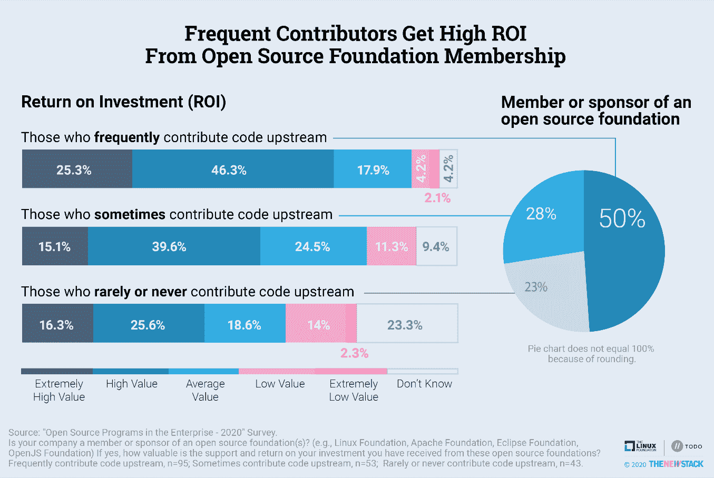

# 价值投资:开源基金会

> 原文：<https://thenewstack.io/value-investing-open-source-foundations/>

Linux 基金会赞助了这篇文章。

开源基金会成员服务周到。根据我们最近的[“企业中的开源”](https://thenewstack.io/open-source-contributions-on-the-rise-in-fintech-healthcare-and-government/)企业中的开源调查，几乎四分之三(72%)经常为上游项目做出贡献的组织从他们的开源基金会成员中获得了高于平均水平的价值。是的，这一结论符合 Linux 基金会的利益，该基金会是调查的赞助者之一，但事实仍然是，那些投资于开源基金会的人普遍感到高兴。

创建基金会是为了正式管理开源项目，并确保没有一个供应商有太多的控制权。T4 有超过 100 个基于学术研究的开源基金会，它们服务于不同的目的，提供各种不同层次的服务。29%的受访者组织是开源基金会的成员或赞助商，如 Apache Software Foundation、Eclipse Foundation、OpenJS Foundation 和 Linux Foundation。除了这些例子之外，调查并没有根据他们的管理模式或他们提供的服务给出开源基金会的定义。

饼图中“那些很少或从不贡献上游代码”的数字从最初发布的图表中的 24%变成了 23%。

如果受访者的组织是一个基金会的成员，他们回答了一个关于他们获得的投资回报的附加问题。20%的人表示他们获得了极高的价值，另外 39%的人获得了高价值，这意味着 59%的人获得了高于平均水平的投资回报。

成员满意度的关键决定因素是组织向开源项目上游贡献的频率。调查中发现的会员中有一半经常捐款，其中 72%至少从会员资格中获得了高价值。相比之下，只有 24%的会员很少或从不捐款，他们高于平均水平的价值观明显更差。

向上游贡献代码而不仅仅是内部管理的开源项目意味着需要与同行合作。

康卡斯特开源项目办公室的负责人 Nithya A. Ruff 告诉 New Stack 说:“在我的组织中，证明成为基金会成员的一个要求是，它需要与对基金会项目的有意义的贡献相结合。“这可能是代码、参与组织的治理、志愿帮助文档、营销或其他功能。如果你能参与进来，让这个项目为你和整个社区带来成功，你就能从你的会员资格中获得最大的收益。”

[开源基金会的批评者抱怨说，他们被少数大型科技公司所控制。诚然，拥有超过 10，000 名员工的公司以及 It 和软件公司更有可能成为开源基金会的成员。但是，我们的研究发现，这些变量对他们获得多少价值没有实质性影响。](https://thenewstack.io/linux-foundation-critics/)

小软件公司看到了价值，因为他们在技术讨论中使用开源基础来与大公司公平竞争。此外，[云计算原生计算基金会的终端用户社区](https://www.cncf.io/people/end-user-community/)的增长表明，各行各业的公司都希望在他们未来几年将使用的软件中拥有发言权。

我们在这里不是要争论开源基金会是最民主的机构，是分配资本的最佳方式，还是技术规划的最佳场所。相反，研究表明，经常参与上游项目的组织很可能发现加入开源实体的价值。

研究方法和完整数据集的描述[可在此处](https://github.com/todogroup/survey/tree/master/2020)找到。

## 进一步阅读

VMware 是新堆栈的赞助商，并共同赞助了这项研究。云计算原生计算基金会是新堆栈的赞助商。

通过 Pixabay 的特征图像。

<svg xmlns:xlink="http://www.w3.org/1999/xlink" viewBox="0 0 68 31" version="1.1"><title>Group</title> <desc>Created with Sketch.</desc></svg>