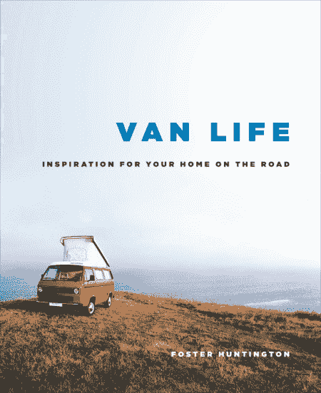

# Van Life:在路上找到家的开发商

> 原文：<https://thenewstack.io/van-life-developers-find-homes-road/>

2015 年，一名 24 岁的特斯拉工程师发现，只要在特斯拉硅谷园区吃饭、洗澡的时候，在道奇面包车里住上五个月，他就可以还清 14000 美元的学生贷款。效果很好，当他搬出自己的货车时，他甚至可以在 Craigslist 上以 2000 美元的价格出售。

然而，他没有预料到的是，他有多么怀念这种生活方式。

他不是唯一一个。几乎与此同时，一名 23 岁的谷歌软件工程师发现，住在福特面包车里的[可以节省 90%的收入——还可以在工作时吃饭和洗澡。四个月内，他已经还清了近 8000 美元的*学生贷款——同时还有足够的钱去当地最好的餐馆吃饭。在一篇引人注目的博客文章中，他描述了校园安全*](http://www.businessinsider.com/google-employee-lives-in-truck-in-parking-lot-2015-10)*[最终抓住他](https://frominsidethebox.com/view?key=5189192371929088)的那一天。*

"他们告诉我要过一个愉快的夜晚，甚至为吵醒我而道歉."尽管两年后他最终离开了谷歌，但他仍然住在自己的货车里。

早在 4 月份,《纽约客》*刊登了一篇关于艾米丽·金和科里·史密斯的详细报道，他们的灵感来自于与福斯特·亨廷顿的一次偶遇，福斯特·亨廷顿是前拉尔夫·劳伦的设计师，他离开了他在纽约的公寓和工作，在一辆 1987 年的大众面包车里生活了很多年。“他们认为他们可以住在一辆面包车里，同时把他们喜欢的东西——旅行、冲浪、山地自行车——放在他们生活的中心，”文章解释道，并指出帮助这一切成为可能的特殊成分。金的新工作是网页开发员，这使得她可以远程办公。*

https://www.instagram.com/p/Bab08u6F626/?taken-by=wheresmyofficenow

这对夫妇的旅程一开始就不顺利。“第一天，货车向后滑下一座结冰的山坡，不得不被拖走，”他们报道说。但随着时间的推移，史密斯开始通过承诺在他们的社交媒体账户上宣传来换取他的货车维修折扣——有时价值数千美元，很快他们也可以在 Instagram feed 上发布特定产品[而获得报酬。赞助商包括 Clif Bars 和 Kettle 品牌的薯片，这对夫妇 2016 年的总收入达到 18000 美元，大部分来自社交媒体。现在他们通过为他们的社交媒体“创造内容”来赚钱，尽管金坚持认为他们只认可有联系的产品。](https://www.instagram.com/wheresmyofficenow/)

 事实上，住在货车里已经成为一种次要的运动。《纽约客》指出，现在 Instagram 上有超过 120 万个标签为#VanLife 的帖子。早在 2013 年，亨廷顿甚至在 Kickstarter 上从 966 名支持者那里筹集了 65，676 美元，资助了一本精装咖啡桌书[关于住在货车里的整个生活方式。“在过去的两年里，我已经开着我的野营车在北美旅行了 8 万英里，”亨廷顿在他的推销中解释说，他提到他遇到过其他旅行者，他们的车辆成为了“生活方式的推动者”，并承诺将他们记录在一本相册中——以及他们的故事。现在已经是第四次印刷了，他刚刚在这个月出版了第二本书。](https://www.kickstarter.com/projects/fosterhuntington/home-is-where-you-park-it)

《纽约客》的文章认为这是“从最近的经济衰退中产生的一种趋势”——科里·史密斯似乎也同意这一观点。“我们听到了所有这些关于你上大学并获得学位后会发生什么的承诺。我们毕业的时候，所有这些都是一派胡言。”

不仅仅是年轻人或科技精英走上了开放之路。根据一本名为《[无依之地](https://www.amazon.com/gp/product/039324931X/ref=as_li_qf_sp_asin_il_tl?ie=UTF8&tag=the0757-20&camp=1789&creative=9325&linkCode=as2&creativeASIN=039324931X&linkId=4d28d81d6dbc954f6354384319b7b38d)的新书，亚马逊已经在房车中雇佣了数千名老年人来处理他们的季节性工作量他们也打零工，收割甜菜或在国家公园当主持人。根据这本书，他们中的许多人“再也负担不起传统的住房。”

这个月有一个新的故事 GitHub 的德国软件工程师的故事，他仍然住在他的车里——在这种情况下，是一辆 1984 年的梅赛德斯-奔驰 209D 野营车。今年早些时候，他安装了太阳能电池板(和移动 WiFi 路由器的屋顶天线)，2017 年 5 月 11 日，他开始了他伟大的极客之旅。

他自称 Jakob，但是你几乎可以感受到他在[的第一篇博客文章中的兴奋。“我们成功地测试了冰箱，并在柏林附近的一个湖边享受了一些冰啤酒……这种感觉真棒:我们可以坐下来，享受日落，喝点啤酒，而不用担心如何回家。”](https://ruby-on-wheels.github.io/blog/leaving-berlin/)

雅各布头两天在他家附近停车，测试这个概念。“一切都非常顺利:视频通话、屏幕共享和配对会话。没有延迟或任何连接问题。”他从一家意大利运营商那里用预付费 SIM 卡购买了稳定的 4G 连接(这也让他在法国、西班牙和葡萄牙上网)——很快就到了起飞的时候了。“我不是在度假，所以没有预算或时间限制。我完全自由了。让我们看看路会把我带向何方！”

他一直在他的 GitHub 知识库的博客中记录他的冒险经历，写下他的第一个技术问题[一滩油](https://ruby-on-wheels.github.io/blog/the-first-technical-issue/)——或者那次他把[锁在自己的浴室外面](https://ruby-on-wheels.github.io/blog/breaking-into-my-own-van/)。每个程序员都知道有一个叫做 Ruby on Rails 的 web 应用框架。但是他的博客的口号是“车轮上的红宝石——路上的开发者”

雅各布把露营者的浴室变成了他自行车的储藏室，他使用公共厕所似乎没有任何问题。(除了那次警察想看看[他是否能通过药物筛选尿检](https://ruby-on-wheels.github.io/blog/trying-to-pee/)——就在他离开休息站之后)。这个月，在他第 150 天的旅途之后，他更新了[。“自从我 5 月离开柏林以来，我访问了 6 个国家，行驶了 12，000 多公里，收集了超过 180，000 瓦时的太阳能，并会见了许多有趣的人。”](https://ruby-on-wheels.github.io/blog/the-first-150-days-of-van-life/)

最有趣的事情可能是这对他工作的影响。“作为一名远程软件工程师，我可以在感觉高效的时候工作，在大脑疲劳的时候休息，”Jakob 写道。然而，在他的大型公路旅行之前，他没有好好利用这一点——错过了在吊床上长时间小睡或者在公园里阳光明媚地散步的机会。住在货车里满足了他对度假的需求，并让他找回了失去的自发性。“浪大的时候，我去冲浪……热的时候，我去游泳。当我累了，我就睡觉。当我喜欢一个地方时，我会留下来……”

当然，“当我的货车坏了，我会设法修好它。”

但是减少他的通勤时间到*零*让他有更多的时间在家做饭——这最终会更健康。旅途生活还有其他好处。

“面包车生活让我能够更好地将个人活动融入我的工作日程，因为一切都更近了:周围有人告诉我与编程无关的故事。我的货车前面有一个吊床，可以在外面轻松地小睡一会儿，还有一个健身公园，我可以在那里做引体向上和跳水，或者在海滩上晒日光浴，以补充我每天所需的维生素 d。”

雅各布告诉世界，他的新生活更简单，也更快乐。“正如一位西班牙旅行者曾经告诉我的那样，‘太阳每天都会升起。’我感觉非常平衡，并期待着所有在我面前的事情！"即使是不受控制的事件也会以某种方式融合成平稳的流动. "事情没有太多计划就发生了。"

"有时我什么也不做，只是在吊床上放松一下."

根据黑客新闻上关于他的故事的评论，他不是唯一的一个。“我也住在车里，”一个名叫 Driverdan 的用户发帖说。“我有一辆 25 英尺(7.6 米)长的旧机场班车，我把它改装成了我的家……”

https://www.instagram.com/p/BU3F8HvlmkS/?taken-by=driverdan

“我在一辆 C 级房车上远程工作了 5 个月[，”另一位评论者补充道，“在一些非常偏远的地区，总共跨越了 36 个州……完成后，我以与购买时相同的价格卖掉了房车，游览了美国的许多地方，节省了 12，000 美元的租金，花了 2，000 美元的汽油和 700 美元的轮胎，200 美元/月的互联网费用……我花了很多钱。”](https://news.ycombinator.com/item?id=15444372)

第三条评论说:“在澳大利亚，我用不到 500 美元+货车的成本，用类似丰田海狮的东西造了一辆货车。”“我[在里面旅行了一年](https://news.ycombinator.com/item?id=15439967)，在里面住了 6 个多月，最后卖掉了它。”

第四位评论者补充道:“我们现在在露营车 [3 年…](https://news.ycombinator.com/item?id=15440305) ”。故事还在继续…

[https://www.youtube.com/embed/kzihYM_o09U?feature=oembed](https://www.youtube.com/embed/kzihYM_o09U?feature=oembed)

视频

https://www.instagram.com/p/BaE42VglKAi/?taken-by=wheresmyofficenow

* * *

## WebReduce

<svg xmlns:xlink="http://www.w3.org/1999/xlink" viewBox="0 0 68 31" version="1.1"><title>Group</title> <desc>Created with Sketch.</desc></svg>