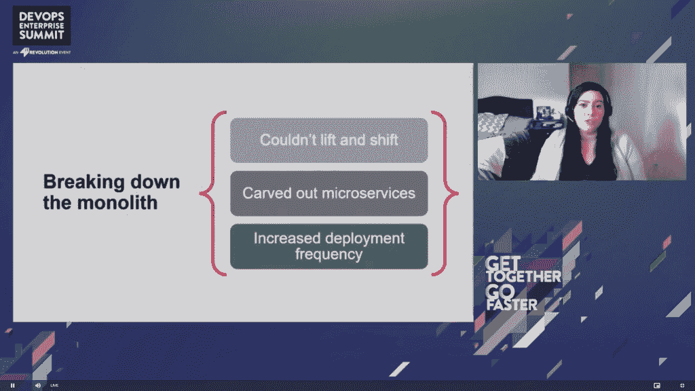
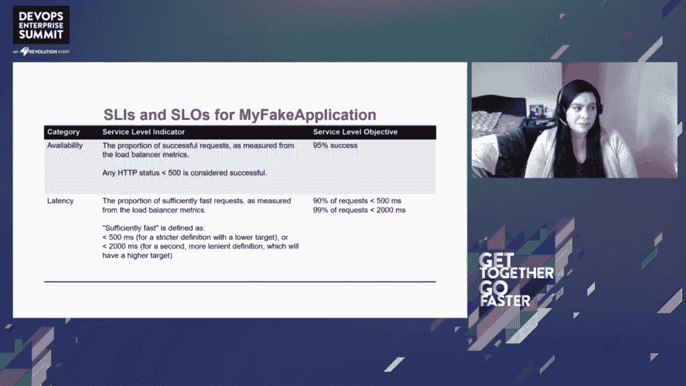
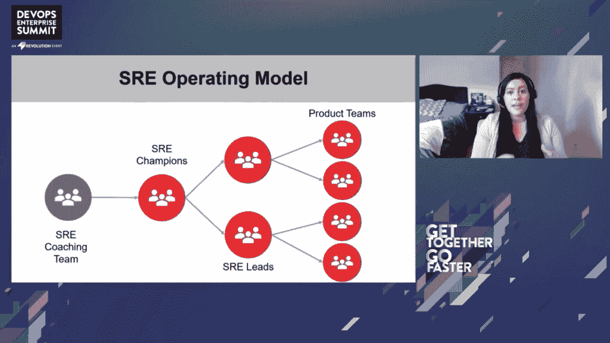

# 先锋的迭代企业 SRE 转型

> 原文：<https://thenewstack.io/vanguards-iterative-enterprise-sre-transformation/>

全球资产管理公司 Vanguard 管理着 8 万亿美元的资产，是共同基金的最大提供商，也是交易所交易基金的第二大提供商。它也不是那么秘密的科技公司，17000 名员工中有 7000 人在技术部门工作。

就在七年前，Vanguard services 还专门托管在一个私有数据中心，其中几乎所有的应用都是单一的。工程团队通过季度发布控制部署。没有可观察性，也不能肯定系统按照他们希望的方式运行。警报系统是集中拥有的，这意味着开发人员必须请求票证来添加和更新警报。毫不奇怪，开发和运营完全相互隔离。

在本周的[devo PS Enterprise Summit(DOES)Europe](https://events.itrevolution.com/virtual/)上，Vanguard 讲述了他们如何从传统架构迁移到云中的主流架构，采用了站点可靠性工程，甚至构建了自己面向客户的 SaaS。

## 先锋是如何开始向云迁移的

高级 SRE·蔻驰[克里斯蒂娜·雅科明](https://twitter.com/srechristina)，从他们的[应用程序现代化](https://thenewstack.io/how-to-build-a-roadmap-to-app-modernization/)开始就一直在先锋工作，她说她的雇主是独一无二的——尤其是在金融服务方面。在其 47 年的历史中，它从来都不是实体的，只是通过电话和网络——使技术成为重中之重。但这并不意味着随着时间的推移，很容易实现分布式和云原生。

她说，将一个单片应用程序“提升并转移”到云上是非常困难的，因此，他们缓慢但稳步地开拓了微服务。Vanguard 团队最初在内部私有云平台即服务上运行。Yakomin 说，即使有了这一举措，回归测试的测试周期也大大缩短了，然后他们给工程部门增加了一个测试自动化的角色。通过添加新的管道，他们能够提高部署频率，并创建测试证据作为其 [CI/CD 流程](https://thenewstack.io/category/ci-cd/)的一部分。

从那里开始，他们可以将底层 PaaS 提升并转移到公共云。

“这使得微服务开发团队的生活变得非常容易，但这对我们的运营团队来说非常困难，”Yakomin 说，“但它给我们留下了一个不必要的抽象层…使环境过于复杂，并导致了比它解决的问题更多的问题。”

## 先锋如何采用云原生混沌工程

虽然这一举措并不完美，但它确实第一次实现了可选性，因此他们可以转向云原生解决方案，选择组合[亚马逊网络服务](https://aws.amazon.com/?utm_content=inline-mention):

*   **亚马逊 ECS** —与他们的非常相似，但他们不需要通行证维护团队
*   **AWS Lambda** —他们发现对于其他事件驱动的工作负载和不经常访问的微服务来说，它更好、更便宜
*   **亚马逊 EKS**——为他们在 AWS 上管理的 Kubernetes

Yakomin 说:“大多数产品团队对承担系统责任相当兴奋，这对他们来说是新的。产品团队开始负责测试应用程序代码和配置。

他们还采用了常见的物理工程实践[故障模式和影响分析](https://asq.org/quality-resources/fmea)。最初来自美国军方，FMEA 专注于:

*   **故障模式**——某事物可能发生故障的潜在或实际方式
*   **影响分析** —了解每次失败的后果

Yakomin 解释说，这是通过查看系统架构并围绕事物如何对压力和失败做出反应创建假设来应用的。然后，他们集成了混沌工程和性能测试来测试每个假设，创建并利用自助服务平台。新的团队惯例包括:

*   **混沌游戏日**——开发了关于系统弹性和预期行为的假设，导致了崩溃，验证了扩展和自我修复，只有几个惊喜。
*   **混乱消防演习**——想要测试未知情况。他们正在尝试一种新的可观察性工具， [Honeycomb](https://honeycomb.io) ，他们想要注入新的失败来测试这个工具。这种方法非常有效，他们记录了这些测试，并将其作为随叫随到培训的一部分。
*   **中断测试他们的自托管 CI/CD 管道**–他们观察到在高流量时期反复出现的不稳定性，这也是开发人员工作和自然部署的时候。他们创建了几个虚拟构建和部署计划，在执行过程中生成了大量日志。Yakomin 在后续的 Slack 聊天中解释说，他们在非工作时间运行这些，再现了高峰流量行为。然后，他们迁移到一个针对磁盘输入/输出操作进行了更好优化的数据库实例，在开发人员第二天遇到这个问题之前就解决了这个问题。

## SRE 在先锋向云迁移中的作用

[站点可靠性工程](https://thenewstack.io/site-reliability-engineering-cloud-native-operations/)正迅速成为向云迁移的必需品。虽然整体应用程序缺乏速度、灵活性和团队自治，但不可否认的是，它们比云中的分布式系统更可预测，也更容易监控和观察。一些组织，比如 Google，有一个专业的 SRE 团队来支持开发团队。其他人就在团队中。在 DevOps 企业峰会的 Slack 社区中的后续对话中，Yakomin 解释了 Vanguard 如何进行组合。

“有时一个产品团队既有应用工程师，也有站点可靠性工程师。应用工程师专注于功能交付，而站点可靠性工程师专注于可用性、弹性和其他非功能性需求。当然，两者都有责任确保他们所做的一切都符合安全控制。在这种情况下，他们通常会随叫随到。”

她进一步解释说，有时会发现 SRE“由 DevOps 团队通过他们自己的 SRE 随叫随到团队(或 24/7 配备人员的 SRE 支持团队)的随叫随到人员参与，作为一种上报途径。"

在采用站点可靠性工程之前，Vanguard 的可用性测量是二元的——服务是启动还是停止？当然，这也包含了不可能 100%正常运行的情况。

Vanguard engineering 开始采用服务级别指标(SLIs)、服务级别目标(SLO)和错误预算，这使得 SRE 团队能够看到处于风险中的请求的百分比。突然间，他们能够平衡可用性和功能之间的权衡。如果一个特性是高优先级的，他们可以允许 99.5%甚至 99%的可用性。或者，如果可用性是关键，那么它与开发人员沟通，他们必须遵循一个较慢的发布计划。

先锋队增加了一个 SRE 教练团队，雅科明是其中的一员。这些 SRE 教练帮助验证工具，创建关于可靠性和 DevOps 最佳实践的自学课程，并担任 SRE 领导的顾问。这些冠军与不同的 SRE 领导一起工作，这些领导与相关产品组保持一致——产品团队可能有也可能没有全职的 SRE 从业者。Yakomin 澄清说，所有 DevOps 工程师都有责任管理警报产品组合，并确保满足 SLO。

她承认保持平衡是一个持续的挑战。“我从工程师那里抽出的每一个小时都是为了让他们接受培训课程，而他们本可以交付新的特性，”这是一个直接的问题，但是这种培训将会在以后增加发布的节奏和可靠性。

先锋 SRE 教练团队现在正在寻找更好地展示影响的方法，同时也在努力应对那些习惯于将正常运行时间视为所有时间的人，因此，雅科明说，“他们可能会将我工作的影响视为挑战。”

有一点是肯定的，SRE 是他们增长最快的角色之一，因为他们希望扩大跨公司的规模，这通常被列为最受欢迎的技术角色之一。先锋公司正在寻找技能不断提升的工程师团队，同时也在外部招聘。

## 先锋的 DevOps 成功

Vanguard 还从仅警报可见性开始，运营部门创建警报控制台，显示各种警报的当前状态。雅科明说，这种方法在一段时间内有效，但还不够。

一旦他们开发了一个中央微服务平台，仪表板就在团队级别开发，“因为我们根本无法集中跟踪所有的微服务。”她说团队很喜欢这一点，并要求添加云日志和指标。随着时间的推移，这种级别的定制变得如此之大，团队可以接受培训，然后获得仪表板克隆，他们可以根据自己的需要进行调整。

“随着我们看到这种规模的增长，我们看到了一些真正积极的成果和一些意想不到的后果，”Yakomin 说。Vanguard engineering 在创建新的警报和仪表板时迅速采用了敏捷性，团队能够利用数据进行决策，甚至更早地回滚。他们还看到了对生产支持的更多关注，以及团队对他们发布的产品拥有更多的所有权。

另一方面，他们开始看到仪表板变得杂乱——跟踪的东西比他们能跟踪的还要多。团队对错误的事情或太多的事情发出警报，这可能很快变成[警报疲劳和忽略警报](https://thenewstack.io/charity-majors-recipe-for-high-performing-teams/)。她说，他们了解到“仅仅因为你可以在你的日志聚合工具中做任何事情，并不意味着你应该这样做”，因为这可能导致成本指数级增长，同时降低性能。

Vanguard engineering 开始提供度量和跟踪，更好地利用亚马逊 CloudWatch 进行[监控](https://thenewstack.io/category/monitoring/)和 [Honeycomb.io](https://www.honeycomb.io/?utm_content=inline-mention) 的可观察性，并围绕 [OpenTelemetry](https://thenewstack.io/how-opentelemetry-can-serve-as-observabilitys-missing-on-ramp/) 进行标准化。

“这使我们能够对未来进行投资，但[避免供应商锁定](https://thenewstack.io/opentelemetry-otel-is-key-to-avoiding-vendor-lock-in/) —我们不是唯一围绕此框架进行标准化的公司。Yakomin 告诉 DOES 的观众，看起来很多行业也在销售 OpenTelemetry 框架。所有采用 OTel 的项目都可以利用集中创建的库来提取共同感兴趣的领域。

DevOps 最显著的成功无疑是在 2019 年，创建了一个面向云原生客户端的应用程序，为 Vanguard 的一半业务服务，即外部金融和财富顾问。它成为 Vanguard 的第一个多租户 AWS 支持的退休规划应用程序，该应用程序 100%构建在云中，工程师们积极应用 FMEA、可观察性等。它还将业务和技术结合在一起，不仅决定如果出现故障会发生什么，还决定如何与所有利益相关者沟通。

正如 DOES event host IT Revolution 的创始人 Gene Kim 在现场活动 Slack chat 中指出的那样:“随着投资行业竞相降低成本，这是先锋的一项重要举措。”站点可靠性工程是一项长期投资，但到目前为止，这项投资在各个行业看来都是值得的。

<svg xmlns:xlink="http://www.w3.org/1999/xlink" viewBox="0 0 68 31" version="1.1"><title>Group</title> <desc>Created with Sketch.</desc></svg>