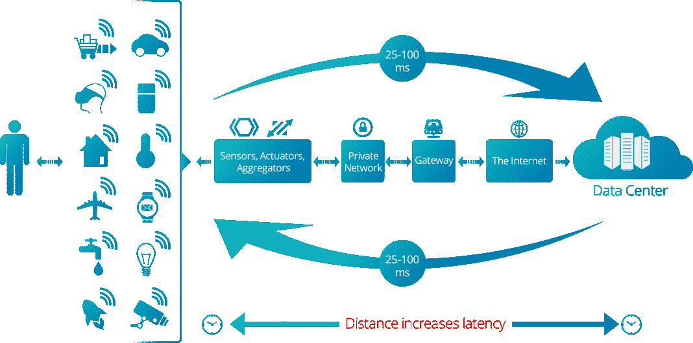

# Vapor IO 和边缘计算的新兴市场

> 原文：<https://thenewstack.io/vapor-io-emerging-market-edge-computing/>

我们对数据中心的理解一直在变化。我们已经看到了远离旧的大型整体砖块和砂浆结构的趋势，并看到了更小外形的新表现。

我们现在看到它随着 [Vapor IO](https://www.vapor.io/) 的 Project Volutus 更进了一步，该公司声称这是一个面向云提供商、移动运营商和大型企业的“数据中心平台”。

Volutus 项目基于 Vapor IO 的机架系统[蒸汽室](http://www.vapor.io/edge/)，加上开源遥测系统 OpenDCRE。新产品还部署了英特尔的 [FlexRAN](https://wiki.emulab.net/wiki/phantomnet/FlexRAN) 软件定义的无线接入网络平台，以实现可扩展性。

Vapor IO 的首席执行官科尔·克劳福德说简单是关键。“我们的蒸汽室是完全独立的，可以放置在恶劣的环境中，例如基站发射塔。它们像乐高积木一样组装在一起:一个三人小组可以在半天内建立一个微型数据中心。我们的 Vapor 软件使远程运行数千个边缘数据中心成为可能。”

OpenDCRE 软件可以作为服务在任何地方运行，为客户提供一个通用的 API 来分析和控制他们的基础设施。

作为系统如何工作的一个例子，Crawford 使用了云提供商的例子，该提供商有四个数据中心(两个在东海岸，两个在西部)，垂直管理，但没有内置智能。在这些地理区域之外，用户将面临延迟问题。

“就像空中旅行一样:要想去任何地方，我必须先飞到一个枢纽，然后到达目的地——互联网也是如此。即使是光速，也有内在的延迟，”他说。

作为对该技术的认可，共享无线基础设施提供商 [Crown Castle](http://www.crowncastle.com) 持有 Vapor IO 的少数股份。在一份声明中，Crown Castle 高级副总裁 Phil Kelley 表示:“边缘计算将成为每个人都在谈论的应用的关键推动者，包括自动驾驶、物联网、增强和虚拟现实以及 5G。我们相信，我们大约 40，000 个基站位置和大型城域光纤覆盖区的组合是 Volutus 成功部署的理想选择。”

从表面上看，这种技术似乎与内容交付网络(CDN)提供商走在同一条路上，但科尔表示情况并非如此。“我们将 CDN 提供商视为客户。即使是一个大型的 CDN 网络也将受益于我们的最后一英里无线网络，我们正在与主要的 CDN 公司就在我们的设施中共同放置他们的设备进行谈判，以将他们的 CDN 扩展到无线网络的真正边缘，”他说。

克劳福德补充说，这两种技术非常不同。“cdn 经过优化，可以单向(向终端设备)交付静态内容。虽然一些 cdn 提供动态内容交付，但它们并不意味着要取代云服务。”

除了与 CDN 公司合作，我们还与大型云提供商和其他网络规模的公司合作。我们使得在边缘运行整个云堆栈成为可能，而不仅仅是 CDN 内容服务功能。这使得开发人员和运营商能够从运行在我们边缘位置的集中式服务器上卸载真正的云计算。"

Project Volutus 在每个位置都有数百千瓦的计算能力，使在边缘运行数据中心规模的工作负载成为可能，可以在 GPU 上进行从物联网数据摄取到分布式机器学习的一切工作。

根据 Vaper IO 的说法，移动设备的计算可以在网络边缘以更低的延迟完成，而不是在数据中心。

Quocirca 的高级分析师 Clive Longbottom 质疑 Project Volutus 是否能应付如此大的工作量。“移动广域网面临着被大量数据淹没的风险，这些数据不仅来自手机，还来自可穿戴设备、家用设备和其他无线连接设备。如果允许来自基站的所有流量不受控制地通过中心，那么 5G 的几百兆吞吐量的承诺将会消失在稀薄的空气中，因为聊天式的物联网数据会吸收所有流量。”

然而，克劳福德说，该系统是为处理大量交通而设计的。“可以在边缘获取和处理的数据量取决于许多因素，包括开发人员运行的软件堆栈和他们连接的现场设备类型，这些都是客户特定的，我们对此没有发言权。然而，我们的系统将能够处理比现在多几个数量级的数据量和设备。”

克劳福德说，目前，Volutus 只针对美国，尽管有扩张的计划。在美国，该项目的早期接入计划将于今年晚些时候在两个城市展开。

<svg xmlns:xlink="http://www.w3.org/1999/xlink" viewBox="0 0 68 31" version="1.1"><title>Group</title> <desc>Created with Sketch.</desc></svg>