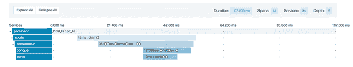
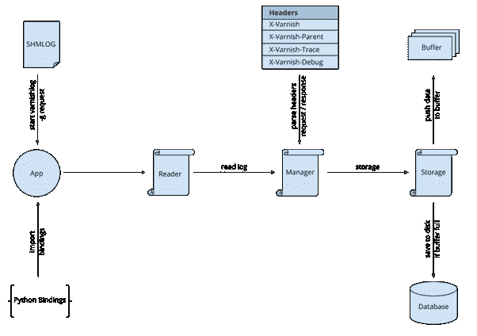

# Varnish 利用 Zipnish 深入研究微服务监控

> 原文：<https://thenewstack.io/varnish-delves-into-microservice-monitoring-with-zipnish/>

Varnish Software 希望在新兴的微服务领域占据一席之地，它发布了一款监控工具，使用其同名的缓存服务器软件来帮助运行基于微服务的快速工作负载。

该软件名为 [Zipnish](https://github.com/varnish/zipnish) ，为管理员提供了一组瀑布式的图表，大大简化了查明缓慢或不可操作的微服务的过程。它可以处理无状态服务，或者那些运行在容器中的服务。

Varnish 的创始人兼首席技术官佩尔·帕尔在[发布该软件的博客文章](http://info.varnish-software.com/blog/an-introduction-to-zipnish)中写道，该软件的想法来自 Varnish 的用户之一，挪威媒体公司 Amedia。

大约十年前，Amedia 将其基础设施重新设计为基于微服务的方法，当时 Docker 甚至还没有在 Solomon Hykes 的眼中闪闪发光。该公司没有使用容器，而是使用了无状态服务，这种服务可以根据需要扩展或缩小，并且在空闲时不需要太多的服务器空间。

为了支持这种有点新颖的架构，该公司采取了不同寻常的措施，使用 Varnish 作为跨不同服务的通信中心。Varnish 的 Varnish Cache 是一个广泛使用的开源 HTTP 引擎，尽管到目前为止它还没有在许多微服务架构中使用。Varnish 还提供[商业版](https://www.varnish-software.com/products/varnish-plus)。

“他们决定在他们的微服务中间涂上清漆。帕尔写道:“微服务不是直接相互对话，而是将它们连接到清漆，清漆将代理这些连接。”。

使用缓存软件作为代理有很多立竿见影的好处。最值得注意的是，端点不依赖于特定的其他在线端点。Varnish 可以配置为定期探测端点，并在主节点离线时将流量重定向到备份。它还消除了建立服务目录的需要，因为 Varnish 本身提供了这种能力。

Zipnish 是作为一种检测迟缓服务的方式出现的。偶尔有 50 毫秒延迟的服务，或者甚至不响应少量请求的服务，可能会降低整体操作速度。在 Varnish 的帮助下，Zipnish 可以很容易地找到有问题的服务。

该软件基于 Twitter 开发的分布式追踪工具 Zipkin T1。Varnish 人员重写了 Twitter 基于 Scala 的工具，使其不依赖于 Java 虚拟机，从而可以通过 Varnish Cache 4.0 中引入的 Varnish 日志 API 利用 Varnish 收集的数据。

Zipnish 的系统级视图

“既然在微服务架构中使用 Varnish 已经有了令人信服的理由，而且从性能角度来看，登录 Varnish 是免费的，为什么不利用它呢？帕尔写道:“Varnish 可以在端点的一点点帮助下，知道每个请求需要多长时间，哪些服务调用依赖于要完成的其他调用，在执行这个调用期间发生了什么特殊情况以及其他一些数据点。”

Zipnish 可以在 FreeBSD 许可下获得。该公司将于 1 月 13 日举行一场关于 Zipnish 的介绍性网络研讨会。

特征图片:[飞行中的红隼](https://www.flickr.com/photos/andymorffew/18388125194/in/photostream/)由[安迪·莫菲](https://www.flickr.com/photos/andymorffew/)制作，获得 [CC GA 2.0](https://creativecommons.org/licenses/by-nd/2.0/) 许可。

<svg xmlns:xlink="http://www.w3.org/1999/xlink" viewBox="0 0 68 31" version="1.1"><title>Group</title> <desc>Created with Sketch.</desc></svg>