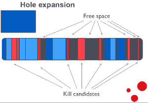
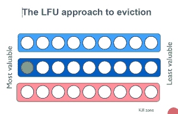

# Varnish 现在为大型数据集提供缓存持久性

> 原文：<https://thenewstack.io/varnish-overhauls-storage-engine-faster-video/>

随着基于网络的视频和照片共享的爆炸性使用，公司已经发现扩展内存是低效的。考虑到这一点， [Varnish 软件](http://www.varnish-software.com/)最近推出了 Varnish [海量存储引擎(MSE) 2.0](https://www.varnish-software.com/plus/massive-storage-engine) 。

Varnish 是一个用于大型 Web 站点的开源 HTTP 加速器，新的 MSE 模块提供了一种缓存大量数据的方法，如果系统崩溃，可以快速重新加载。

“视频会消耗内存，”Varnish 软件的创始人兼首席技术官帕斯·帕尔在最近于三藩市举行的 [Varnish 峰会](https://www.varnish-software.com/events)上解释道。此外，当系统移动到 TB 或 petrabytes 存储时，为千兆字节工作负载设计的内存分配在高压下是不可靠的。

帕尔认为，市场发生了巨大的变化。Varnish 客户和市场中的其他人现在正从内容分发网络管理公司(cdn)转向管理他们自己的内容分发。

清漆正在帮助他们实现这一转变。例如，提供海量视频分发的 Twitch 正在内部分发视频。特斯拉和 Pinterest 都出席了峰会，它们运营着自己的 cdn。

Varnish 既适用于传统的 CDN，也适用于进入这个领域的公司。“如果有一场 CDN 战争，你不想参战，你想成为武器供应商，”帕尔解释说。

基于 [Varnish API](https://thenewstack.io/varnish-api-engine-focuses-on-performance-amid-heavy-traffic/) ，Varnish 工程师发现传统文件和 malloc 后端的伸缩问题导致了严重的性能下降。进入 MSE，它关注三个基本领域:

*   防碎片分配算法
*   由于 LRU(最近最少使用)被 LFU(最少使用)取代，缓存命中率更高
*   可选持久性数据存储

基于文件的内存存在性能和碎片问题；它使用内存映射，使进程保持同步读取。帕尔称同步读取“完全是浪费”，因为它将处理时间限制在系统的读/写能力之内。

清漆创造了一个过程，称为孔扩张。“Varnish 使用显式编写代码，然后在内核中使用水印系统进行分配，而不是使用内存映射进行隐式编写，”他解释道。这改变了限制因素 I/O 容量，而不是读/写容量，从而允许更快的响应时间。

“放在应用服务器前面，非常简单，因此速度也快了 200–1000 倍。因此，每次你将数据从缓存层移动到应用服务器，Varnish 将在 30-40 微秒内提供数据，而典型的缓存需要 10-20 毫秒，”帕尔说。

每天数百万的视频或照片浏览量。

## 孔扩张是如何工作的

在插入新对象之前，该算法将空闲空间组合成一个足够大的洞，以容纳新的缓存。

Varnish 工程师创建了一种算法来整合碎片化的空间，malloc 虚拟化分配，然后依靠内核来完成这项工作。这为新对象创建了一个连续的空间，以便完整地插入，而不是分割新对象。

帕尔说，这使得使用 Varnish 的系统可以运行多年，而不会积累内存碎片。"支离破碎的空间会减慢速度."

为了实现性能的圣杯，Varnish 不使用 SendFile，而 SendFile 被认为是缩放方面的行业标准，这在不久前给他们带来了一些严厉的批评。帕尔对批评不屑一顾。Varnish 不使用 SendFile，因为这是不必要的，因为一切都已经映射到内存中。使用 SendFile 会复制现有功能，并显著降低系统速度。

## LRU 对 LFU

传统的内存缓存使用 LRU 而不是 LFU。

配备“最少使用/最近最少使用的混合”缓存回收算法，在缓存中提供更智能的选择标准，以便在需要空间时自动回收最少访问的对象。

## 坚持

[MSE 2.0 的新增功能](http://info.varnish-software.com/blog/varnish-mse-persistence)是使用持久性的选项。帕尔说，这几乎没有增加开销，但在崩溃恢复时间的好处是令人印象深刻的。

“如果服务器崩溃，在内存中重建内容会花费大量时间。帕尔说:“虽然内容越来越多，但性能却受到了影响。“我们在 Varnish Massive Store Engine 2.0 中添加了持久性，以确保我们的用户能够尽快修复和维护他们的网站。”

请注意，这不是一个放之四海而皆准的解决方案。帕尔说，这只对中型和大型客户有意义。“这就像一个本地的面包店，”他说，“如果你不管理万亿字节的数据，你就不需要那么多软件。”

<svg xmlns:xlink="http://www.w3.org/1999/xlink" viewBox="0 0 68 31" version="1.1"><title>Group</title> <desc>Created with Sketch.</desc></svg>