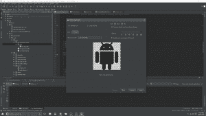

# 矢量图像来到 Android:开发者需要知道什么

> 原文：<https://thenewstack.io/vector-images-come-android-devs-need-know/>

令许多新 Android 开发者困惑的事情之一是如何在他们的应用程序中支持多种屏幕尺寸。当它被设计时，Android 被设计成可以在许多具有不同屏幕尺寸、显示分辨率和像素密度的设备上运行。应用程序开发人员必须考虑这些差异，以便在所有设备上创建一致的用户体验。

事实上，Android 中表示图像的方式一直是使用位图。位图将图像表示为网格中的一组像素。虽然位图提供了更好的性能，但由于构建和渲染矢量图像的计算成本，它们在图像可伸缩性方面也有严重的限制。位图图像在较小的设备屏幕上可能看起来很棒，但在较大的设备上放大时质量会明显下降。

在 Android 中，这个问题的典型解决方案是创建具有不同 dpi(每英寸点数)值的图像的多个版本，以支持应用程序将在其上运行的设备的不同屏幕尺寸和密度。不幸的是，这种方法会导致额外的时间和精力来创建额外的资产，并且应用程序的 apk 文件(和设备)会占用更多的空间来存储这些资产。

在 Android Lollipop ( API level 21)中，Google 最终包含了对矢量图像资产的原生支持，允许图像以几何形式表示为一组点、线和曲线，以及它们相关的颜色信息。矢量绘图解决了这个问题，因为您只需在 XML 文件中创建一次图像，并利用其在不同设备的所有显示密度上的可扩展性。这不仅节省了文件空间、开发时间和精力，还简化了应用程序的维护。这种效果在创作动画时被放大；您可以只使用 XML 文件，而不是针对不同的显示密度使用多个系列的位图图像。

## 没有 SVG 给你

在 Android API 版本 21 (Lollipop)之前，矢量图像表示必须手动完成，或者通过使用各种第三方库来处理可缩放矢量图形(SVG)。SVG 是许多平台的默认矢量图像表示格式，自 1999 年以来由万维网联盟(W3C)开发。Android 目前仍然不支持 SVG 格式(尽管阅读下面的内容可以了解使用 Google 的 Vector Asset Studio 的解决方法)。

虽然我无法从 Android 团队找到关于缺乏对 SVG 支持的官方说法，但可以合理地假设他们不愿意接受该标准可能是因为，至少部分是因为性能问题。相对于移动设备的有限内存，SVG 文件可能会很大，并且它们的解析和光栅化可能会在运行在有限功率上的功能较弱的移动处理器上导致问题。

尽管 Android 似乎不会很快支持 SVG，但有许多开源库允许开发人员在 Android 上使用 SVG 文件，如 [AndroidSVG](https://github.com/BigBadaboom/androidsvg) 库。Android 在 Lollipop 和新版 Android(最新版本是 [Android Marshmallow](https://www.android.com/versions/marshmallow-6-0/) )中对图像进行矢量化的解决方案是`VectorDrawable`和`AnimatedVectorDrawable`类。我建议不要在你的 Android 应用中使用 SVG 格式，而是考虑用 Android Studio 1.4 中发布的 [Vector Asset Studio](http://android-developers.blogspot.ca/2015/09/android-studio-14.html) 将你的 SVG 文件转换成 VectorDrawables。

[https://www.youtube.com/embed/wlFVIIstKmA?feature=oembed](https://www.youtube.com/embed/wlFVIIstKmA?feature=oembed)

视频

### 矢量绘图

API level 21 中引入的`[VectorDrawable](https://developer.android.com/reference/android/graphics/drawable/VectorDrawable.html)`类允许你使用 XML 文件定义一个静态的可绘制对象。作为`Drawable`类的子类，你可以很容易地将 VectorDrawables 集成到你之前任何使用 Drawables 的代码中，但是注意，由于`VectorDrawable`类只在 Lollipop 中引入，所以它只适用于运行 Android 5.0 及以上版本的设备；Android 的支持库中目前还没有`VectorDrawable`类的实现。VectorDrawables 与 SVG 格式有一些相似之处，使用包含其 *moveto、line、curve、arc* 和 *closepath* 指令的`<path>`元素。`android:pathData`属性使用与 SVG 路径数据中的“d”属性相同的格式。要创建一个`VectorDrawable`，其形状的细节必须在一个`<vector>` XML 元素中定义。

### 动画矢量图

Lollipop 中为矢量图形支持引入的另一个类是`[AnimatedVectorDrawable](https://developer.android.com/reference/android/graphics/drawable/AnimatedVectorDrawable.html)`。就像`VectorDrawable`类一样，`AnimatedVectorDrawable`扩展了`Drawable`，但并不是`VectorDrawable`的子类。`AnimatedVectorDrawable`允许你制作一个`VectorDrawable`的动画属性来创建一个动画 drawable。不太可能的 VectorDrawables 只需要一个 XML 文件，`AnimatedVectorDrawable`对象通常需要一个用于`AnimatedVectorDrawable`的 XML 文件，但也需要另外两个文件，一个用于正在制作动画的`VectorDrawable`，另一个用于动画制作人员(一个`ObjectAnimator`或`AnimatorSet`)。和`VectorDrawable`类一样，目前还没有`AnimatedVectorDrawable`类的 Android 支持库实现。

## 矢量资产工作室

在 Android Studio 1.4 中，谷歌增加了一个新工具来更好地支持矢量资产，即[矢量资产工作室](https://developer.android.com/tools/help/vector-asset-studio.html)。通过此功能，导入 SVG 文件变得更加容易，现在您可以使用软件提供的任何材质设计图标矢量资源。Vector Asset Studio 使用 SVG 文件中的数据或 Google material design specification 提供的材质图标为您的 VectorDrawable 生成一个 XML 文件。

尽管 Vector Asset Studio 支持 SVG 格式的基本标准，但它目前并不支持所有的 SVG 功能，这是您在导入文件时应该记住的一点。如果在导入过程中遇到错误，请简化您的 SVG 文件，然后重试。

## 向后兼容性

由于带有`VectorDrawable`和`AnimatedVectorDrawable`类的 vector asset 支持只是在 13 个月前发布的 Android Lollipop 中添加的，它并不被绝大多数 Android 设备直接支持。大多数 Android 开发人员支持低于版本 21 的最低 API 级别，因此需要为旧设备提供额外的矢量资源支持。

虽然 Android 团队没有对矢量资产的官方支持库，但 Vector Asset Studio 可以在构建时为各种像素密度生成合适的 PNG 文件。要启用此功能，您必须使用版本 1.4.0-beta3 的 Gradle Android 插件(或更高版本，版本 1.5.0 是最新的稳定版本)。请注意，存在一些限制；目前不支持`<group>`和`<clip-path>`元素，并且您的 XML 矢量文件不能包含对要生成的 PNG 文件的其他资源文件的引用。

如前所述，目前存在许多第三方库，使开发人员能够直接处理 SVG 文件，但也有一些工具使前 Lollipop 设备能够处理 VectorDrawable XML 文件。Wael Nafee 的 [vector-compat](https://github.com/wnafee/vector-compat) 库是一个开源项目，增加了对 Android API 版本 14 之前的棒棒糖设备的`VectorDrawable`和`AnimatedVectorDrawable`支持。该库还智能地依靠官方的`VectorDrawable`和`AnimatedVectorDrawable`在装有 Lollipop 或更高版本 Android 的设备上实现。

由于 Android 主要是一种移动设备操作系统，旨在运行在功率、内存和处理速度有限的设备上，因此在选择使用矢量资产之前，应考虑许多因素。VectorDrawables 最适合更小、更简单的图像，比如图标。如果您的图像很大或非常详细，PNG 或 NinePatch 图像可能更适合。Android Developer reference 建议将矢量图像的最大分辨率限制在 200 x 200 dpi，因为矢量图形的初始加载可能相对昂贵，导致绘制时间较长。

<svg xmlns:xlink="http://www.w3.org/1999/xlink" viewBox="0 0 68 31" version="1.1"><title>Group</title> <desc>Created with Sketch.</desc></svg>