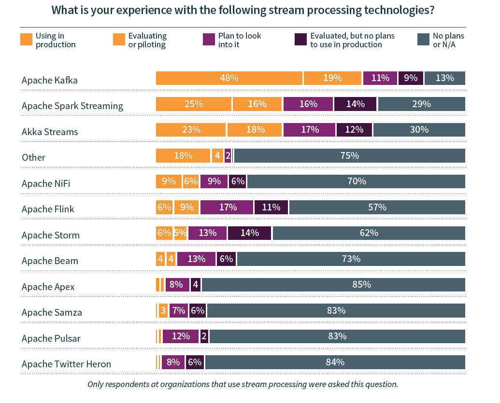
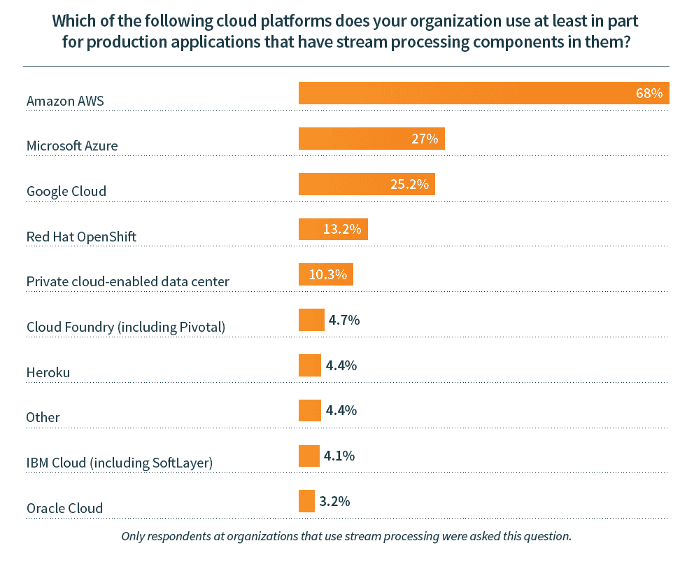

# 供应商争夺流处理技术的用户

> 原文：<https://thenewstack.io/vendors-compete-for-users-of-stream-processing-technologies/>

企业正在采用来自云提供商和更专业的供应商的商业流处理产品。事实上，根据新的堆栈和 Lightbend 最近的[调查](https://thenewstack.io/your-new-use-cases-require-streaming-data-now-what/)，在应用程序中使用流处理的公司中，至少有 54%在生产中使用供应商的流处理产品或服务。在被询问的供应商中，平均有三家(2.8 家)正在生产中使用，或者正在由拥有实时流处理用例的公司进行积极评估/试点。随着越来越多利用流处理的应用程序进入生产环境，我们预计会有大量的供应商基于他们支持的开源技术以及他们如何将流处理捆绑到一个更大的平台上来展开竞争。请注意，这项研究不应用于计算市场份额，让我们深入研究数据。

开源技术是流处理栈的核心。事实上，83%拥有流处理应用程序的组织正在利用或积极评估/试验 Apache Software Foundation 项目来实现这种类型的功能。Apache Kafka 领先，三分之二的受访者使用或评估 Kafka 的流处理应用程序，但这是针对包括流处理以及发布/订阅和存储的[功能](https://kafka.apache.org/)。由于 Kafka 通常只是作为流处理栈的一部分使用，所以根据用例需求，其他技术还有很大的利用空间。

来源:流数据和未来技术栈。n≈429。这个图表不应该用来计算市场份额，因为 a) Lightbend 的社区可能被过度采样，b)没有询问像 Confluent 这样的卡夫卡专家。

鉴于其支持特定开源技术的传统，Lightbend (Akka)、Cloudera/Hortonworks (Hadoop)和 Databricks (Spark)在用户路线图上显示突出就不足为奇了。在使用或积极评估 Akka 流的人中，66%也在使用或考虑 Lightbend 对于 Spark Streaming，Databricks 让 35%的技术用户/评估者至少也对其产品进行评估或试点。对于集成了 [Hadoop](https://thenewstack.io/concern-about-state-lessens-as-more-applications-use-stream-processing/) 作为数据流来源的公司，38%的公司正在使用或评估 Cloudera。请注意，提供 Kafka 托管或支持版本的几家公司没有包括在调查问卷中。鉴于它的突出地位，我们预计合流也将看到那些与现有 Kafka 部署的强烈考虑。

随着不同程度的成功，大型云提供商也通过提供托管开源和专有技术的组合来赢得客户。AWS 是领先的供应商，有 22%的用户使用其产品，包括 Kinesis 和最近添加的托管 Kafka 服务。这种领先地位部分是由于该公司在云计算市场的主导地位；三分之二的公司表示，他们至少有一个流处理应用程序将 AWS 作为其堆栈的一部分。在这一群体中，37%的人实际上正在使用该公司的流处理产品。谷歌也做得不错；尽管 25%的流处理用户将 Google 作为其堆栈的一部分，但该群体中有 45%的用户正在为生产应用程序部署类似 Dataflow 或 Dataproc 的产品。Azure 不太成功，这些云客户中“只有”18%选择像 Event Hubs Stream Analytics 这样的微软服务。从积极的方面来看，Azure production 的使用在那些拥有物联网用例的人和那些预计明年多个数据流的集成将成为前沿和中心的人中尤为强劲。

下面的图表也被用来写这篇文章。我们鼓励您阅读完整的"[流数据和未来技术堆栈](https://www.lightbend.com/white-papers-and-reports/survey-streaming-data-future-tech-stack)，以获得更多见解和分析。一如既往，新的堆栈将解释开源技术是如何部署的，无论是自托管还是托管服务。

来源:流数据和未来技术栈。n≈410。除了前三项技术之外，Apache 的 Flink、Beam、NiFi、Pulsar 和 Storm 都受到了高度重视。

来源:流数据和未来技术栈。n=341。

通过像素的特征图像。

<svg xmlns:xlink="http://www.w3.org/1999/xlink" viewBox="0 0 68 31" version="1.1"><title>Group</title> <desc>Created with Sketch.</desc></svg>