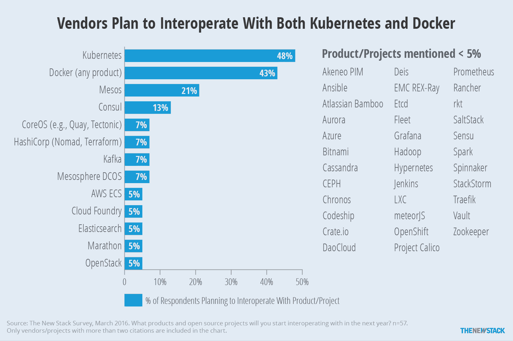

# TNS Research:致力于 Kubernetes 互操作性的供应商

> 原文：<https://thenewstack.io/vendors-working-towards-k8s-docker-interoperability/>

今年，似乎每个人都在追随 T2 的潮流。apprenda[收购 Kismatic](https://thenewstack.io/apprenda-acquires-kismatic-launches-kubernetes-distro/)只是一家公司将生产工作负载部署到支持 Kubernetes 的基础设施上的最新举措。然而，Kubernetes 的崛起并不意味着这个开源容器编排引擎赢得了商业主导地位的战争。

在去年对 48 家与集装箱相关的公司进行的调查中，New Stack 发现 Docker 处于单极世界中，43 名受访者中有 42 人要么目前与 Docker 合作(60%)，要么计划在未来与该公司合作(37%)。

今年，我们进行了一项[新调查](https://thenewstack.io/ebookseries/)，向最终用户和供应商询问了关于容器编排的问题。结果表明，48%为供应商工作的受访者表示，他们的公司计划在明年开始与 Kubernetes 互操作，43%的受访者表示 Docker 也是如此。这个结果并不是说 Docker 已经失去了它的中心地位，而是说 Kubernetes 已经到来。

Kubernetes 现在加入 Docker，成为供应商互操作性计划的一部分。

新的调查关注于容器编排，而不是更广泛的容器生态系统。如果我们只是狭隘地看一下谷歌关于容器编排的搜索，它正在击败 Docker Swarm 以及 Apache Mesos 和 [Cloud Foundry](https://www.cloudfoundry.org/) 。然而，从搜索量来看，更多的是衡量热门程度，而不是实际采用程度。考虑到更广泛的容器生态系统，人们一直在争论 Mesosphere、AWS、CoreOS 和 CloudFoundry 在重要性方面是否可以与这两个领导者匹敌。如何衡量重要性值得商榷，但要求与你的公司合作总是一件好事。

[cyclone slider id = " ebook-3-赞助商"]

另一个需要考虑的警告是，调查问题只询问“新的”互操作性。换句话说，Docker 仅出现在 43%的供应商回应计划中的原因是因为许多公司在 2016 年之前就开始与它进行互操作。

## **这是什么意思？**

我们无法预测未来，也不知道谁会赢得容器编排大战。然而，显而易见的是，企业正在用新一轮风险投资来武装自己。新的 Stack 预计将报道许多公司与 Kubernetes 以及 Docker 最新集成的公告。一长串插件和合作伙伴本身并不能表明谁将是市场的赢家。然而，创造可操作的产品和服务需要资源，人力资源。因此，我们希望看到开发者和人才的竞争。

虽然我们不知道任何 M&A 的计划(我们可以公开谈论)，但我们知道有几家较小的公司有实现容器环境的经验。就像 Kismatic 一样，随着服务提供商开始实际销售他们的新容器服务，他们将会很受欢迎。Jetstack 和[集装箱解决方案](http://container-solutions.com/)是两家可以提供帮助的集装箱部署咨询公司。此外，尽管如果像 [CoreOS](https://coreos.com/) 这样的公司不能凭借其捆绑解决方案获得主导地位，围绕开源项目成立的公司可能会转变为各种系统集成商。

[CoreOS](https://coreos.com/) 、 [Cloud Foundry](https://www.cloudfoundry.org/) 和 [Docker](https://www.mirantis.com/software/docker/kubernetes/) 是新栈的赞助商。

专题图片:爱尔兰国家图书馆:“[开着他们的汽车](https://www.flickr.com/photos/nlireland/8571539286/)”(细节)。

<svg xmlns:xlink="http://www.w3.org/1999/xlink" viewBox="0 0 68 31" version="1.1"><title>Group</title> <desc>Created with Sketch.</desc></svg>