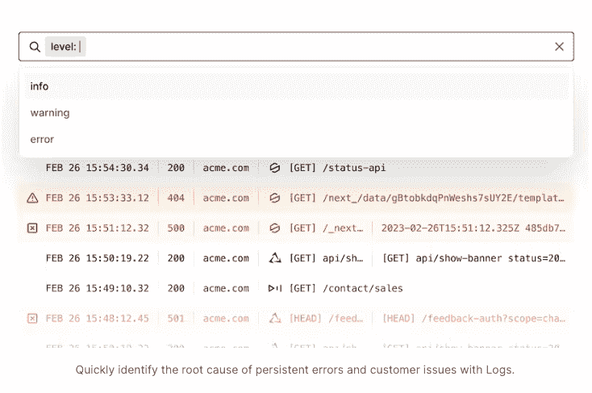

# Vercel 将日志记录和监视功能引入到它的 Observability 套件中

> 原文：<https://thenewstack.io/vercel-brings-logging-monitoring-to-its-observability-suite/>

前端平台提供商 [Vercel](https://vercel.com/) 更新了其[可观察性套件](https://vercel.com/blog/introducing-monitoring)，包括开箱即用和定制监控及日志记录等新功能。Vercel 首席技术官 [Malte Ubl](https://www.linkedin.com/in/malteubl/) 在发布前与新堆栈坐下来讨论新的监控功能。

“这是一个简单的产品，但非常重要，因为它可以帮助你确保你的服务是稳定的，你可以理解和解决问题，”Ubl 说。

当涉及到查询数据以获得特定见解时，Vercel 挖掘了一些有影响的领域，如“从技术角度来看，我的网站发生了什么？”“我看到了什么错误？”，以及“我在发送缓存响应吗？”

其他内置队列类别包括:

*   带宽和流量峰值
*   请求路径上的性能下降
*   特定部署导致 500 个错误

但是并不是所有的东西都适合现成的查询。正是出于这个原因，Vercel 创建了自定义查询编辑器。Ubl 将编辑器的使用描述为“人们基本上也可以使用类似 SQL 的语言编写自定义查询。”

编辑器与 SQL 的相似之处在于查询相当简单，但不同之处在于编辑器使用纯文本，这意味着不需要额外的编码语言。

在所有可用的特性中，Ubl“个人对新的日志体验感到非常兴奋。”

日志界面。

不同的订阅级别获得不同的覆盖层。帐户级别越高，他们获得的日志保留就越多，最低层仍然有先进先出机制，这意味着他们仍然可以始终看到最新的日志。

Ubl 说，为每个人启用日志的目的是因为他们“希望人们说好吧，你有问题，你应该能够看到发生了什么”。

日志对 Vercel 来说并不新鲜，尽管这是第一个对所有用户可用的版本，而不仅仅是高级用户，已经有时间解决这个问题了。Ubl 对产品很有信心。Ubl 说:“我们已经专门为企业客户使用它有一段时间了，所以我们在人们如何使用它方面有很多经验。”

Vercel 并没有把它的 observability suite 作为其他监控整个堆栈的工具的替代品。它更像是一个补充工具。“比如说，你有非常充分的理由想要覆盖整个堆栈，但[这个可观察性堆栈]证明非常有价值，可以让你更好地了解[Vercel]的情况。”

Ubl“对人们尝试它感到兴奋”，他说“[客户]希望我们也在这个领域做得更多”，尽管没有宣布未来的产品或发布日期。

<svg xmlns:xlink="http://www.w3.org/1999/xlink" viewBox="0 0 68 31" version="1.1"><title>Group</title> <desc>Created with Sketch.</desc></svg>