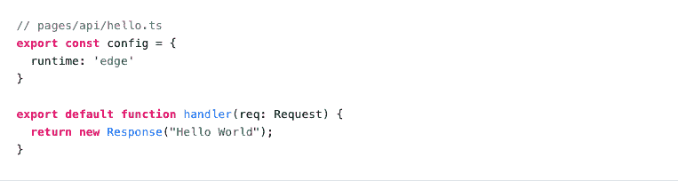

# Vercel 将无服务器功能带到了边缘

> 原文：<https://thenewstack.io/vercel-brings-serverless-functions-to-the-edge/>

前端开发工具提供商 [Vercel](https://vercel.com/about) 发布了一个中间件库，名为 new Edge Functions，它在[亚马逊网络服务](https://aws.amazon.com/?utm_content=inline-mention)上提供功能的自动全球部署。

[边缘函数](https://vercel.com/blog/edge-functions-generally-available)是用 [JavaScript](https://thenewstack.io/2022-a-golden-year-as-javascript-moves-to-the-edge/) 、 [TypeScript](https://thenewstack.io/what-typescript-brings-to-node-js/) 或 [WebAssembly](https://thenewstack.io/should-webassembly-get-a-paas/) 编写的函数的无服务器实例(允许你从其他语言引入函数)。对于边缘功能，部署在全局边缘网络上是默认的。冷启动发生得更快，并且仍然有虚拟机隔离，但是新的架构导致更低的延迟。

自从今年早些时候测试版发布以来，Vercel 的 Edge 网络已经经历了超过 300 亿次 Edge 函数调用。在一项涉及图像生成的测试中，edge APIs 返回结果的速度比热的无服务器函数快了近 40%,而成本却只是后者的一小部分。

Vercel 的首席技术官 [Malte Ubl](https://www.linkedin.com/in/malteubl/) 与新的堆栈坐下来讨论 Edge 功能。

## **什么是边缘函数？**

Edge 函数是 Next.js、Nuxt、Astro 和 SvelteKit 支持的中间件函数，也是在 Vercel CLI 中作为独立函数创建的。

边缘函数的默认设置是在最靠近请求的区域运行，目标是降低延迟。它们在缓存之后运行，可以缓存和返回响应，这使它们成为获取数据或重写的可用解决方案。

定价模式是按每次调用 50 毫秒的 CPU 时间计费的。这意味着计费是基于执行计算操作所花费的时间，而不是等待数据提取所花费的时间。

## **全球部署**

Ubl 说，全球部署无服务器功能的一个原因是“它非常昂贵”。如果这是优先考虑的问题，那么这也是选择无服务器选项时需要权衡的因素之一。他继续说道，“通常情况下，您只会在全球范围内的单个数据中心进行部署。你可以[部署]在多个[数据中心]中，但这种情况很少见。”

但是，成本本身并不是进入边缘网络的唯一障碍。理解构建和维护全球边缘网络的复杂性通常比添加中间件更复杂。Edge Functions 旨在为其客户弥合差距。

AWS 在 Edge 功能方面的唯一角色是网络基础设施提供商，因为 Ubl 确认 Vercel 正在“自行终止 AWS 网络内的流量。“但 Vercel 并没有使用 AWS 基础设施内的所有可用数据中心，因为 Ubl 解释说，全球有大约 12-20 个数据中心的数据中心“最佳点”,当利用这些数据中心时，将为所有用户提供大约 10 毫秒的延迟，同时维护网络安全。

对于这一点，Ubl 解释说，并非每个数据中心都是平等的，“在[不可信]位置运行缓存可能没问题，但您不一定希望您的计算机在那里。”为了简单起见，Vercel 提供了大约 15 个 Edge 函数的位置，可以在这里找到

默认部署在离发出请求的应用程序用户最近的区域。数据中心越近，延迟越短。除非应用程序需要使用数据库，否则这通常会进行跟踪。对于这些情况，GA 发布的新特性区域部署允许开发人员将功能绑定到特定区域(即数据库执行计算操作的区域)。

## **冷启动问题解决**

**一个不可思议的特性是可以缩减到零个实例，尽管对于用户来说可能感觉不到这一点，因为下次调用时必须重新启动这个函数。Vercel 在其架构中投入了大量工程力量，以最大限度地缩短冷启动时间。Ubl 将更快的冷启动定义为“我们谈论的是边缘功能上几十毫秒的冷启动时间，而不是无服务器的几百毫秒的冷启动时间。”**

 **更好的是没有冷启动。在 beta 和 GA 之间，Vercel“大大提高了产品健康的性能，”Ubl 在解释冷启动实例的减少时表示。“我们现在在路由收到的传入流量方面做得更好了，因此我们减少了调用未预热的函数的时间。”

## **建筑**

在更传统的无服务器基础设施(如 AWS Lambda)中，每个函数都有一个 microVM，里面有一个启动节点。隔离层(处理请求的层)位于启动节点的内部。每个功能都由三层隔离组成，都需要 RAM，并且都有相关的成本。

Edge Functions 的基础架构仍然包括保护客户免受潜在伤害所需的隔离层，但它只包括实例的最内部部分，即虚拟机隔离。这对于冷启动非常有帮助，因为只需要旋转一层隔离层。基础设施设计是效率和成本双赢的源泉，因为当请求到达时需要的工作更少。

## **未来的路线图**

前面还有工作要做。增加 Node.js 兼容性是投资的主要领域之一。可观察性和错误报告目前也正在扩展。任何新版本的发布日期尚未公布。

<svg xmlns:xlink="http://www.w3.org/1999/xlink" viewBox="0 0 68 31" version="1.1"><title>Group</title> <desc>Created with Sketch.</desc></svg>**