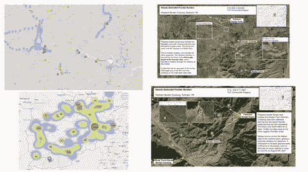
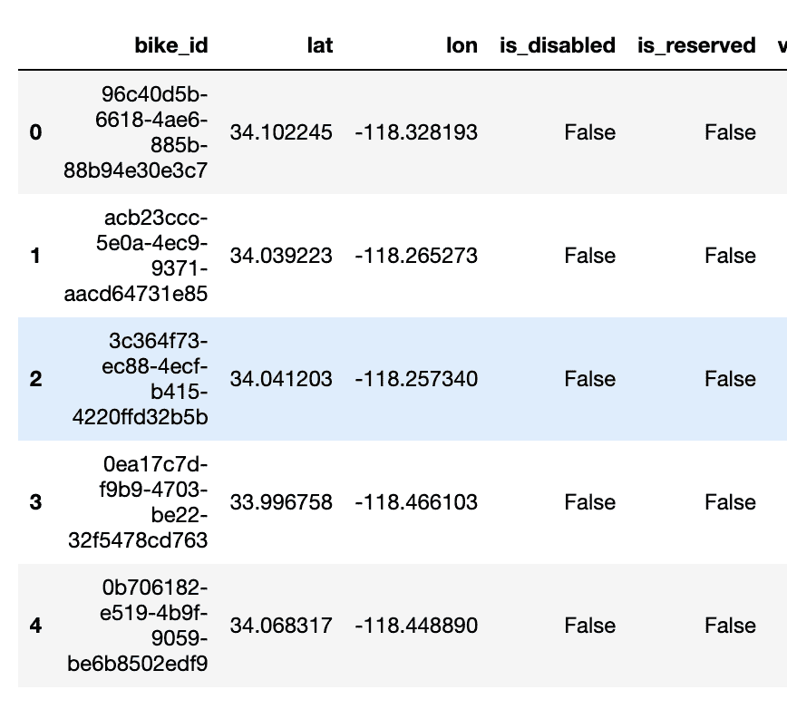
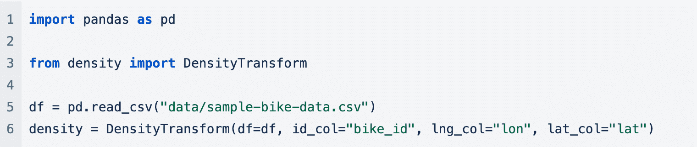
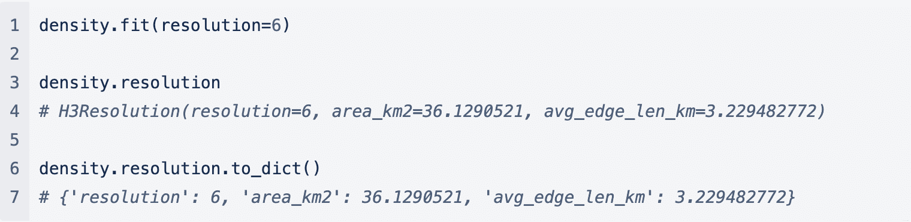
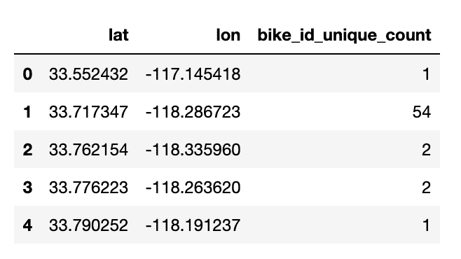
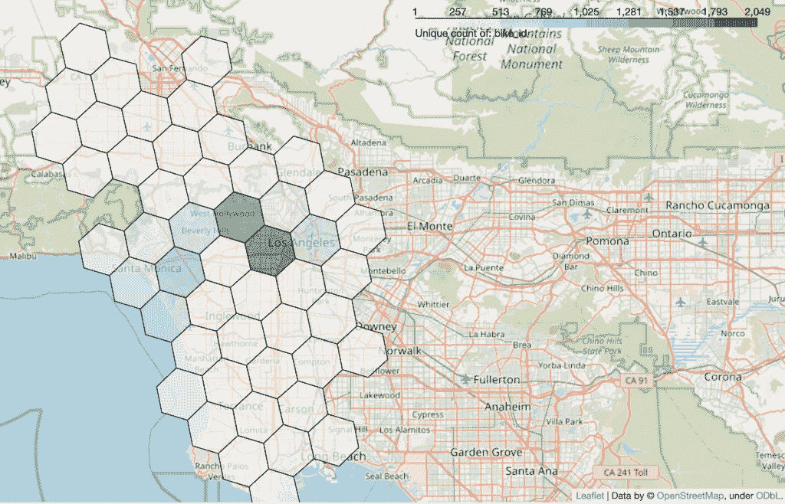
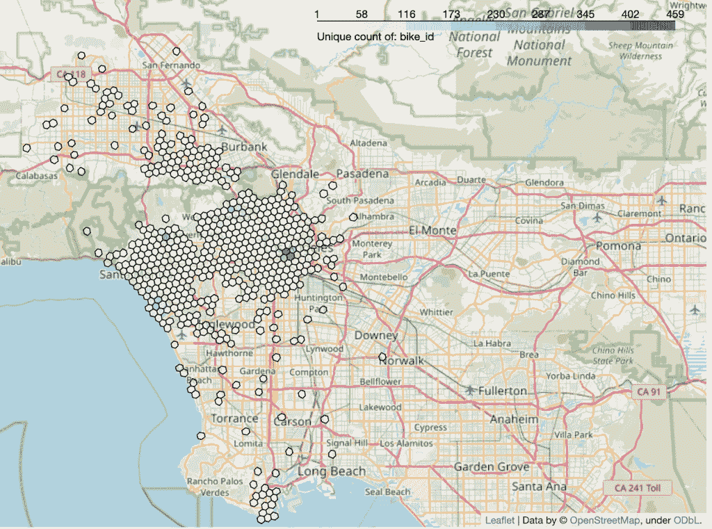
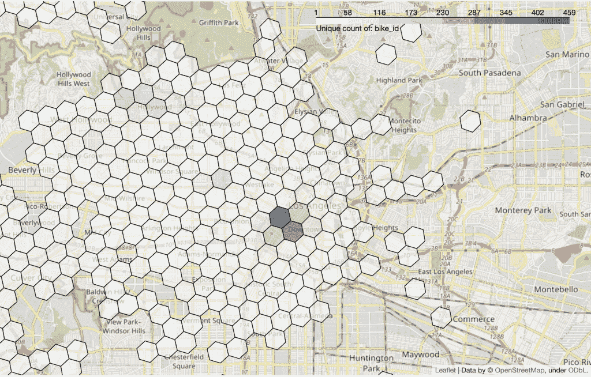

# 退伍军人节对开源和疏散行动的思考

> 原文：<https://thenewstack.io/veterans-day-reflections-on-open-source-and-evacuation-operations/>

[](https://www.Gretel.ai)

 [约翰·迈尔斯

约翰·迈尔斯是 Gretel.ai 的联合创始人兼首席技术官。Gretel 是隐私工程即服务和合成数据工具包的先驱，该工具包具有易于使用的 API 和开源的基于人工智能的核心，专为开发人员打造。](https://www.Gretel.ai) [](https://www.Gretel.ai)

自从离开军队后，我很幸运地与科技和创业行业的许多其他退伍军人一起工作，并与他们一起创办公司，包括 [Gretel](http://www.gretel.ai) 。今年退伍军人节，我想回顾一下我有机会与许多其他退伍军人一起工作并受益于开源软件社区正在构建的蓬勃发展的工具集的一系列具体事件。

2021 年 8 月中下旬，美国空军领导了历史上最大规模的非战斗人员撤离行动(NEO)。在两周多一点的时间里，大约 124 000 人从阿富汗空运撤离。我在空军服役超过 12 年，尽管在整个过程中充满了困惑和混乱，

知道空军在领导这项工作，我感到很自豪。在空军服役期间，我不是一名飞行员，但我确实坐过很多次 C-17 和 C-130，我想直到今天，我几乎更愿意乘坐美国空军的飞机，而不是其他航空公司的飞机。你的行李自由飞翔，真的出现了，而且[行李员](https://www.airforce.com/careers/detail/aircraft-loadmaster)不能容忍不守规矩的乘客。

我的妻子是一名美国退伍军人，精通多种语言，我和她一直盯着电视，在频道间切换，播放关于撤离的最新消息。加起来，我们在阿富汗度过了超过 24 个月。看着这一切展开，引发了很多回忆，讲故事，但更糟糕的是，一种无助感。

然后，突然之间，信息开始疯狂地涌入。当我们很快得知[各种退伍军人团体和非政府组织](https://www.politico.com/news/2021/09/09/white-house-afghanistan-evacuation-partnership-510815)正在组织团队来帮助汇总信息和细节，以帮助那些最有可能无法通过空运离开的人时，我们的信号应用程序通知就爆炸了。

任务是收集尽可能多的潜在地面渗透路线的公开来源情报，并提供给各个小组领导，以便他们可以将情报传递给仍在地面上的人。在接下来的 72 小时左右，我们把餐厅和厨房改造成了一个迷你操作中心，然后一头扎了进去。

我们称我们的各种努力为 GTFO 行动。

请求蜂拥而至:搜索任何和所有公开可用的信息，以确定道路沿线的塔利班检查站，利用可获得的卫星图像寻找潜在的疏散路线，分析无数基于位置的信息，以找到要避开的人和交通密度，目标是找到安全疏散路线，这些路线被发现受到威胁的可能性较低。

在这一点上，我做了任何正常的初创公司联合创始人都会做的事情，把我的另一位联合创始人拖入疯狂！我联系了 Alex，一个情报界和几次部署的老手，给了他大约 30 秒的概述，这就是全部了。然后他告诉他的一个密友，一个前军队情报官员发生了什么，他也一头扎了进去。

> 随着这些事件的展开，我们不断地评论当我们都服务时，能够做这种类型的工作对于日常技术人员来说是不可能的。感谢开源社区，现在你可以在几天内解决最困难的问题。

亚历克斯和我花了大部分时间试图理解各种基于位置的数据；我们真正需要做的是将位置数据聚合成各种密度，这样我们就可以将活动叠加到我们的主要通用操作图(COP)上，这基本上是一个共享的谷歌地图，启用了各种图层。我们与之交谈的另一个小组建议使用优步的六边形层次空间索引来做这件事，另一个小组建议使用 T2 的叶子来可视化。

一旦我们能够分析一些位置数据，我们就将 GPS 位置移植回我们的谷歌地图。最后，我们能够提取更新的卫星图像，以更好地了解潜在的越境威胁，并将手机覆盖范围与我们的其他位置数据相叠加，以便更好地为地面团队确定“可以”和“不可以”的区域。一切都被添加到我们的地图上，然后我们可以链接到特定的幻灯片和更详细的分析。



优步建造 H3 显然有不同的目的，因为没有人真的把优步带出阿富汗，但他们决定开源这项技术对我们来说是一个巨大的推动力。H3 也是对位置数据进行隐私保护转换的一种非常好的方式，同时保持它的有用性，双赢。这种位置分析还有很多其他的用例，所以我把一些杂乱的代码打包成一个小模块，让我们的一些工作自动化。你可以在这里查看[代码](https://github.com/gretelai/safe-location-density)，我们将对下面的特性做一个小小的浏览。

首先，遵循 GitHub repo 中的*入门*部分。该模块要求 Pandas 数据帧至少有三种类型的列:

*   纬度
*   经度
*   通用“标识符”这可能是客户 ID、设备 ID 等。这是我们将为密度分析进行唯一计数的字段。

对于本演练，我们将使用一些公开的出租小型摩托车数据。repo 中已经有一个样本数据集，如果您想创建自己的数据集，utils.py 模块中也有一些样本代码。

这是我们正在使用的数据集的一个片段:



标识符列是`bike_id`，它在任何给定的时间点标识唯一的自行车或踏板车。

首先，我们将导入并创建一个`DensityTransform`实例。



创建实例时，您需要提供四个参数:

*   源数据帧
*   作为您的“标识符”的列名
*   纬度和经度列名，默认为 lat 和 lng

接下来，我们将拟合模型。这里你必须选择想要的 [H3 *分辨率*](https://h3geo.org/docs/core-library/restable/) 。这是一个介于 0 和 15 之间的值，包括 0 和 15。数字越大，每个六边形覆盖的面积越小。模型拟合后，您可以使用 resolution 属性检查十六进制分辨率的详细信息。

在这种情况下，地图上的每个六边形大约覆盖 36 平方公里。



现在，我们可以使用指定的分辨率将原始数据转换为位置密度。进行此操作时，您也可以选择转换“`identifier`”字段的名称。


这将创建一个新的数据帧，如下所示:



在这个生成的数据帧中，`lat`和`lon`列现在是每个六边形的*中心，对于每个六边形，我们得到了自行车 id 的唯一计数。*

最后，我们有另一个变换函数，它将运行相同的计算，但是显示一个显示六边形的地图，用它们不同的密度进行颜色编码:

```
density.transform_plot(bins=8)

```

这将把独特的计数分成八个独特的`bike_id`计数范围，并绘制一张地图:



最后，如果我们想提高分辨率，我们可以重新运行整个过程。这里我们将使用方法链接在一个命令中做所有的事情:

```
DensityTransform(df=df,  lat_col="lat",  lng_col="lon",  id_col="bike_id")  \    
      .fit(resolution=8)  \     
       .transform_plot(bins=8)

```

这里我们看到我们的六边形小了很多，也更具体了:



放大一点，我们可以更清楚地看到不同的密度:



接下来可以进行许多改进和特性添加，例如:

*   过滤掉低于一定密度的六边形，以保护隐私。
*   除了使用精确的唯一标识符计数，您还可以实现分桶
*   利用密度的自定义范围，在本例中，每种颜色代表统一数量的唯一自行车 id，我们可以自动设置这些范围，以解决唯一计数的非线性范围。

值得注意的是，在过去的几年中，已经开发了许多开源工具和功能。这种开放和免费的技术在十年前刚刚出现，我们很幸运有这些工具，让退伍军人和其他支持者在永远挂起我们的制服多年后团结在一起。这种疏散努力今天仍在继续，一些流离失所的人仍然需要帮助，这可能不会是我们最后一次利用开放技术实现这些目的。

<svg xmlns:xlink="http://www.w3.org/1999/xlink" viewBox="0 0 68 31" version="1.1"><title>Group</title> <desc>Created with Sketch.</desc></svg>