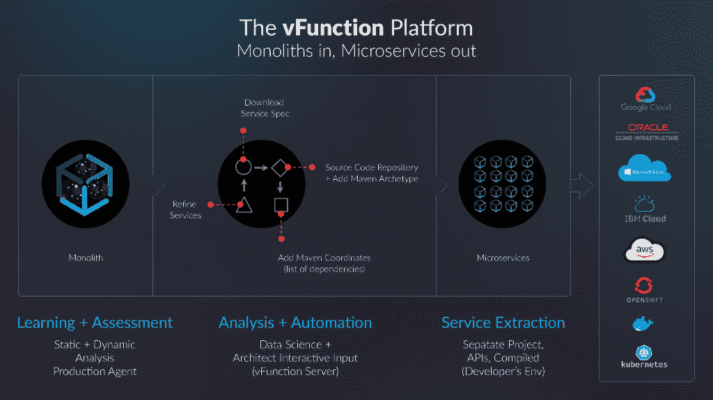
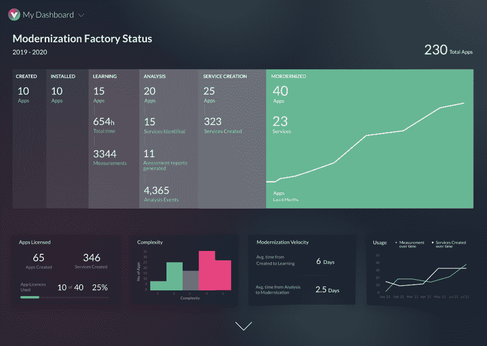

# vFunction 将整体 Java 转变为微服务

> 原文：<https://thenewstack.io/vfunction-transforms-monolithic-java-to-microservices/>

今天有超过 210 亿个 Java 虚拟机主要运行单一的应用程序。周二，一家名为 [vFunction](https://vfunction.com/) 的新公司的首席执行官兼联合创始人[默蒂·拉法林](https://www.linkedin.com/in/mrafalin/)指出，许多公司可以利用云原生架构，但为这种新环境重建这些架构将是复杂、耗时的，并且可能需要让员工从事其他更具附加值的任务。

这家公司创建了一个系统，使用它声称的可扩展、可重复的工厂模型，将单片 Java 应用程序转换为微服务。

“如果没有对这些应用程序的完整重构，你就无法利用真正的云基础设施，如 Kubernetes、无服务器或云提供的所有优秀功能。问题是，重构真的很难，”拉法林说。“您越现代化，从云获得的价值就越多。如果您只是重新托管，是的，您可以关闭您的数据中心，但您不会从中获得太多价值。如果您重新构建平台，是的，您将从 DevOps 中获得一些好处，但您仍然没有将应用程序分解为微服务。您没有获得弹性、工程速度、成本节约，因此为了获得真正的好处，您需要进行这种类型的重构。没有有效的技术来做到这一点，而这正是我们大约三年前就开始着手做的事情。”

vFunction 在内部运行，而不是在云中运行，客户在本地安装服务器。然后，它通过安装在应用服务器上的代理，首先对正在运行的应用执行动态分析，从而将整体应用转换为微服务。vFunction 还对应用程序二进制文件执行静态分析，并结合两者来识别各个服务。

Rafalin 解释说:“我们的目标是真正收集生产应用程序的数据，以便我们能够识别与特定用户流相关的真正服务。”。“我们的想法是将这个庞然大物分解成一个领域驱动的设计练习。”

从那里，用户可以通过图形用户界面来确定应该将哪些服务拆分为单独的微服务，或者进一步细分。

“这不是黑匣子，对吗？理解这一点非常重要，它将所有这些可见性都交给了架构师或高级开发人员，但他们才是主导者，”Rafalin 说。“他们决定如何使用该应用程序。一旦他们对设计感到满意，他们只需点击一个按钮，就会为每项微服务创建一个服务规范文件。”

然后，vFunction 自动创建单个微服务，复制必要的源代码并自动创建它们。它将所有内容放入一个目录中，然后可以单独上传到一个存储库。至于代码的部署，vFunction 是完全不可知的，微服务可以部署在任何 Kubernetes 或者云原生平台上。Rafalin 提到，动态分析的另一个好处是，vFunction 还可以识别“死代码”,用户可以将其删除，因为它不再被使用。

该公司表示，它已经将所有这些付诸实践，并提供了一个未具名的“全球金融数据服务领导者”的案例研究，它表示，该公司能够将一个应用程序分解为八个独立的服务，来自大约 10 万行代码和 250 个类，比其他方式快 15 倍。

目前，vFunction 只适用于 Java，但是 Rafalin 说。NET 可能在明年出现。

“Java 方面的市场机会是巨大的，”Rafalin 说。“它基本上是大多数企业的支柱，因此有很多事情要做，但算法和我们的技术在非常基础的层面上工作。它肯定可以转换成其他语言。”

<svg xmlns:xlink="http://www.w3.org/1999/xlink" viewBox="0 0 68 31" version="1.1"><title>Group</title> <desc>Created with Sketch.</desc></svg>