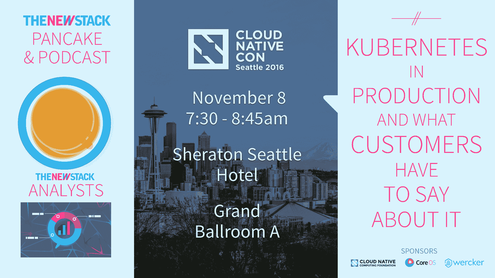

# 视频:OpenStack 峰会巴塞罗那展厅

> 原文：<https://thenewstack.io/vibe-at-open-stack-summit-barcelona/>

无论是从过时的传统解决方案迁移，还是继续建立生产环境，或者定制 OpenStack 环境以满足独特的组织目标，上周巴塞罗那 2016 OpenStack 峰会的与会者都能够[将](https://thenewstack.simplecast.com/episodes/tns-sound-bytes-the-vibe-at-openstack-summit-barcelona)与社区联系起来，并了解如何更好地将 open stack 整合到他们自己的项目中。

我们的视频记者 Norris Deajon 在展会现场与来自威瑞森、思科、Cirba、英特尔、红帽、JPB Groep BV 等公司的与会者交谈。他还与 [OpenStack 基金会](https://www.openstack.org/foundation/)业务开发和联盟总监 [Heidi Bretz](https://www.linkedin.com/in/heidiskupienbretz) 讨论了当今的组织如何在自己的项目中使用 OpenStack 来帮助实现目标。

[https://www.youtube.com/embed/desiMCAzGKk?feature=oembed](https://www.youtube.com/embed/desiMCAzGKk?feature=oembed)

视频

“我们使用 OpenStack 部署容器。目前，我们正试图为 Courier 编写代码，为虚拟机中的容器进行联网，”英特尔软件工程师 [Louise Daly](https://www.linkedin.com/in/louise-daly-36b09996) 说道。相比之下，威瑞森云产品技术专家 [Beth Cohen](https://www.linkedin.com/in/bfcohen) 在峰会上更好地了解了 [SDN](https://thenewstack.io/beyond-greenfield-rearchitecting-containers/) 的未来，以及其他电信公司如何在自己的环境中使用 OpenStack。

在 DevOps 方面，思科高级 QA 工程师 [Alka Sathnur](https://www.linkedin.com/in/alka-sathnur-9ba755) 提到 OpenStack Barcelona 是她的第一次会议，并继续强调说，“我们正在研究我们需要关注的性能问题，以及如何通过 OpenStack 缓解这些问题。”

其他组织可能不适合标准的 OpenStack 用例，JPB·格罗普 BV 公司的负责人[埃里克·舍恩梅克](https://www.linkedin.com/in/erik-schoenmaker-a1b84318)评论说，虽然他们的企业还没有准备好生产环境，但他们在峰会上利用时间更好地了解了 OpenStack 可能会对他们的组织产生的影响。

对另外一些人来说，这次会议不仅是一次与社区建立联系的机会，也是一次潜在的拓展海外商业机会的机会。NGINX 销售总监 [Ronan Kirby](https://www.linkedin.com/in/ronankirby) 指出，它最近在巴塞罗纳开设了第一个欧洲办事处，这凸显了 OpenStack 带来的潜在市场的重要性。Red Hat 高级解决方案架构师 [Sanjay Aiyagari](https://www.linkedin.com/in/aiyagari) 强调了此次峰会的社区方面:“这次会议很棒，因为我可以亲眼见到那些我只在电子邮件、电话或网络研讨会上见过的人。把一张脸和一个名字放在一起，真正地认识人们，了解他们，这太棒了。”

Bretz 简洁地总结了展厅参观，进一步强调了 OpenStack 旨在构建的社区。“我希望每个人都学到了很多。我知道我学到了很多。我认识了这个社区的很多人，我希望你们都已经互相认识了。我们下次波士顿见！”

思科、英特尔和红帽是新堆栈的赞助商。

<svg xmlns:xlink="http://www.w3.org/1999/xlink" viewBox="0 0 68 31" version="1.1"><title>Group</title> <desc>Created with Sketch.</desc></svg>