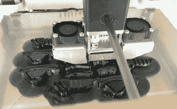

# 维多利亚之手项目:将 3D 打印应用于假肢

> 原文：<https://thenewstack.io/victoria-hand-project-applying-3d-printing-to-prosthetics/>

3D 打印正以不同的方式应用于世界各地，但也许没有一种方式比维多利亚之手项目更有价值。它为柬埔寨这样的国家的人们提供低成本的假肢，在那里地雷留下了可怕的需求。

作为不列颠哥伦比亚省蓬勃发展的创业场景的一部分，Victoria Hand Project 赢得了 2017 年[Google.org 影响力挑战赛，加拿大](https://impactchallenge.withgoogle.com/canada2017)，并获得了在 7 个国家提供 300 只手的资金。

它在尼泊尔、柬埔寨、危地马拉、厄瓜多尔和海地都有诊所。首席运营官 [Michael Peirone](https://www.linkedin.com/in/michael-peirone-08b44576/) 表示，有了这笔资金，该项目在埃及增加了一个诊所，可能会在秋天增加一个乌干达诊所，并计划在印度也增加一个。

它不是建立一个制造工厂，而是建立诊所，提供 3D 打印机，并培训当地人自己制作手——如何使用打印机，如何组装手以及如何使用所有的软件。

如果一个零件坏了，可以快速便宜地打印出一个替代品。

这只手的总成本是 320 美元，包括支付给为患者定制前臂插座的临床医生和技术人员的费用，以及 80 美元的材料费。他说，相比之下，在北美，为病人提供一个挂钩的材料需要 2000 至 5000 美元，而一个带肘部的碳纤维上臂大约需要 10000 美元。

## 保持低成本

该项目由维多利亚大学生物医学工程系发展而来，目前仍在该系。尼古拉斯·维特伊等学生参与了最新的设计，VC200。

维多利亚大学的教授尼古拉·德切夫早在 90 年代就提出了最初的设计，当时他还是多伦多大学的一名硕士生。不过，它使用金属手指，价格为 1 万美元。

这种设计是完全机械的，而不是使用电机或传感器，这将增加成本。它采用了肩带；通过耸起肩膀，用户可以拉动电缆并握紧手。手指一起移动，但由于适应性抓取，它们是半独立的。

Peirone 说，手使人们能够做各种各样的工作。例如，使用手指上的锁定机制，一个人可以携带一个包。他说，通过练习，用它投球是可能的，尽管接球更容易。

https://www . Facebook . com/ajplusenglish/videos/906550406153134/

Peirone 说，该项目没有编写任何自己的软件，而是找到了满足其需求的现有程序。

“当这个项目在三年前开始时，为了找到能够完成我们需要的操作的软件，进行了大量的研究，”Peirone 说。

“我们花了很多时间寻找定制前臂插座的方法。拥有一个适合用户的定制插座是整个系统最重要的部分之一。即使是制造一只看起来像人手的假手也需要很多时间。”

它使用 SolidWorks 计算机辅助设计(CAD)软件对每个组件进行建模。它被用来为 3D 打印改变德切夫的金属手，并被用来为每个病人定制基于方程的前臂插座模型。

“SolidWorks 非常适合为机器或汽车的零部件建模，但为有机形状建模却很困难。然后把这个有机的形状变成方程式驱动的，会让它变得更加复杂。“手也需要塑造成一个有机的形状，”Peirone 说。

它在不同的国家使用 AgiSoft PhotoScan 和/或 T2 Scan Studio。这些使用摄影测量来创建用户残肢的精确模型。它将捕捉残肢的 80 张照片，并在 30 分钟内创建一个残肢的计算机模型。这个过程比激光扫描便宜得多。

Peirone 说，Next Engine 3D 激光扫描仪使用的 Scan Studio 工作良好，扫描所需的工作较少，但过于昂贵，无法在每个诊所配备。

[MeshMixer](http://www.meshmixer.com/design.html) 用于从扫描数据中创建自定义前臂插座。测试了不同尺寸(长度、周长)的插座，以确定哪种最适合用户的肢体，最舒适。

来自 SolidWorks 的模型被加载到 3D 打印软件 Cura 中，以便在 [Ultimaker 3D 打印机](https://ultimaker.com/)上打印。Cura 使用户能够设置所有参数，如填充密度、壁厚、印刷速度和印刷布局。

定制的插座和假肢是由一种叫做 PLA 或聚乳酸的生物塑料打印而成的。它是黑色的，但是团队成员发现不同国家的人们非常关注手的美学，许多人不喜欢黑色，所以手被涂成患者更喜欢的颜色。

除了螺栓和电缆，所有东西都是 3D 打印的，然后由技术人员组装。打印插座可能需要八到十个小时；其他组件可能需要 20 个小时。这些诊所通常一周可以做两只手。

该项目与危地马拉和厄瓜多尔的[活动范围项目](http://www.rompglobal.org/)以及尼泊尔整形外科医院等组织合作。Peirone 说，谷歌的资金(25 万美元)应该持续三年，但之后将需要更多资金。

<svg xmlns:xlink="http://www.w3.org/1999/xlink" viewBox="0 0 68 31" version="1.1"><title>Group</title> <desc>Created with Sketch.</desc></svg>