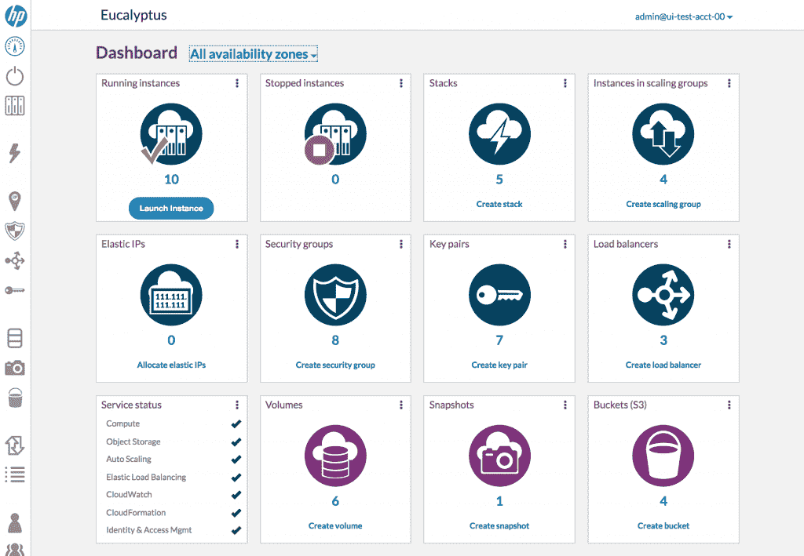
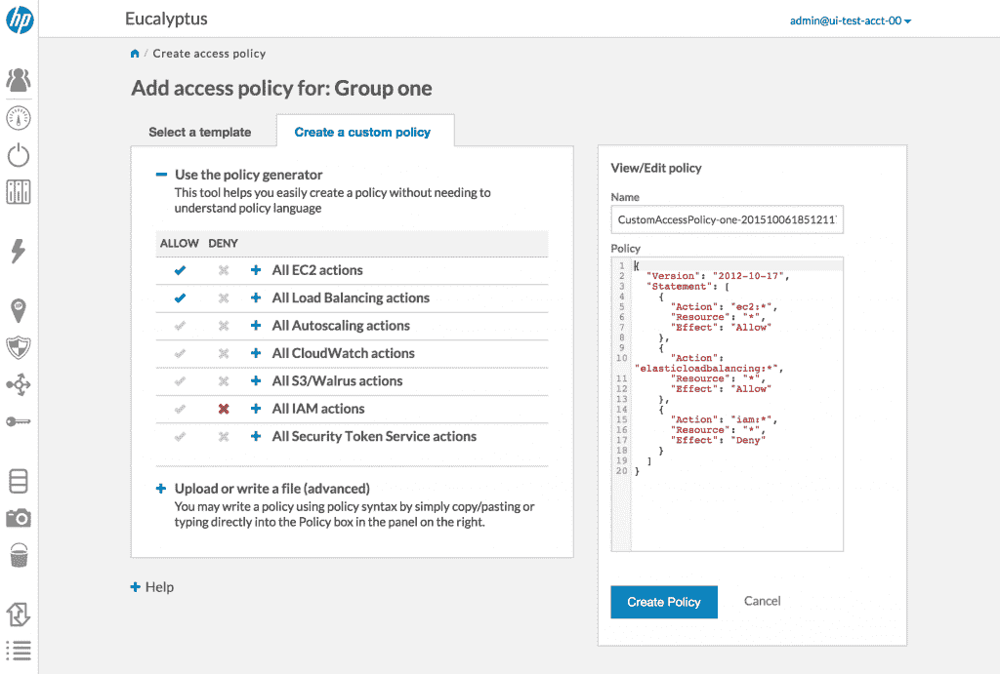
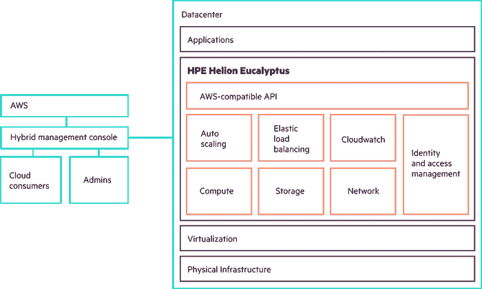

# 视频:HPE Helion Eucalyptus 如何让 AWS 更易于使用

> 原文：<https://thenewstack.io/video-introducing-hpe-helion-eucalyptus-aws-api/>

大规模部署软件要求公司快速工作，无论是从私有云还是异地数据中心。HPE 通过其 [Helion Eucalyptus](http://www8.hp.com/us/en/cloud/helion-eucalyptus-overview.html) 解决方案为开发者提供了基础设施中 AWS 的灵活性。Helion Eucalyptus API 允许开发人员访问各种 AWS 工具和服务，包括 EC2、S3、STS、SWS 和 EBS。

下面的视频是一个简短的演示，突出了 HPE Helion Eucalyptus AWS API，以及它在开发人员配置自己的 AWS 应用程序时的许多用途。

[https://www.youtube.com/embed/vph2wLFbAkQ?feature=oembed](https://www.youtube.com/embed/vph2wLFbAkQ?feature=oembed)

视频

在这次演示中，HPE 用户体验和前端开发高级经理[珍妮·洛萨](https://www.linkedin.com/in/jenny-loza-7b27664)展示了 HPE 桉树 API 如何立即改善 AWS 的开发者体验。在第一次启动 Eucalyptus 控制台时，开发人员不仅可以登录 Eucalyptus，还可以使用他们自己的私钥登录 AWS。这允许团队使用单一的工具来管理他们的资源，保持事情的流线型。

用户首先会注意到，HPE 努力保持标准 AWS 管理控制台和 Helion AWS API 之间的差异一致。“我们试图保持术语等方面的一致性，因此如果你来自 AWS，你应该能够加入 Eucalyptus，而不会有任何真正不和谐的感觉，”Loza 说。

登录后，用户将能够查看他们云的仪表板，其中将显示任何正在运行的服务和对象存储。Loza 随后开始设置使用 HPE Helion Eucalyptus AWS API 启动一个新实例，通过使用 CloudFormation 和 AWS 模板来增加投入。

Loza 说:“你可以将 CloudFormation 模板直接引入 Eucalyptus，并使用它在 Eucalyptus 中部署你的应用程序，而无需或只需很少的更改。

惠普 Helion Eucalyptus 控制台

在选择了 CloudFormation 模板之后，Loza 创建了一个新的 EC2 实例，它具有一个弹性 IP 地址。复制模板的 URL，她导航回到 Eucalyptus 来创建一个新的 CloudFormation 堆栈。Eucalyptus 警告用户他们正在使用的模板不是本机的，提示他们解析它以获得任何需要的更新。与标准 AWS 模板不同，Eucalyptus 用户无需为此模板使用的 AWS 资源付费，因为它现在是他们自己的内部云的一部分。

## 保持一切安全、灵活和可扩展

在创建自己的堆栈后，Loza 展示了用户如何能够查看以工作流为中心的界面，该界面允许他们根据需要对任务进行优先级排序。开发人员可能会发现自己在使用 Eucalyptus 中不受支持的服务，尽管 HPE 的团队不会让用户在遇到基础设施中不受支持的部分时无所适从。

“我们会告诉你你的服务到底是什么不被支持，这样你就可以进去，修复你的模板，做你需要做的事情，”Loza 说。

HPE 的团队已经看到它的许多用例都围绕着基于负载的自动伸缩来处理大规模的应用程序。Loza 解释说，“传入的流量将通过负载平衡器均匀地减缓到所有实例，支持应用程序的实例数量将根据流量水平和工作负载水平自动增加和减少。”HPE Helion Eucalyptus API 不仅允许开发人员创建负载平衡器，还可以根据需要定义自动扩展组，以适应他们自己的用例。

HPE Helion Eucalyptus 访问策略控制台

开发人员可以在 Eucalyptus 中创建扩展组并直接定义他们的策略，能够设置 CloudWatch 警报，以便在流量超过某个点时触发。HPE 为开发人员提供了一种以工作流为中心的策略管理方法，还能够根据 CPU 利用率设置警报，Loza 随后通过配置一系列警报集来展示这一点，如果 CPU 利用率超过 50%，警报集将按一个实例进行扩展。

用户还可以直接在 Helion Eucalyptus 中创建拥有自己独特安全权限的用户组。Loza 指出，HPE Helion Eucalyptus API 可以“自动为您创建一些非常简单的策略，因此您可以允许某人拥有完全访问权限，您可以允许某人访问资源，但不能创建组、调整策略，如果您愿意，您可以提供只读访问权限，或者您可以创建自己的自定义策略。”

HPE Helion 桉树建筑

正如 Loza 在演示结束时解释的那样，HPE Helion Eucalyptus AWS API 非常灵活，允许开发人员以更少的中断完成更多的工作。“他们仍然可以继续开发他们一直在开发的东西，但他们可以在内部使用它。人们可以使用它进行开发、测试，然后在生产中部署到 AWS 中，”Loza 说。

HPE 是新堆栈的赞助商。

<svg xmlns:xlink="http://www.w3.org/1999/xlink" viewBox="0 0 68 31" version="1.1"><title>Group</title> <desc>Created with Sketch.</desc></svg>