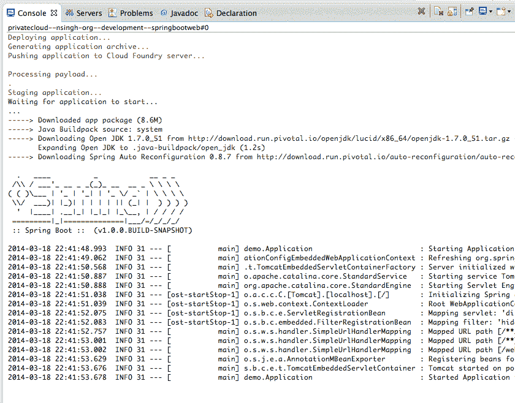

# 视频:在 Cloud Foundry 的 Spring Boot 上快速启动应用程序

> 原文：<https://thenewstack.io/video-quickly-spin-apps-cloud-foundrys-spring-boot/>

这是关于使用 Pivotal Cloud Foundry 平台的四部分视频教程系列的第三部分。点击此处

[Part 1](https://thenewstack.io/video-get-started-pivotals-cloud-foundry-stack/)

和

[Part 2](https://thenewstack.io/video-developers-can-use-pivotals-cloud-foundry-stack/)

.

将软件部署到生产环境中是一件令人头疼的事情。在大规模工作时，反应迟钝、速度慢或无法处理特定用例的缓慢系统不仅会很快导致时间损失，还会导致利润损失。随着越来越多的自动化平台出现，以缓解开发人员在将代码投入生产时遇到的一些常见问题，理解这些产品如何工作以及它们提供了什么是至关重要的。

下面嵌入的视频是四集系列中的第三集，重点介绍 Pivotal 的 [Cloud Foundry](https://www.cloudfoundry.org/) 及其在该领域的产品。在这一部分，我们来看看 [Spring Boot](http://projects.spring.io/spring-boot/) ，这是一种开发者快速创建独立 Spring 应用程序的方式，可以在瞬间投入生产。

“我的朋友 [Andrew Shafer](https://twitter.com/littleidea) 说，你要么建立一个软件企业，要么就会被已经建立了软件企业的人打败，我全心全意地相信这一点，如果你试图移动软件，你需要快速移动，”Pivotal 的首席开发人员 Josh Long 说。

[https://www.youtube.com/embed/grsWZPUeE7c?feature=oembed](https://www.youtube.com/embed/grsWZPUeE7c?feature=oembed)

视频

在这个例子中，Long 创建了一个预订服务。单击“生成”会创建一个可由 Maven、Gradle 或其他 CI 软件处理的 zip 文件。在 IDE 中，Long 创建了一个可以轻松映射回数据库的实体。Boot 可以实例化一个数据源并写入其中，也可以连接到开发人员提供的数据源。选择的数据库是一个 Java 持久性 API (JPA)映射层，尽管 Spring Boot 提供了对 MongoDB、Redis 等的支持。

Spring Boot 控制台暂存

当一个数据字符串被创建后，Spring Boot 会自动将它写入内存数据库，让开发人员可以快速开始工作。Spring Boot 通过启动嵌入式 Web 服务器来设置 REST 控制器。然后，存储库将看到一个应用程序有一个 MVC hook 组件，然后启动一个嵌入式 Web 服务器。

“开发人员也能够将数据的创建映射到存储库，让存储库来完成工作，”Long 说。

当查看浏览器时，用户可以在新输入旁边看到他们的旧输入。链接告诉客户端有效负载在哪里，允许知道在 ui 的拓扑结构中哪里可以/不可以。如果开发者决定改变他们的 API 拓扑，Spring Boot 提供了在不破坏客户端的情况下这样做的能力。Spring Boot 还将超媒体集成到其 RESTful APIs 中，允许他们完全通过超媒体或自描述 API 而不是通过文档来与设置好的 Spring 应用程序进行交互。

Spring Boot 使用户能够查看显示系统信息、最终指标、健康代码、购物车或自定义输出的指标，以更好地监控和了解您的系统正在做什么。

### 链接:

Pivotal 是新堆栈的赞助商。

通过 Pixabay 的特征图像。 

<svg xmlns:xlink="http://www.w3.org/1999/xlink" viewBox="0 0 68 31" version="1.1"><title>Group</title> <desc>Created with Sketch.</desc></svg>