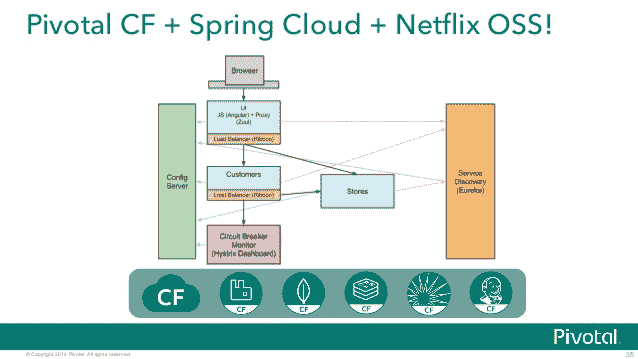
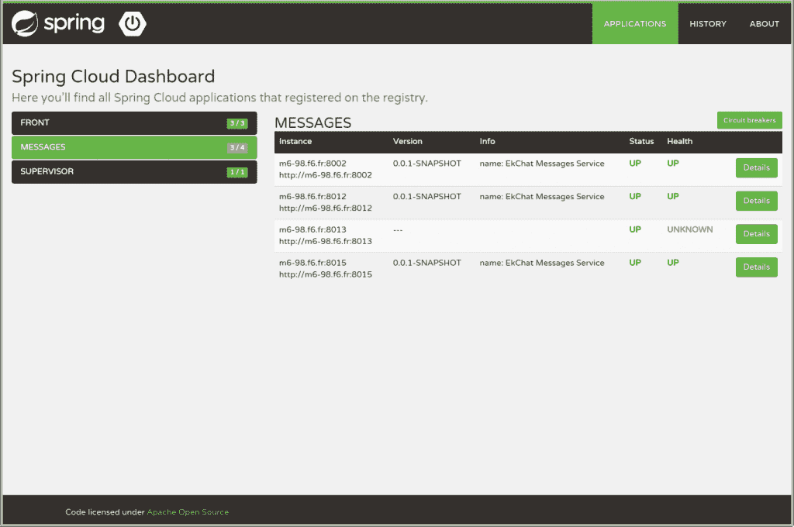

# 视频:利用 Pivotal 的 Spring Cloud 简化服务配置

> 原文：<https://thenewstack.io/video-service-discovery-made-easy-spring-cloud-config/>

这是关于使用 Pivotal Cloud Foundry 平台的四部分视频教程系列的第四部分。点击此处

[Part 1](https://thenewstack.io/video-get-started-pivotals-cloud-foundry-stack/)

和

[Part 2](https://thenewstack.io/video-developers-can-use-pivotals-cloud-foundry-stack/)

和

[Part 3](https://thenewstack.io/video-quickly-spin-apps-cloud-foundrys-spring-boot/)

.

将软件部署到生产环境中是一件令人头疼的事情。在大规模工作时，快速集成微服务的能力是每个组织都在考虑的事情。当转向生产时，微服务必须易于发现、管理和结构化。在将服务部署到生产环境中时，易用性是关键，当时间紧迫时，避免为了更新几行代码而重新启动流程可以节省宝贵的时间。

下面嵌入的视频是四部分系列的最后一部分，重点介绍 Pivotal 的 [Cloud Foundry](https://www.cloudfoundry.org/) 及其为使用 Spring 的开发人员提供的产品。在这一部分，我们来看一下 [Spring Cloud Config](http://cloud.spring.io/spring-cloud-config/) ，这是一种开发人员快速配置分布式系统的易于发现的 Spring 应用程序的方式。

[https://www.youtube.com/embed/eJwrvCWtv14?feature=oembed](https://www.youtube.com/embed/eJwrvCWtv14?feature=oembed)

视频

## 使用 Spring 云配置部署微服务

在本次演示中，Pivotal 的首席开发人员 Josh Long 首先介绍了集中式配置的常见模式。当多个服务正在运行时，重新启动进程来更改信息(如密码和主机名)会很快变得繁琐。Spring Cloud Config 是位于存储库配置文件前面的微服务，允许用户快速将 Spring 实例部署到生产中。

Long 继续演示，再次查看上一个演示中的站立预订应用程序。在这种情况下，该服务是一个标准的预订服务，旨在返回预订属性。当在 Spring Cloud Config 中创建应用程序时，用户可以指向他们桌面上的存储库，允许任何标识为他们选择的目的地的微服务发现适用的存储库。如果发生冲突，用户可以根据需要改进 Spring 来添加依赖项，从而允许集中配置。Spring Boot 在启动时读取属性文件，而 REST 控制器模仿它的消息，然后注入一个指定的消息密钥。

春天云和网飞开放源码软件架构

当提交对属性文件的更改时，Spring Cloud Config 会立即意识到新的值。然后，用户可以通过向 localhost 8000/refresh 执行空 post 来触发外部刷新。当这个过程完成时，[服务发现](https://thenewstack.io/how-does-service-discovery-work-in-kubernetes/)会立即反映代码中的变化，而不必重新开始这个过程。

“这使我能够非常简单地集中更改和管理更新，并联合所有服务的更改，”Long 说。在使用分布式系统时，将服务与主机和端口分离对于大规模运营的成功至关重要。Long 指出，解决这一问题的一种方法是使用 DNS，但这可能会带来挑战。通常，DNS 运行在负载均衡器的前面，负载均衡器位于任何正在运行的微服务的前面。Long 说:“如果这些组件中的一个出现故障，就无法询问群集的状态以确定它是否停机。

通过在 Spring Cloud Config 中设置[网飞尤里卡](https://github.com/Netflix/eureka)，用户能够利用客户端发现抽象。这允许创建可通过服务注册发现的唯一服务 id。一旦在 Eureka 中注册了服务，其他服务就可以与 registry API 和 REST API 通信。对于那些对创建边缘服务感兴趣的人来说，Spring Cloud Config 尤其强大。企业可能有一套微服务通过注册中心或安全设置相互通信。

春云仪表板

边缘服务设置在微服务和组织基础设施的后端之间。因此，这使它们成为放置安全性、身份验证、API 和协议转换以及网关的理想场所。如果一个用户启动多个服务，负载平衡由[网飞 Ribbon](https://github.com/Netflix/ribbon) 通过 Spring Cloud 处理。这个客户端负载均衡器允许用户决定如何在客户端路由流量。“这样，我们可以做一些比循环负载平衡更有趣的事情，”Long 说。

正如本教程结尾所指出的，使用分布式系统的一部分是模式的发现和应用。这些模式集成在一起并相互关联，使它们更加灵活，更能适应当今的软件开发环境。像 Spring Cloud Config 这样的解决方案允许企业在一个已经很强大的平台上运行他们的代码，而不是必须编写额外的代码并从头创建他们自己的平台。

## 链接:

通过 [Pixabay](https://pixabay.com/) 生成特征图像

<svg xmlns:xlink="http://www.w3.org/1999/xlink" viewBox="0 0 68 31" version="1.1"><title>Group</title> <desc>Created with Sketch.</desc></svg>