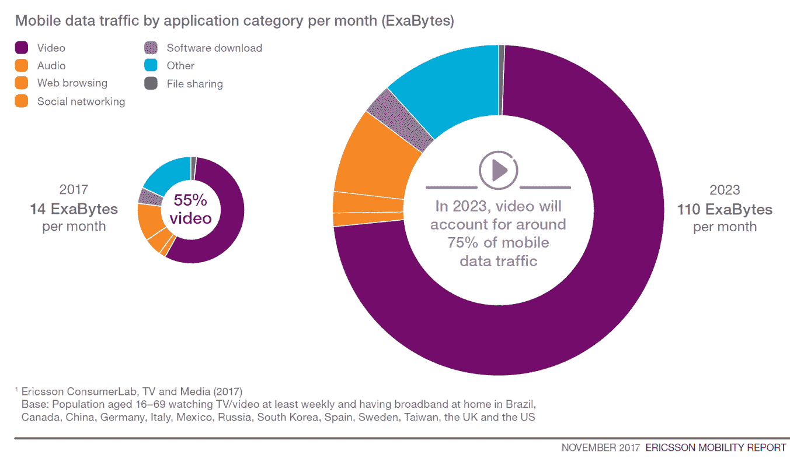

# 视频数据流量对网络中立性的影响

> 原文：<https://thenewstack.io/video-will-increasingly-crowd-data/>

我们脑子里想的是网络中立。一个关键问题是不同类型的内容对网络容量的影响。为了给你一个更好的视角，我们看了来自[思科的视觉网络指数](https://www.cisco.com/c/en/us/solutions/collateral/service-provider/visual-networking-index-vni/complete-white-paper-c11-481360.html)和[爱立信的移动报告](https://www.ericsson.com/en/mobility-report/reports/november-2017)的数据。我们发现，对于数据中心之外的流量，视频是一个数据猪，预计只会变得更糟。

事实上，思科报告称 IP 视频已经占全球消费者流量的 73 %,预计到 2021 年将增长到 83%。然而，这一视频的传播方式却大相径庭。目前，只有三分之一的 IP 视频来自传统的商业电视服务(如美国的康卡斯特(Comcast)和 FIOS)。随着消费者越来越多地拔出和使用移动设备，这一数字在未来将会下降更多。

就移动数据而言，爱立信报告称，视频占流量的 55%，到 2023 年将增长到 75%。然而，手机带来了另一个问题。数据中心和大多数互联网接入提供商对带宽收费——在给定时间内可以发送的最大数据量。移动设备通常是按每千兆字节付费的。这似乎是一个调节过度使用的好模式，但它不是最民主的系统。目前，创新取决于内容传输网络和其他技术，这样消费者就可以获得高质量的视频，而不会降低质量。

就像这些天的其他事情一样，区块链也提出了一个解决方案。具体来说，人们正在试验创建基于以太坊的网状网络的方法，这种网络将在边缘绕过互联网。

当然，对于视频导致的网络拥塞，也有基于政策的解决方案。不是监管，而是类似于存储管理策略的东西。流量的优先化已经在网络中发生。也许，仅仅是也许，这种类型的优先化可以用于视频而不是非视频应用。你怎么想呢?

通过 Pixabay 的特征图像

<svg xmlns:xlink="http://www.w3.org/1999/xlink" viewBox="0 0 68 31" version="1.1"><title>Group</title> <desc>Created with Sketch.</desc></svg>