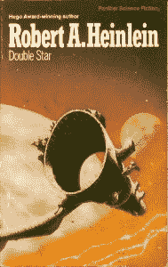

# 温顿·瑟夫警告人类:我们的数据能保存超过一个世纪吗？

> 原文：<https://thenewstack.io/vint-cerf-warns-humanity-can-data-survive-longer-century/>

传输控制协议(TCP)的合著者[温顿·瑟夫](https://research.google.com/pubs/author32412.html)被誉为“互联网之父”，但现在他担心一个更大的通信协议，在数千年的规模上。未来我们的文明将如何与人交流？对于未来的几代人来说，我们将如何保持当今 21 世纪社会的荣耀？

是的，我们已经有了存储介质——但就长期耐用性而言，它真的能与几个世纪前相比吗？“我们正在倒退，”瑟夫在他的专栏中争辩道[发表在*ACM*](http://cacm.acm.org/magazines/2016/10/207755-were-going-backward/fulltext)通讯上，深情地回顾人类的历史——过去时代的方式保留了他们生活的一瞥，以在时代间回响。这就像是人类在过去 17000 年中的灵媒之旅，提供了令人惊叹的穿越时间的视角。

楔形文字泥板和纸莎草手稿已经成功地存储了数千年的信息。破布纸和最初的照片，在玻璃板上或锡上拍摄，保留其内容持续了两个世纪，现在。

但是我们的电子邮件呢？瑟夫指出:“我认为最近的媒体没有石头或陶土的弹性是有争议的。”“现代照片可能不会持续超过 150-200 年就会褪色或分解。现代书籍，除非用档案纸，可能不会超过 100 年。”

瑟夫习惯于大规模思考。除了作为谷歌的官方互联网传播者，他还与美国国家航空航天局合作建造星际互联网。读到这位 73 岁的技术专家，以及他对媒体历史的思考，我有两个想法。首先，做温顿·瑟夫一定很有趣。但是第二，我们真的有从历史中消失的危险吗？

“除非我们直接面对这一挑战，”瑟夫写道，“否则我们在过去 100 年左右集体创造的真正令人印象深刻的知识可能会随着时间的推移而消失。”

这是他以前分享过的信息。英国广播公司(BBC)在 2015 年初的一次采访中报道说，“他担心，当我们进入他所描述的‘数字黑暗时代’时，后代将很少或没有 21 世纪的记录。”。比伯夫妇还称瑟夫“可能是唯一一个打领带的谷歌员工。”采访发生在美国科学促进协会的年会上，BBC 报道说，“他现在的重点是解决一个威胁根除我们历史的新问题。”

这不仅仅是保存所有的部分。“更关键的问题是，不管记录数字比特的介质是什么，我们能在多长时间内读取它们，我们能在多长时间内理解它们……？即使假装你可以再次读取磁盘，你有知道这些位是什么意思的软件吗？'

[https://www.youtube.com/embed/sfA2fwAL_W4?feature=oembed](https://www.youtube.com/embed/sfA2fwAL_W4?feature=oembed)

视频

在他们采访的视频中，瑟夫像过去和蔼可亲的助理教授一样轻轻地敲响了警钟。但他提出，人类也需要一个标准化的描述来描述与媒体相关的一切——应用程序、操作系统。否则，您的曾孙将无法观看您的任何家庭电影。

瑟夫以前也谈到过这个问题，但这次是针对个人的。瑟夫在康涅狄格州纽黑文的家中写作，他从书架上拿出一本珍藏了 35 年的罗伯特·海因莱茵的《双星》但是他担心弄坏它的装订——更不用说它的小字体了——于是他买了一个 Kindle 版本。

“这一经历让我再次思考我们的文物的短暂性，以及除非我们坚持保护数字内容，否则远在我们之前的几个世纪可能会比我们更为人所知……就像中世纪的僧侣和穆斯林通过复制到新媒体来保护内容一样，我们难道不需要为我们的现代内容做同样的事情吗？”

但幸运的是，已经有人在解决这个问题了。事实上，在 2015 年 3 月，Cerf 接触了卡内基梅隆大学的一个团队，展示了他们的“ [OLIVE](https://olivearchive.org/) ”(用于虚拟化执行的开放图像库)项目，该项目试图建立“一个长期保存软件、游戏和其他可执行内容的强大生态系统”。

研究团队已经创建了一个虚拟机档案——和[一个迷人的老式软件集合](https://olivearchive.org/docs/collection/)。有一款游戏 [*神秘屋*](https://archive.org/details/Hi-Res_Adventure_1_Mystery_House_1980_On-Line_Systems) 运行在 1982 年的虚拟苹果 II 上，还有[最初的毁灭战士](http://www.emuparadise.me/Abandonware_Games/Doom_(1993)(Id_Software)/93124)——用于 DOS——运行在 1983 年的虚拟 DOS 操作系统上。他们可以在 1993 年的 Mac 电脑上重现运行在 Windows 3.1 上的 WordPerfect 6.1 和 NCSA Mosaic。

如果这还不够，瑟夫的文章还提出了一些有趣的反驳。在 ACM 网站上的评论中，一位用户建议，也许每一代人都有机会对人类的所有内容进行某种管理，所有重要的东西都被转录到最现代的媒体中。一则令人欣慰的轶事表明，也许事情还没有变得如此可怕。“我那本 60 年前的罗伯特·海因莱茵的*双星*，虽然边缘有点发黄，用的是我新安装的白内障晶状体，仍然可读。

“欢迎你来借。”

* * *

# WebReduce

通过 Pixabay 的特征图像。

<svg xmlns:xlink="http://www.w3.org/1999/xlink" viewBox="0 0 68 31" version="1.1"><title>Group</title> <desc>Created with Sketch.</desc></svg>