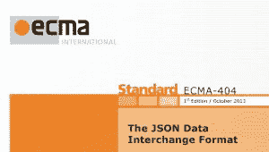

# JSON 如何颠覆 XML 和其他来自老式计算机节的教训

> 原文：<https://thenewstack.io/vintage-computer-festival-2017-giant-floppy-disks-json-vanquished-xml/>

老式计算机节有着漫长而曲折的过去，始于上个千年的末期。虽然现在已经有了 12 个正式的西 VCF 音乐节，但最初的在第十场演出后就失去了连续性，因此不再在这个海岸举行。去年，VCF 东部背后的人们重新点燃了西部，随着新领导人和非营利组织[复古计算联盟](http://vcfed.org/wp/)的加入，它又回到了正常运转的状态。

隐藏在今年精心设计的 Apple II、Monster 6502 和 IMSAIs 中的是这个行业如何建立的故事。从技术细节的讨论到深层的商业交易，VCF 是创建硅谷的人们讨论其历史的场所。

[计算机历史博物馆](http://www.computerhistory.org/)是 VCF 的绝佳场所，尤其是因为它独特地提供历史人物作为讲解员。这些人包括 Pong 的创造者 Al Alcorn，第一款电脑游戏的发明者 Stephen“Slug”Russell 和一群来自施乐 PARC 的开发者。

大多数人都知道这些名人背后的故事:两个史蒂夫如何开创了苹果，比尔和他的伙伴们如何建立了微软，飞兆半导体如何在 50 年代和 60 年代开创了一千家公司。

然而，在这些故事的背后，有一些仍然只是被悄悄地讲述。VCF 是听他们的好地方。

## JSON:简单的数据交换格式，可以

一个这样的故事是关于流行的 JSON 数据交换格式是如何形成的。芯片晨星公司(Chip morning star)、 [F .兰德尔·法默(Randall Farmer)](https://www.linkedin.com/in/frandallfarmer/)、[马克·s·米勒](https://research.google.com/pubs/author35958.html)和[道格拉斯·克洛克福特](http://www.crockford.com/)是四位著名的开发人员，他们对计算的贡献现在才刚刚开始得到认可。这四个人已经合作过很多次了，而且一般来说，当他们合作的时候，已经远远领先于他们的时代，以至于不能真正取得成功。

你可能还记得我已经写过关于 Chip 和 Randy 的文章，我和他们一起为 Commodore 64 带回了第一个图形化的 MMO，[栖息地](http://neohabitat.org)。他们在这个游戏上的工作从 1984 年持续到 1988 年，它的每一点都是有预见性的，预示着未来。可悲的是，这款游戏每分钟的费用也只有 0.60 美元，包括当时的网费、电话费和游戏费。

和往常一样，未来并没有平均分配，奇普和兰迪的宝宝被遗忘了。当然，这并不是他们最后一次尝试。最终，两人创建了[电气社区](http://www.crockford.com/ec/)，以及其他旨在大规模构建虚拟世界的项目。正是在这个时候，克罗克福德和米勒进入了故事。他们的工作，以及电气社区其他人的工作创造了一种基于安全和信任的编程语言。

最终，在他们的项目中使用大量的 JavaScript 时，Randy 厌倦了一直和 XML 打交道。你可能还记得几年前一个叫做 [AJAX](https://www.w3schools.com/xml/ajax_intro.asp) 的热门话题:异步 JavaScript 和 XML。当时，用 XML 封装所有东西是必要的，但是 Randy 每次不得不将 JavaScript 对象放入网络管道时，都被用 XML 封装和解包弄得筋疲力尽。

"我不能直接把一个 JavaScript 对象传递给客户端吗？"他会一遍又一遍地问。最终，克罗克福德写了一份关于如何做到这一点的简单文件，并将其发布在 Json.org 上。兰迪开玩笑说，他们假装这是一个规范。虽然克罗克福德在 2000 年代初发布了他的文本，但实际规格从 2013 年开始出现，称为 [ECMA-404](http://www.ecma-international.org/publications/files/ECMA-ST/ECMA-404.pdf) 。

Randy 指出这个故事是一个例子，说明最简单的前进道路最终总是会取得胜利。当然，他和 Electric Communities 的团队又一次走在了时代的前面，并没有成为一个产品。然而，今天我们在网上接触的所有东西都可能以某种方式使用 JSON。JSON 的出现及其易于使用的语法也是 Web 服务的最后一颗钉子，Web 服务基于 XML 的数据交换规则要复杂和脆弱得多。

## 制作 Flippy Floppy

VCF 的另一个警示故事是软盘的历史。加利福尼亚州弗里蒙特的 Foone Turing 在 VCF 西部展上展示了这种计算机媒体的完整历史，我们所说的 T2 是指完整的 T3。他的收藏包括 8 英寸、5.25 英寸和 3.5 英寸的软盘，以及异常的变体，如 2.88MB 软盘、Famicom 软盘，甚至是 Amstrad 和索尼分别使用的臭名昭著的 3 英寸和 2 英寸的变体。

软盘展示凸显了个人电脑的肮脏历史。多年来，所有参与者的最大目标都是额外增加 100KB，再增加几 KHZ，只要能让你的产品从竞争平台的海洋中脱颖而出。结果，在今天严峻的历史面前，以这种方式设计的计算机现在甚至连保存的目的都没有用了。

让我们以[公司的 ColecoVision Adam](http://oldcomputers.net/adam.html) 计算机为例。我选择这个平台来指责仅仅是作为一个行业的警示故事。你必须记住，就在推出 Adam 的十年前，Coleco 还是一家皮革打孔公司。他们是如何进入电脑行业的，这个故事可能会被许多现在正在制作手机游戏、生活相机或自拍杆的公司效仿。对一些人来说，机会在敲门，但对另一些人来说，它就在街上，以一种诱人的方式来回挥舞着手指。

> 没有打印机你就不能打开亚当。

亚当也是如此。从历史的角度来看，这个系统几乎不可能运作。首先，它使用盒式录音带作为其数据媒体的选择。虽然盒式磁带很便宜，可以存储大量数据，但它们也很慢，不可靠。亚当配备了一个卡带盒和一个第二插槽。其他介质不可用于该设备。

整个装置还配有一台打印机，这是实际需要的。没有打印机你就不能打开亚当。这是因为 Adam 插在打印机上，打印机再插上电源。最重要的是，Adam 将通过该设备发送这样一个电涌，播放器中的任何磁带都会在启动时立即消磁。这个装置是设计上的失败。

然而，这种产品进入市场并卖出了几台。为什么？因为它向后兼容家用电视游戏系统。

此外，当时还不清楚家用电脑到底有什么好处。有一种感觉，这样的设备应该能够打印，玩游戏，做你的税，但实际上，大多数机器最终是这些才能的混合物，或好或坏。C64 非常喜欢游戏。Apple II 有大量严肃的软件和股票交易程序。麦金塔努力使其易于打印。事实上，在那个时代，没有一个平台可以做我们现在在计算中认为理所当然的所有事情，所有人都在努力实现差异化。

## 新老板，旧老板

这有点类似于今天在云中发生的事情。云提供商都在竞相展示他们的最佳产品，并表明他们更擅长数据存储，或规模更便宜，或安装更快。然而，在现实中，我们在 10 到 20 年后会想到的云平台可能会包括以上所有内容，甚至更多。

如果你接受我的推理，你的未来应该尽可能完全脱离任何给定的云平台。或者，也许它应该构建在像 Cloud Foundry 这样的便携式 PaaS 之上。或者，也许这意味着你应该做好随时行动的准备。个人电脑时代的结束见证了兼容性和便携性

对开发者来说，真正的诀窍是确保他们不会把自己的未来押在 ColecoVision Adam 上。最终，IBM 个人电脑胜出，仅仅是因为它能做所有的事情。跨不同硬件类型的单一软件平台确保了最大可能的受众可以得到满足，而开发人员不必在 Atari ST、C64、Apple II 和其他平台上进行利基押注。相反，DOS PC 成为默认平台。

这样好些了吗？好吧，至少我们整洁的新游戏不会在第一次使用时被删除。

特征图片:Foone Turing 的[巨型软盘](https://www.youtube.com/watch?v=LEAGxKJTs14)之一。

<svg xmlns:xlink="http://www.w3.org/1999/xlink" viewBox="0 0 68 31" version="1.1"><title>Group</title> <desc>Created with Sketch.</desc></svg>