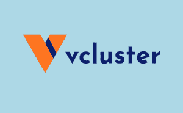

# 虚拟集群是 Kubernetes 多租户的未来

> 原文：<https://thenewstack.io/virtual-clusters-are-the-future-of-kubernetes-multitenancy/>

跨团队共享 Kubernetes 集群极其困难。如果您与 Kubernetes 社区中的人交谈，您会经常听到他们讨论获得多租户权利有多难。这一困难导致许多公司完全放弃多租户，转而为团队甚至单个工程师提供专用集群。然而，更多的集群意味着平台团队更多的集群管理难题，以及更多的能源消耗和对环境的负面影响，正如今年早些时候 IBM 的 [Holly Cummins](https://twitter.com/holly_cummins) 在她来自 [KubeCon+CloudNative Con EU](https://www.cncf.io/kubecon-cloudnativecon-events/?utm_content=inline-mention) 的[主题演讲](https://www.youtube.com/watch?v=j5jql3e6hTA)中提到的。

虚拟集群是一种新的方法，允许团队共享集群，而没有 Kubernetes 多租户带来的一些痛苦。

## 最新技术:使用名称空间的多租户

 [里奇·巴勒斯

Rich 是 Loft Labs 的高级开发人员支持者，在那里他致力于为使用 Kubernetes 的开发人员和平台工程师改进工作流程。他是 Kube 拥抱播客的创建者和主持人，在那里他采访了 Kubernetes 社区的成员。他是波特兰发展日的创始组织者，他还帮助组织了其他的社区活动。里奇对科技工作如何影响心理健康有着浓厚的兴趣。他患有多动症，并在推特上记录了他的旅程。](https://twitter.com/richburroughs) 

Kubernetes 多承租的主要方法是基于名称空间的构造和隔离这些名称空间的策略。团队或开发人员在集群中有一个专用的名称空间，并受基于角色的访问控制(RBAC)权限的限制。准入控制和网络策略等附加工具进一步限制了开发人员使用集群的能力。

这种名称空间沙箱方法的一个主要障碍是，开发人员想要管理的一些 Kubernetes 对象是在集群级而不是名称空间级运行的。假设一个开发人员想要在一个集群中部署一个包含服务和部署等资源的舵图，这些资源是命名空间的，但是舵图还包含定制资源(CRD)，这些资源是集群范围的。

这在这个名称空间沙盒模型中是不可能的，因为开发人员在他们专用的名称空间之外没有足够的 RBAC 权限。

## 虚拟集群的概念

借助虚拟集群，用户可以看到具有自己控制平面的集群的虚拟表示。它看起来完全像一个成熟的 Kubernetes 集群，其 API 请求与其他用户隔离。虚拟集群可以完全在主机集群的命名空间内运行，具体取决于实施情况，并且通常为在虚拟集群内创建的对象提供单独的数据存储(比如 etcd)。

2019 年，[Rancher 的首席技术官 Darren Shepherd](https://twitter.com/ibuildthecloud) 发表了名为 [k3v](https://github.com/ibuildthecloud/k3v) 的虚拟集群的初步概念验证实施，开启了让虚拟集群在 Kubernetes 中可靠工作的旅程。到目前为止，已经出现了两种工作方式的虚拟集群:

这两个项目在如何实施虚拟集群方面有不同的观点，但共同的目标是让平台团队减少集群蔓延。

## 虚拟集群应对多租户挑战

运营多租户集群的平台团队需要应对几个挑战:

*   如何隔离租客？
*   如何创造出色的用户/开发者体验？
*   如何明确划分平台用户和平台运营方的责任？

## 挑战 1:租户隔离

正如我们提到的，到目前为止，多租户的标准方法是使用 RBAC、准入控制和网络策略等工具来隔离租户。当像 Kubernetes 集群这样共享资源时，安全性成为一个大问题，默认的安全行为是“拒绝全部”操作共享集群的平台团队可能会锁定用户对名称空间的访问，例如，网络策略可以限制 pod 可以连接到哪些资源。

但是，这种全盘否定的方法会对开发人员完成工作的能力产生非常负面的影响。当他们向应用添加功能时，他们必须与平台和安全团队密切合作，以获得对其 pod 的正确访问级别。

**虚拟集群如何提供帮助:**

*   由于虚拟集群通常只需要拥有在底层集群中创建非常基本的对象(如 pod)的权限，如果租户在虚拟集群中工作，集群管理员可以严格锁定租户对非常少的基本资源的集群访问。
*   每个用户独立的控制平面允许开发人员发送 API 请求，而不会影响在同一集群中工作的任何其他团队，从而提供了一个额外的隔离层。
*   准入控制和网络策略等工具可以应用于主机集群级别，让用户在虚拟集群中有更多的自由。

## 挑战 2:开发者体验

 [卢卡斯·根特莱

Lukas Gentele 是 Loft Labs 的首席执行官，Loft Labs 是一家初创公司，为 Kubernetes 构建开源开发工具，并帮助公司从传统软件开发过渡到云原生软件开发。在搬到旧金山创办 Loft Labs 之前，Lukas 在他的祖国德国创办了一家专注于 Kubernetes 的咨询公司。他之前在 KubeCon、ContainerConf 和 Continuous Lifecycle 等会议上发言，为 Heise 和 Better Programming 等杂志撰写文章，并喜欢在 meetups 上分享他的经验。](https://www.linkedin.com/in/gentele/) 

如果您曾经坐等另一个团队为您提供一些基础设施或在防火墙上打开一个端口，您就会知道这有多痛苦。这些延迟不仅损害了速度，还降低了开发人员的满意度。正如微软研究员[妮可·福斯格伦](https://nicolefv.com/)和她的团队在他们的优秀论文“[开发者生产力的空间](https://queue.acm.org/detail.cfm?id=3454124)”中提到的，“生产力和满意度是相互关联的，而且……满意度和参与度的下降可能预示着即将到来的倦怠和生产力的降低。”工具的重要性不仅仅在于周期时间。

平台工程师知道，提高工作效率的最佳方法是为用户提供自助服务。使用 Kubernetes 集群的开发人员需要随需应变的基础设施，并且他们需要部署不仅仅是 pod 的灵活性。他们甚至可能需要跨多个名称空间工作，例如，当一起测试几个微服务时。

此外，公司中的开发人员不是一个整体，他们可能有不同的工具需求。像网飞这样的一些公司认识到了这一点，虽然有内部工具可用于 CI 和部署之类的事情，但团队可以选择使用适合他们用例的不同工具。在共享集群中很难做到这一点，因为集群中运行的工具会影响其他团队。

**虚拟集群如何提供帮助:**

*   当工程团队需要虚拟集群时，他们可以快速且经常自主地对其进行配置。
*   开发人员可以将集群范围的资源(如 CRD)部署到他们自己的虚拟集群中。
*   工程师可以在他们的虚拟集群中跨多个命名空间工作，而不会影响其他用户。
*   开发人员可以使用他们喜欢的任何工具来部署到集群，从手动运行`kubectl apply`到安装一个全功能的 GitOps 框架，比如 ArgoCD。

## 挑战 3:责任

分担 Kubernetes 集群的责任可能会引起争议。产品工程师和平台团队可以有非常不同的目标，并且可以用相反的标准来衡量。这种错位是 DevOps 出现的原因，但是我们还没有完全解决这个问题。

平台团队通常理解，扩大开发人员的权限并授权他们承担责任对他们有利。他们希望向左移动，以允许开发团队更快地移动，同时保持并关注安全性和稳定性。但是在这种责任转移的模式中，许多问题都要由这些团队来回答:谁有权限和授权来执行一项任务，以及完成这项任务的专业知识？开发者需要多久才能得到自己需要的东西？什么可以自动化，谁可以自动化？

虚拟集群如何帮助:

*   **虚拟集群明确责任模式**。平台团队可以管理主机集群，并对其稳定性负责。开发人员拥有在主机集群上运行的虚拟集群，并且开发人员负责在虚拟集群中运行的内容。
*   **虚拟集群可以快速启动和关闭**，因此随着时间的推移，随着新的组织结构的出现和职责的转移，它们允许团队快速移动。

## 结论

虚拟集群的势头正在增长，原因显而易见。自从我们推出开源项目 [vcluster](https://www.vcluster.com/) 以来，我们看到 Kubernetes 社区对虚拟集群表现出了浓厚的兴趣。事实上，WG 多租户社区也一直致力于虚拟集群实施，这表明人们迫切需要这种解决方案。

对于平台团队来说，操作多租户集群是一项繁重的任务，对于在这些集群内受限的名称空间中工作的人来说，这也是一件令人沮丧的事情。Kubernetes 的前景是巨大的，但是缺乏对多租户的支持是一个巨大的痛点。虚拟集群解决了平台团队和开发者每天都会遇到的现实问题。这就是为什么我们认为虚拟集群是 Kubernetes 多租户的未来。

<svg xmlns:xlink="http://www.w3.org/1999/xlink" viewBox="0 0 68 31" version="1.1"><title>Group</title> <desc>Created with Sketch.</desc></svg>