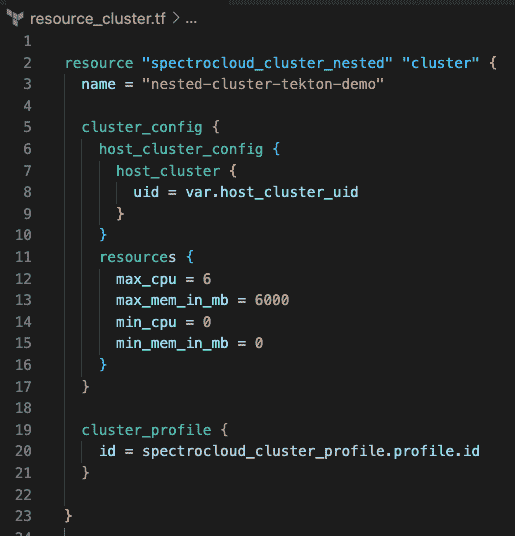

# 使用 Spectro Cloud 调色板的虚拟 Kubernetes 集群

> 原文：<https://thenewstack.io/virtual-kubernetes-clusters-with-spectro-cloud-palette/>

应用程序开发人员需要从 Kubernetes 资源中得到什么非常简单:

*   访问不受限制的 K8s 沙盒，具有与其生产 K8s 环境相同的重型计算能力、容器网络接口(CNI)、容器存储接口(CSI)驱动程序和云控制器管理器(CCM)
*   随时随地自由部署所需资源，无需等待内部调配许可的批准和履行。

然而，今天的许多开发人员没有这一点。此外，他们感到受到组织强加的[安全流程](https://thenewstack.io/category/security/)的约束，尤其是在 Kubernetes 供应和基于角色的访问控制(RBAC)方面，在定制资源密集型开发期间，他们面临 API 版本的竞争。

作为一名平台工程师，解决这个难题是你的挑战。专用集群、友好集群和名称空间都不是完美的答案(我们马上就会看到)，但是现在有了第四种方法！

请继续阅读，了解 Spectro Cloud Palette 的[新嵌套集群功能](https://docs.spectrocloud.com/clusters/nested-clusters)如何在不牺牲安全性或可见性的情况下解决这些问题。

## 为什么访问 Kubernetes 集群如此困难？

今天，大多数开发人员可以通过三种方式之一访问 Kubernetes 集群，但没有一种是理想的。

**本地** [**类**](https://kind.sigs.k8s.io/) **集群**很容易部署，但是在本地设置和生产环境之间实现一致的配置并不总是可能的。诸如秘密管理、入口控制器、负载平衡器、网络安全策略和资源限制等考虑都将发挥作用。此外，本地 Kubernetes 集群不能与多个团队成员共享以进行协作。

**从由平台工程团队维护的集群访问名称空间**将集群置于企业控制之下，但会遇到租赁和物流方面的限制。名称空间方法固有的软多租户模型无法处理同一[自定义资源定义(CRD)](https://sdk.operatorframework.io/docs/building-operators/golang/crds-scope/) 的多个版本，并且在涉及某些操作员和其他集群范围的资源时，无法提供硬隔离。最后，在这种情况下管理 RBAC 可能会变得繁重，导致程序效率低下和摩擦。

**每个开发人员一个专用集群**是另一种选择。但是这种方法很快变得过于昂贵，因为大多数开发人员会让他们的集群全天候运行。许多开发人员集群还需要相当大的多集群管理开销，以确保一致性，并保持一切最新和安全。

## 什么是嵌套集群？

这就是调色板嵌套集群的用处。我们刚刚在[我们的 Palette 3.0 发布会](https://www.spectrocloud.com/news/spectro-cloud-announces-palette-3-0-transforming-how-ops-teams-deliver-and-efficiently-manage-new-and-existing-kubernetes-clusters-with-their-developers/)中引入了这个特性，这是关于开发者体验的。

嵌套集群构建在 [Loft Labs](https://loft.sh/) 开源项目、 [vcluster](https://www.vcluster.com/) 和 [vcluster CAPI 提供商](https://github.com/loft-sh/cluster-api-provider-vcluster)之上，作为核心开源技术。我们可以继续谈论 vcluster 的[优点，但这里有一张图片:](https://loft.sh/blog/virtual-clusters-for-kubernetes-benefits-use-cases/)


本质上，vcluster 依靠两个核心组件:一个 syncer 和一个 K8s 控制平面(通常是 K3s 等单二进制分发，尽管支持完整的 CNCF K8s 控制平面)来在现有的主机群集中创建“虚拟”Kubernetes 群集。

syncer 负责在两个 Kubernetes 控制平面(主机和虚拟)的 API 服务器之间同步 K8s 资源。通常，某些基本的 K8s 原语，如 pods 和[服务](https://www.spectrocloud.com/blog/getting-started-with-kubernetes-services/)总是从虚拟 Kubernetes 集群同步到主机。默认情况下，虚拟集群利用与主机相同的容器运行时接口(CRI)。

然而，高级场景是可能的，其中虚拟集群使用其自己的 CRI 来实现最大隔离。确切地说，同步了哪些 K8s 资源—以及在哪个(些)方向上，等等。—高度可配置，因此支持广泛的使用情形。

例如，想象一个场景，其中多个团队正在开发微服务，每个团队都依赖于一组共享服务。人们可以在 Kubernetes 主机集群上只部署一次基础服务，并将它们映射到每个 Kubernetes 虚拟集群。

我们将在此结束对 vcluster 的描述，但我们强烈建议您花些时间阅读 Loft Labs 的[文档](https://www.vcluster.com/docs/what-are-virtual-clusters)。

## 为什么使用调色板嵌套集群？

借助调色板嵌套集群，我们将 vcluster 与调色板平台相集成。现在，您的集群管理员可以使用 Palette 为传统 K8s 集群提供的相同企业级流程编排、集群范围可见性、第 2 天操作和细粒度 RBAC 来部署和管理 v cluster。使用嵌套集群的结果非常广泛:

*   **提高利用率:** Kubernetes 嵌套集群使您的平台团队能够将大量虚拟 Kubernetes 集群打包到一个主机集群上。因此，您可以最大限度地利用您的云资源，而无需在 K8s 版本、CRD 版本、RBAC、冲突的软件堆栈和应用程序配置等方面做出妥协。
*   **更快的“集群时间”和卓越的开发人员体验:**您现在可以为您的开发人员团队提供非常类似于拥有他们自己的专用集群的体验，通过卓越的协作，只有“集群时间”要快得多。而且，您可以更加自由地做这些事情，因为启动嵌套集群的成本、工作量和风险要低得多。总的来说，向您的 K8s 环境提供和接纳开发人员将变得不那么令人沮丧。
*   **选择和灵活性:**调色板嵌套集群与主机集群一起工作，包括我们自己的调色板扩展 Kubernetes (PXK)、AKS/EKS/GKE、VMware Tanzu、Rancher RKE1/RKE2 和 Google Anthos 等发行版。我们正在为嵌套集群增加 OpenShift 支持。此外，他们应该在任何符合 CNCF 标准的 K8s 发行版上开箱即用。我们还为通过 Palette 构建的嵌套集群提供技术支持。

理解嵌套集群价值的最佳方式是尝试它们，所以请继续阅读指导演示。

## 教程:嵌套集群入门

### 先决条件

如果你想继续下去，有几个先决条件:

一旦您启动并运行了 Kubernetes，就可以按照嵌套集群文档通过 UI 提供您的第一个嵌套集群，只需点击几次鼠标。

但是在这里，我们将使用 Spectro Cloud 的 Terraform provider 从命令行声明性地提供嵌套集群，因为我们知道这是真实世界的工作方式；).为了增加趣味，一旦一切上线，我们将在嵌套集群中自动部署和配置 [Tekton](https://tekton.dev/) 和 [Tekton 链](https://tekton.dev/docs/chains/#tekton-chains)，并在供应链安全方面做一些 GitOps。

这是我们将要做的事情的图片:


这里有一个更详细的解释:

*   使用[Spectro Cloud terra form provider 部署嵌套集群。](https://registry.terraform.io/providers/spectrocloud/spectrocloud/0.10.0)
*   同时部署 Tekton 操作员、Tekton 链和一些 Tekton CRs。
*   将提交推送到特定的 git 存储库。
*   观察由我们的提交启动的一连串事件:
    *   git repo 上的 webhook(由 Tekton 自动生成)将触发 Tekton PipelineRun。
    *   PipelineRun 将执行许多任务，这些任务将克隆 Git repo，从它构建 Docker 映像，最后，使用新构建的映像部署 pod。
    *   Tekton Chains 将使用我们提供的 X.509 密钥签署每个 TaskRun。
*   使用 cosign 验证其中一个 Tekton 任务运行的签名。
*   拆掉所有东西，包括嵌套的集群。

### 逐步地

**1。克隆 Spectro Cloud 的 Terraform provider repo 并导航到端到端示例目录**

```
```bash
git clone  <a  href="https://github.com/spectrocloud/terraform-provider-spectrocloud">https://github.com/spectrocloud/terraform-provider-spectrocloud</a>
cd terraform-provider-spectrocloud/examples/e2e/nested
```

```

`examples/e2e/nested`目录包含部署嵌套集群所需的所有 Terraform 配置文件，其中包含上述所有 Tekton 组件。

**2。填写`terraform.tfvars.template`，重命名为`terraform.tfvars`**

a.注意:对于`external_domain`，请使用您在[为主机集群上的可访问性](https://docs.spectrocloud.com/clusters/nested-clusters/cluster-quickstart#ingress)配置入口时选择的主机 DNS 模式。


Terraform 变量示例

取消`resource_clusterprofile.tf`中所有内容的注释，以及`resource_cluster.tf`中定义集群概要文件资源的三行。您的`resource_cluster.tf`文件应该如下所示:



现在我们几乎准备好`terraform apply -auto-approve`，坐下来，享受表演…但首先我们需要生成一个 Kubernetes 秘密，其中包含 Tekton 链的 X.509 密钥对。

Tekton Chains 操作符将使用这个密钥对对 Tekton 管道执行的每个 TaskRun 进行签名(它将签名作为注释添加到 TaskRun 资源中)。然后，稍后，我们将能够使用 cosign 来验证集群中每个 TaskRun 的签名。

**3。从`tekton-demo`目录**中运行`generate_cosign_secret.sh`


X.509 密钥对生成

**4。好的，我们成功了！继续运行`terraform apply -auto-approve`和**

在 10 秒钟内，您将看到一个新的集群配置文件出现在调色板中。让我们来看看:


接下来，嵌套集群和所有 Tekton 组件将开始供应。这部分大约需要五分钟。


等待它…瞧！您的主机集群中运行着一个虚拟的 Kubernetes 集群。它包含一个相当大的 CRD 集合，主机集群对此一无所知。您拥有集群管理权限，可以随心所欲地使用它，而且配置过程不到五分钟！


在嵌套集群部署过程中，会创建许多 Tekton 资源。虽然 Tekton 的内部工作不是这篇文章的重点，但下面是 Tekton 组件所创建和分解的内容:

**管道**

*   创建 Webhook:将 webhook 添加到您在 Terraform 设置中配置的 GitHub repo 中(使用您的 GitHub 访问令牌来完成)。
*   创建入口:创建一个入口资源，将 GitHub webhook 中定义的回调 URI 路由到 Tekton 触发器使用的 EventListener。
*   构建/部署:一个两阶段管道，首先使用 [Kaniko](https://github.com/GoogleContainerTools/kaniko) 从 Git repo 构建 Docker 映像，然后创建一个使用新构建映像的 Pod。

作为群集配置文件配置的一部分，将自动为前两个安装管道创建管道管路。剩余的其他资源将保持空闲，在开始行动之前等待 git 提交:)。

**触发器**

*   EventListener，由 TriggerTemplate 和 TriggerBinding 组成
*   EventListener 解析 GitHub webhook 回调并为构建/部署管道创建 PipelineRun

**5。接下来，让我们启动一些 GitOps 魔法，由 Tekton 提供:**

```
```bash
git commit  -a  -m  "trigger tekton pipeline"  --allow-empty  &amp;&amp;  git push origin master
```

```

Tekon CRs——改编自 [Tekton 触发器](https://github.com/tektoncd/triggers/tree/main/docs/getting-started)和 [Tekton 链](https://github.com/tektoncd/chains/blob/main/docs/tutorials/getting-started-tutorial.md)教程——现在将做他们的事情。观察构建/部署管道运行以创建任务运行。接下来，它将创建负责构建和部署来自演示[榆科 repo](https://github.com/TylerGillson/ulmaceae) 的映像的任务。


Tekton 创建的 webhook 成功交付


通过 git 提交触发的 PipelineRun


PipelineRun 创建的任务运行


任务运行创建的窗格:映像构建、映像部署和已部署

好了，现在我们已经验证了我们的 GitOps 流正在按预期工作，让我们确保 Tekton Chains 也在发挥作用。

**6。运行`validate_taskrun.sh`以验证最新的任务运行使用 cosign**

这个助手脚本只是自动化了提取 Tekton 链生成的签名并使用 cosign 进行验证的过程。您应该会看到以下输出:


成功的签名验证

**7。我们对嵌套集群和 Tekton 的旋风式访问现在已经完成。继续使用`terraform destroy`进行清理。**


在< 5 minutes

## Ready to Explore Nested Clusters Further?

We have only scratched the surface of what’s possible and the value that Nested Clusters can unlock in your [Kubernetes](https://thenewstack.io/primer-how-kubernetes-came-to-be-what-it-is-and-why-you-should-care/) 环境中拆除的一切。

在 Spectro Cloud，我们热衷于为[开源社区做贡献。](https://thenewstack.io/power-community-open-source/)当然，我们将核心开源技术，如[集群 API](https://info.spectrocloud.com/report-oreilly-cluster-api) 和 vcluster 集成到我们的平台中，将它们转变为企业级交钥匙解决方案。但是，对于我们在现实世界的企业场景中看到的任何问题/特性，我们也会增强并反馈给上游社区。通过像 Kairos(强大的防篡改 edge K8s 引擎)这样的项目，我们也为社区贡献了全新的项目。

我们真诚地希望本教程对您有所帮助，并且您学到了一些新东西。如果您想更深入地了解嵌套集群并看到一些实际的好处，[请查看我们 11 月 30 日的网络研讨会。](https://info.spectrocloud.com/nested-clusters-webinar)同时，如果您有任何问题，请不要犹豫，通过[电子邮件](http://tyler@spectrocloud.com)或 [LinkedIn](https://www.linkedin.com/in/tyler-gillson/) 联系我们。

<svg xmlns:xlink="http://www.w3.org/1999/xlink" viewBox="0 0 68 31" version="1.1"><title>Group</title> <desc>Created with Sketch.</desc></svg>