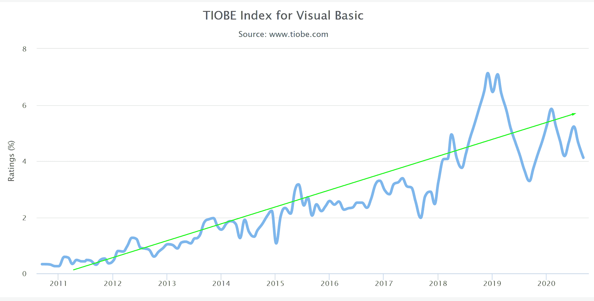

# Visual Basic 徘徊不前

> 原文：<https://thenewstack.io/visual-basic-lingers-on/>

Visual Basic 在人们的记忆中是今天低代码产品的先驱，但它仍然在 T2 TIOBE 指数中排名第六，该指数是基于不同编程语言在搜索引擎中的点击率。然而，根据谷歌趋势，对编程语言的实际搜索已经从地图上消失了。换句话说，有很多关于 Visual Basic 的内容，但是没有人去找。

Visual Basic 内容创作一直停滞不前，之后出现了高峰。NET Core 发布，导致 2019 年初 TIOBE 所有搜索结果超过 7%。因为 Visual Basic 是用来创建。NET apps，2020 年 StackOverflow 开发者调查中有 27%的人广泛使用它，这并不是巧合。去年的净核心。还要注意，微软的 Visual Studio 代码是目前使用最广泛的集成开发环境(IDE)，这使得继续使用 Visual Basic 变得很容易。

Visual Basic for Applications (VBA)曾被前几代公民开发人员广泛用于自定义 Microsoft Office 应用程序，但早已被其他人抛弃。在前面提到的 StackOverflow 调查中，只有 6%的人在过去一年中广泛使用了 VBA，其中大多数人在未来 12 个月中没有这样做的意愿。我们并不是说 Visual Basic 的最新版本已经准备好卷土重来了。相反，有一些线索表明，Visual Basic 在与。NET 环境或入侵仍然广泛使用的 Office 365 应用程序。

通过 Pixabay 的特征图像。

<svg xmlns:xlink="http://www.w3.org/1999/xlink" viewBox="0 0 68 31" version="1.1"><title>Group</title> <desc>Created with Sketch.</desc></svg>