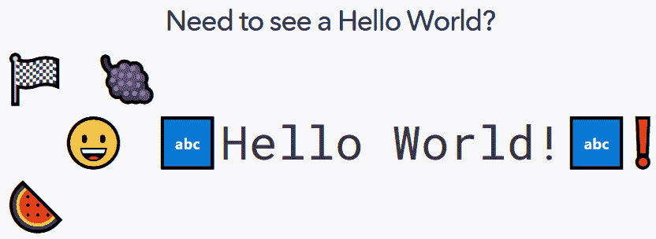
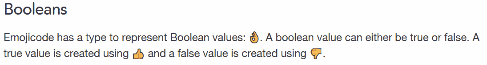

# 视觉基础:Codecademy 推出了一门用表情符号编码的课程

> 原文：<https://thenewstack.io/visual-basics-codecademy-launches-a-course-on-coding-with-emojis/>

7 月 17 日是“世界表情日”，因此在线学习网站 [Codecademy](https://www.codecademy.com/) 找到了一种有趣的方式来庆祝。它推出了一个五小时的迷你课程，教授[表情代码](https://www.emojicode.org/)，一种完全由表情组成的独特编程语言。

“我们相信表情符号具有表现力，”该语言的官方网页解释道。"让我们利用这一点让编程变得更有趣、更容易理解."

最初， [Codecademy 计划在愚人节当天公布迷你课程](https://twitter.com/JoshuaKGoldberg/status/1283468603237511168)，但由于《世界高峰》处理新冠肺炎疫情事件而被推迟。

“我认为营销团队不想太五音不全，所以我们在找到一个更好的日子，也就是现在的世界表情符号日之前，有点退缩了，”高级课程开发人员 [Sonny Li](https://www.linkedin.com/in/sonnynomnom/) 在 YouTube 上对该语言的创作者、 [Theo B. Weidmann](https://tbw.design/) 进行了一个长达[小时的特别采访，他帮助设计和审查了 Codecademy 的新迷你课程。](https://www.youtube.com/watch?v=grmVLN4_Ztg&feature=youtu.be%20)

他们的采访从解释表情代码的文件扩展名开始，这个扩展名要么是`.emojic`要么是……葡萄表情符号。“我需要对此说点什么，”魏德曼插话道。“我一直反对使用表情符号文件名。但事实证明，表情代码社区真的很喜欢使用表情文件名……所以我们决定引入它。”

李承认“它真正体现了表情符号的含义。”

[https://www.youtube.com/embed/grmVLN4_Ztg?feature=oembed](https://www.youtube.com/embed/grmVLN4_Ztg?feature=oembed)

视频

## **俏皮的语法**

表情符号是用 Unicode 定义的小型数字图像[,带有一组专用的十六进制数字，因此它们可以在所有计算机上呈现相同的效果。](https://www.codenewbie.org/blogs/what-emojis-tell-us-about-encoding)

在 Emojicode 中，葡萄表情符号表示代码块的开始，而代码块的结尾用西瓜表情符号表示。但是为什么是葡萄呢？魏德曼承认，主要是个人偏好，尽管他补充说，在早期，“我决定使用很少用来表达有意义的东西的表情符号”，作为其他语言中常见的花括号等日常符号。

“花括号传达的意义就像那些葡萄和西瓜一样小。当然，除了一个事实，那就是我们人类认为这些花括号是属于彼此的。但这只是时间问题，你会发现西瓜和葡萄也属于同一个世界。”

这是一个赛车启动方格旗表情符号，指示执行期间运行的代码，表情符号在开头使用一个笑脸，结尾使用一个感叹号，而不是在文本周围使用引号。为了表示一个字符串，代码包含在两个“ABC”表情符号之间。

在采访中，Codecademy 的李同意 YouTube 上一位评论者的观点，他说这种语言有助于你形象化代码是如何工作的——同时以一种新的方式思考编码。“当然……”魏德曼回答道。“我们不会对实际存在的单词进行编码思考……事实上，这不是我们编程的方式。顺便说一下，数学也是如此。这些也只是一些人编造的迹象。”

乐趣贯穿整个语言。猪鼻表情符号方法访问列表的元素，而仓鼠表情符号则对它们进行洗牌。列表本身是由爆米花表情符号和茄子表情符号之间的一组变量创建的。

是的，表情符号可以被认为是字符串的一部分。事实上，即使是错误消息也包含一个表情符号(就在更有用的错误行号和字符位置之后。)在打印出包含错误的行之后，向上箭头表情符号甚至被用来指向错误发生的位置。

“用表情符号定制错误信息对我来说非常重要。”

给变量赋值是通过一个向右的箭头来完成的。尽管声明“可变的”变量和非常数值需要额外的表情符号——蜡笔和“新的”表情符号。并且 Emojicode 也对它的变量进行严格的类型化。

“我们在表情代码中没有功能，”魏德曼在采访中解释道。“它只是对象，就像在 Java 中一样。”

思想泡泡表情符号用于评论。模的符号——它给出两个数相除后的余数——是一个人把东西扔进垃圾桶。

Codecademy 称它是一种“轻松的语言”，具有“有趣的语法”，他们的[课程网页](https://www.codecademy.com/learn/learn-emojicode)认为“你将永远不会再以同样的方式看待你的编程语言。”

尽管它们包含了对新程序员的警告。"我们不建议你将此作为编程的第一门课程."

## **一种语言的诞生**

Emojicode 编译成快速运行的原生机器语言，文档说明该语言是完全开源的。它的 [GitHub 库](https://github.com/emojicode/emojicode)甚至指出 Dockerfile 可以在 Ubuntu 18.04 环境中构建。但是语言是从哪里来的呢？

白天，魏德曼是苏黎世的一名数码产品设计师——至少，根据谷歌对他的德语网页的翻译。"我们的核心能力在于识别和阐明需求和功能."

在 2016 年的一篇文章中，魏德曼承认他不清楚自己为什么开始使用这种语言，“但我记得有人给我发了一条带有很多表情符号的信息，我想我的大脑最终开始将它解析为代码。”

根据魏德曼对 Codecademy 的评论，他在 2014 年的第一次尝试只是一个使用 JavaScript 的解释器。"这个想法变得非常有趣，我开始用 c 语言实现这种语言."

第一个公开版本于 2016 年初发布，在黑客新闻上引起了广泛的反应。一位自称程序员/企业家的人写道:“是时候让我们摆脱硬编码在键盘上的符号，开始为我们的思想寻找更好的抽象概念了。”。但是另一个评论者有一个更发自内心的反应。

“我最近做了一个奇怪的类似于这个的噩梦…”

## **分享灵感**

这种语言现在已经吸引了一小群忠实的追随者。在采访中，魏德曼指出，已经有了像 Sublime 和 TextMate 这样的文本编辑器插件，它们带有插入该语言表情符号的键盘快捷键，而其他人已经使用自定义键盘布局完成了类似的事情。

此外，Atom 编辑器曾经有一个 Emoji IDE 插件，“但我放弃了对它的支持，”魏德曼后来补充道，因为整个事情对利益来说太麻烦了——让我们这么说吧。"

当有人问魏德曼五年后他会在哪里说这种语言时，他回答说“我不知道。当我开始的时候，我从来没有想过会有一门关于这个的课程。我从来没有想到人们真的会在里面建造东西。我不知道五年后我们会在哪里。

“也许所有地方的软件都将使用表情代码编写。我不知道。”

Sonny Li 补充道，“我们拭目以待。”

与此同时，他可以自豪地反思他带给这个世界的东西:一种让极客梦想通过绘制一面赛车旗、一个笑脸、两个“ABC”图标、一个红色感叹号和一个西瓜来在白板编码面试中表现出色的语言。

* * *

## WebReduce

<svg xmlns:xlink="http://www.w3.org/1999/xlink" viewBox="0 0 68 31" version="1.1"><title>Group</title> <desc>Created with Sketch.</desc></svg>