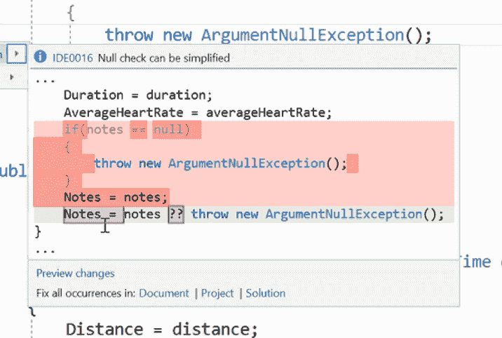

# Visual Studio 2017 提供实时单元测试和数据库开发运维

> 原文：<https://thenewstack.io/visual-studio-2017-brings-devops-databases/>

本周[发布的 Visual Studio 2017](https://blogs.msdn.microsoft.com/visualstudio/2017/03/07/announcing-visual-studio-2017-general-availability-and-more/) 标志着软件成为微软旗舰集成开发环境(IDE)的 20 周年，也可能标志着 DevOps 成为真正主流的时间点。

[Visual Studio](https://www.visualstudio.com/) 仍然迎合广泛的受众——从使用[免费社区版](https://www.visualstudio.com/vs/community/)的业余爱好开发者，到印度的大型外包提供商，他们需要将软件发布到 DVD 上，因为他们的工作场所仍然没有互联网连接，以及“真正接受 DevOps 心态的超级敏捷组织”，Visual Studio 的首席项目经理 [Tim Sneath](https://github.com/timsneath) 告诉新堆栈。“但我们肯定看到 DevOps 正在迅速成为主流。”

[DevOps](/category/devops/) 是 Visual Studio 2017 的重点领域之一，尽管微软希望将它与更常见的“左移”一样进行右移，Visual Studio 项目管理总监约翰·蒙哥马利[解释道。“DevOps 仍然是我们正在学习并变得越来越好的东西(作为一个行业)。端到端 DevOps 工作流是一个相当长的流程；它从代码编辑开始，一直到 CI/CD 管道，最终产生一个分析服务；开发人员可能会查看结果，然后回到他们的编辑器。”](https://www.twitter.com/johnmont)

Visual Studio 中的实时单元测试被标记为通过和失败——破折号显示没有测试覆盖的代码。

## 更紧密的循环

“‘Shift left’将 CI/CD 管道中稍后发生的所有内容带回到内部循环中，这样开发人员在输入时就可以开始准确地看到他们的应用程序发生了什么——在签入发生之前，在部署发生之前。Montgomery 建议说:“我认为我们可以做得更好，缩短这个周期，以便您可以在签入之前发现一系列问题，并更快地识别生产中的问题，就在代码编辑体验中。”

这包括编辑器中的工具，如显示根本原因的异常助手、实时单元测试和编辑体验中的代码分析。当您编辑代码时，您可以看到您是否有完整的测试覆盖，或者如果您对代码所做的更改意味着它不再通过测试，而不是等到您构建项目或将代码签入 CI 服务器来进行静态代码分析，您可以在编辑器中获得提示和建议。这些可以包括团队编码实践，如使用显式类型而不是“var”(存储在项目 repo 中的“EditorConfig”文件中)，以及帮助您获得语言功能的代码建议，如用于抛出空值或元组的新 C# 7 语法。

建议可以基于团队编码风格。

尽早发现会影响部署的问题只是第一步。您还需要工具来构建整个 DevOps 工作流。Visual Studio 2017 提供与其他系统和服务的集成，从微软自己的 [Xamarin 测试云](https://developer.xamarin.com/guides/testcloud/introduction-to-test-cloud/)(使用真实设备)、用于托管移动应用的 [Azure 应用服务](https://azure.microsoft.com/en-us/services/app-service/)和用于在线团队开发的 [Visual Studio 团队服务](https://azure.microsoft.com/en-us/services/visual-studio-team-services/) (VSTS)，到 [Docker](http://www.docker.io) 和 [Git](https://git-scm.com/) ，因此您可以将应用打包并从 Git 存储库中自动部署。

现在，您可以从 Visual Studio 内部使用 Git 做更多的事情；您可以看到传出提交的差异，使用强制推送来完成重定基础或推送修改的提交，删除上游分支，或继续修补重定基础。该集成现在基于 GIT.EXE Git 核心，因此它支持 SSH 并保留您现有的配置选项。

代码建议有助于您获得新的语言特性。

DevOps 越来越意味着使用开源代码和外部组件。对于 Visual Studio 2017，微软与 WhiteSource 合作，将其开源安全和管理服务集成到 VSTS(以及本地等效服务 [Team Foundation Services](https://www.visualstudio.com/team-services/) )中，作为一个[构建任务](https://marketplace.visualstudio.com/items?itemName=whitesource.ws-bolt)，您可以添加该任务，以向您提供您所依赖的开源组件中任何已知漏洞的报告。(Visual Studio Enterprise 用户可以在一个项目上免费使用 [WhiteSource Bolt](https://www.whitesourcesoftware.com/how-to-setup-bolt/) 六个月。)

对于想要所有这些的大型企业，微软正在捆绑 Visual Studio、VSTS、用于 CI/CD 的 Azure 服务(包括负载测试、移动应用测试和 WhiteSource Bolt)，加上 Azure 的折扣定价，以及作为企业开发加速器的培训；这是现有微软客户对采用 DevOps 感兴趣的明确迹象。

## Devops for。网

对于微软商店来说，微软的。[网](https://www.microsoft.com/net)和[。NET Core](https://www.microsoft.com/net/core#windowsvs2017) 将会是 DevOps 的重要组成部分。

Montgomery 承诺 Visual Studio 是“云不可知论者”，但他也提到了 Azure 支持的选项。NET 和。NET Core(你可以把它看作是。NET，适合轻量级 Docker 容器，运行速度快)。

“当 Visual Studio 和。NET 核心部署到 Azure，我们可以进行调试和诊断。我们可以追踪到生产中出错的应用程序的代码行。我们可以将 App Insights 遥测技术集成到应用中，开发人员无需编写任何代码。”

直接从 Visual Studio 使用 Azure App 服务，无需经过 Azure 门户，只是 Visual Studio 2017 中第一个连接服务选项；蒙哥马利说会有更多。你可以建造集装箱化的。NET 和。NET 核心应用程序使用 Docker 容器从 Visual Studio 内部为 Windows 和 Linux。因为 Visual Studio 知道您正在构建一个. NET 应用程序，所以它会将[ASP.NET 图像](https://hub.docker.com/r/microsoft/aspnetcore/)放在 Docker 文件中。您甚至可以从 Windows 上的 Visual Studio 调试到 Linux 容器中，并将不止一个容器而是多个容器部署到 orchestrator 中。甚至构建环境也在 Docker 映像中提供。

覆盖整个 DevOps 工作流是“右移”思想的来源。“‘右移’是指从一开始就注重质量是不够的，”蒙哥马利解释道；“你需要来自用户的持续反馈，将所有过程整合在一起；比如生产测试、实验和用户遥测收集。”它们都是“右移”实践，Visual Studio 将越来越多地集成它们。

Visual Studio 2017 附带的 Redgate 工具使数据库成为 DevOps 工作流的一部分。

## 数据库开发

DevOps 工作流中经常被忽略的一个领域是数据库，但 Visual Studio 2017 包括三个工具，可以帮助您跨数据库管理 DevOps 周期。 [Redgate 的 SQL 搜索工具](http://www.red-gate.com/products/sql-development/sql-search/)可以帮助您在多个数据库中查找 SQL 片段和对象，包含在 Visual Studio Community、Pro 和 Enterprise 中，这应该可以提高数据库开发人员的工作效率。

Visual Studio Enterprise 2017 还包括 [Redgate 的 ReadyRoll](http://www.red-gate.com/products/sql-development/readyroll/) 数据库版本和模式管理工具的“核心版本”，以及智能感知风格的 SQL 提示代码完成。

ReadyRoll Core 帮助您开发迁移脚本并使用源代码控制管理数据库更改，因此它基本上是数据库的“配置代码”。Montgomery 说， [SQL Prompt 核心](https://marketplace.visualstudio.com/items?itemName=vs-publisher-306627.RedgateSQLPromptCore)扩展帮助你编写、格式化和重构 SQL 代码。SQL Prompt 在你输入的时候弹出建议，完成 UPDATE 之类的操作符，并提醒你需要设置 UPDATE 之后的下一个命令。完成编辑后，您也可以运行脚本检查器。"这些对数据库的作用就像 VSTS 对源代码的作用一样."

使用 ReadyRoll 作为生成任务，在生成代码时更新数据库。

通常，对代码和数据库模式的更改是独立进行和部署的，即使代码可能依赖于数据库模式的特定版本。Sneath 解释说，ReadyRoll 有助于协调这一点。

当用户在生产中操作数据库模式时，ReadyRoll 记录模式的当前版本和以前版本之间的差异，并可以创建从一个版本到另一个版本的迁移脚本。用户可以将它们签入源代码，就像其他版本一样。

Montgomery 说:“你总是知道你使用的是什么版本的数据库模式，你知道你想得到什么版本，你可以通过运行这些脚本向前迁移。”

这意味着您可以保持您的前端和后端更改同步，即使开发人员对数据库的本地版本进行了更改，因为 ReadyRoll 会将他们的更改同步回项目，刷新模式，并创建一个 changelog。在应用脚本之前，您可以看到脚本的内容，并且可以将部署模式更新作为构建过程的一部分。

微软正在更新其数据库开发工具。Sneath 指出 [SQL Server 2016](https://www.microsoft.com/en-us/sql-server/sql-server-2016) 将其工具转移到 Visual Studio 的更高版本中。SQL Server 2012 使用的是 Visual Studio 2010 工具；现在是基于 Visual Studio 2015。”

对于企业开发人员来说，Visual Studio 和 SQL 之间的强大 DevOps 集成将是有用的，但微软会更进一步吗？

Sneath 指出，Visual Studio 中的 NoSQL 支持仍然基于扩展，而不是内置功能，但这是微软处理 Visual Studio 新功能的方式。“我们的理念是从大扩展开始。Docker 支持最初是 Visual Studio 2015 中的一个扩展，现在是产品的核心部分，其他功能也是如此。在发展非常迅速的地方，在有很多快速实验的地方，你会看到我们继续推出扩展，然后进入核心产品。”

专题图片:[雕塑家工作室](http://www.metmuseum.org/art/collection/search/11586?sortBy=Relevance&amp;ft=studio&amp;offset=0&amp;rpp=20&amp;pos=18)，路易斯·默勒，来自纽约大都会艺术博物馆，公共领域。

<svg xmlns:xlink="http://www.w3.org/1999/xlink" viewBox="0 0 68 31" version="1.1"><title>Group</title> <desc>Created with Sketch.</desc></svg>