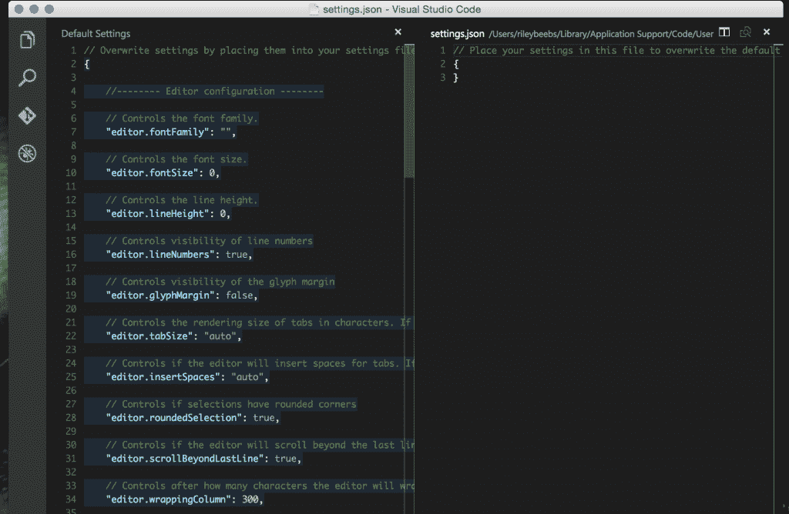
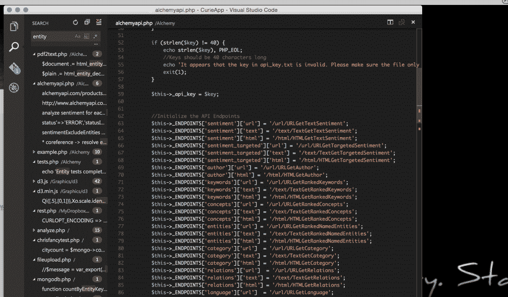
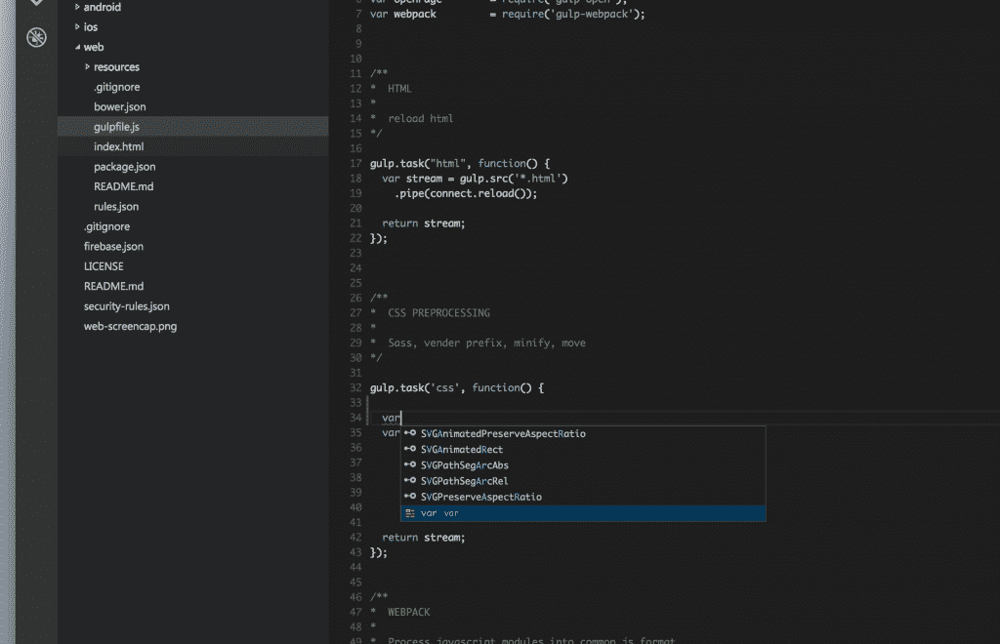

# Mac 版 Visual Studio:优点、缺点和新奇之处

> 原文：<https://thenewstack.io/visual-studio-for-mac-the-pros-cons-and-curiosities/>

几个月前，我听说“Visual Studio 即将取代 Mac。”起初，我不相信告诉我的人。但是一旦我对他们的情感有了信心，我就激动不已。现在它已经到来了…好吧，它真的不是 Mac 版的 Visual Studio。这是 Visual Studio 代码。

这个想法很棒。我打算把我那缓慢的 Windows 7 盒子，里面装着我的 Visual Studio 2012——扩展和所有东西——以及我的 dev 转储到我那超快的 4K iMac 上。所有这些都没有向新兵训练营让步；但看起来这一时刻还没有到来。

Visual Studio Code 是一个集成开发环境(IDE ),可以在 Mac 上运行，也可以在 Linux 和 Windows 上运行(出于某种原因)。但 Visual Studio 却不是。

我给了它整整三个小时的测试:安装很容易，直到我需要更新 Mono。从 GitHub 打开第一个项目也很容易。以下是我的发现:

## 赞成的意见

### 轻量

是的，非常轻。这是所有关于进入，编码，提交和离开。这很好，因为如果你习惯于 Visual Studio，你知道它可能会很重。Visual Studio 代码的启动时间要少得多，自动完成也快得多。

### JSON 设置

我喜欢 IDE 的所有设置都是基于项目的 JSON 文件。

【T2

### 搜索

搜索界面真的很不错。它响应迅速并支持正则表达式。

## 骗局

### 语言支持

对于受支持的语言(JSON、CSS、HTML、{less}和 Node.js)，智能感知和自动完成功能有效。而且很快。但是对于其他语言，比如 PHP，你得到的只是语法高亮。

代码自动完成，当它工作。

### 单声道的

他们支持 Mono，这很酷，但是我的测试 intellisense 和 autocomplete 不支持。确实是。看在上帝的份上。你为什么不在代码支持上多花点功夫呢？

### 构建我的代码！

您只能运行 Mono 和 Node.js 项目。这很令人困惑，因为对 Mono 的语言支持不是很好，但是你可以调试它。这对他们来说是免费的。他们所做的就是调用本地安装的 mono 编译器，由它来完成工作。即使有非常可爱的调试图标，也不太可能进行任何调试。

这有点令人失望，但仍然很整洁。实际的用例一定非常有限。我在想象一个小团队，或者快速开发一个非常小的组件。但是我不认为 Visual Studio 代码会取代开发人员专用的 IDE。我也没有看到它被用于任何持续的能力。

那么它为什么存在呢？我觉得多半是营销戏。它当然发展得很好。但这可能是阻力最小的一条路，看看他们最重要的“开发工具”焦点如何适应 Linux 和 Mac。它还建立了微软与其他应用程序协调的信心。如果我是微软，我会观察下载量并查看所有反馈，以简单地衡量人们使用它的真实情况。如果您可以让跨任何平台的开发人员沉迷于 IDE，那么您就拥有了整个 VSO 套件。

但我也有这种奇怪的感觉，这也是我在 [Build 2015](http://www.buildwindows.com/) 上得到的感觉，微软和 Xamarin 正在策划一些事情。虽然在很多层面上他们是竞争对手，但他们会尽力合作。微软把越多的产品和 Xamarin tools 放在同一台机器上越好。阴谋，多吗？

所以我现在还不能放弃我的戴尔，按照这个速度，我可能会在编写 Visual Studio 代码之前完全转移到[云 IDE](https://thenewstack.io/cloud-ides-have-a-wow-factor-but-for-developers-its-just-different/) 。我觉得值得一试。但是几个小时后你就会明白要点了。老实说，如果你已经安装了 Git 客户端，并且需要在睡觉前快速修改代码，这非常好。

<svg xmlns:xlink="http://www.w3.org/1999/xlink" viewBox="0 0 68 31" version="1.1"><title>Group</title> <desc>Created with Sketch.</desc></svg>