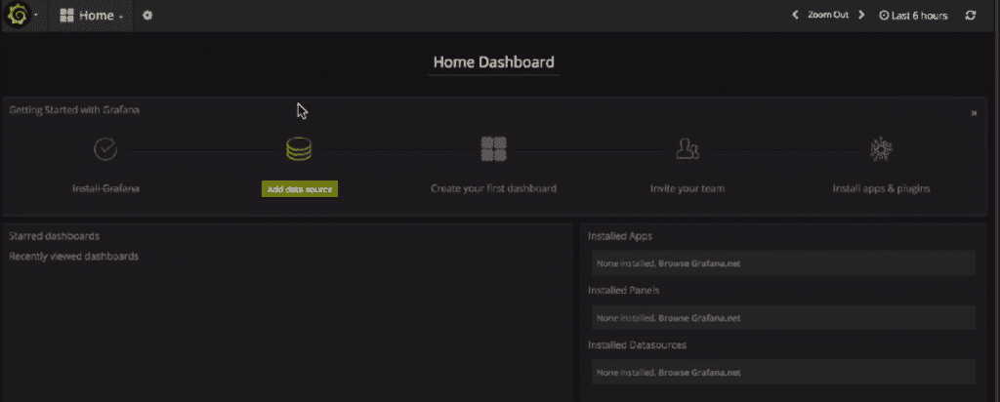

# 用开源的 Grafana 和 InfluxDB 可视化时间序列数据

> 原文：<https://thenewstack.io/visualize-time-series-data-open-source-grafana-influxdata/>

最近由 NGINX 委托对大约 1825 名 NGINX 用户进行的[调查显示，大约 68%的受访者组织正在使用或调查微服务，66%的受访者正在使用或调查容器。当您谈论样本池的“三分之二”时，您正在处理相当大的一部分。](https://www.nginx.com/resources/library/app-dev-survey/)

但反正这些都是 NGINX 的用户，所以你要问剩下的三分之一发生了什么。

正如本出版物的读者所知，采用这些技术是有代价的。与以前相比，DevOps 团队通常最终需要监视和控制更多的活动部件。此外，他们正在监控更短暂的组件，这可能会促使他们使用几种不同的监控解决方案。

 [贡纳尔·亚森

Gunnar 是 InfluxData 的支持工程师。他喜欢帮助客户充分利用他们的 InfluxData 解决方案，并负责 InfluxCloud 的 AWS 架构、自动化和发布管理。他目前选择的编程语言是 Go。](https://www.influxdata.com/) 

两个流行的开源项目 InfluxData 的 InfluxDB 和 Grafana 的合作可以帮助他们监控和控制他们的云基础架构、应用程序和数据库实例以及容器，为 DevOps 提供一个整合的视图或单一控制台。

[InfluxData](https://www.influxdata.com/) 提供了一个时间序列数据平台，用于收集和存储指标和事件进行监控。它包括一个流引擎和 100 多个收集器代理，用于从大量来源收集指标并将它们存储在时间序列数据库中。该数据库针对高写入负载和大型数据集存储进行了优化。它通过缩减采样以及自动终止和删除不需要的数据来节省空间。它还带有一个优雅的 UI，支持可以触发 HipChat、OpsGenie、Alerta、Sensu、PagerDuty 和 Slack 等流行工具的警报阈值。

[Grafana](https://grafana.com/) 是一个厂商中立的开源时间序列分析平台，拥有超过 100，000 个活跃安装。DevOps 团队求助于 Grafana Labs 来帮助整合他们不同的数据源。它与 InfluxData 的无缝集成使其成为可视化收集指标的理想工具。

## 如何设置 Grafana 和 InfluxDB

你可以从这里 [下载 InfluxDB 和相关工具](https://portal.influxdata.com/downloads) 和 [Grafana 从这里](https://grafana.com/grafana/download)。

对于 InfluxData，您将需要一个代理来收集和存储您的指标。我们推荐我们自己的 Telegraf ，它有超过 100 个插件，尽管你也可以使用像 StatsD 这样的传统收款代理。

[T3](https://storage.googleapis.com/cdn.thenewstack.io/media/2017/11/7463c23b-171102-influxdb-02.png)

卡尔·伯格奎斯特

Carl 是 Grafana 的核心贡献者和 Grafana 实验室的首席工程师。他总是一只脚在运营，另一只脚在开发。Carl 喜欢看人们使用 Grafana 了解他们的系统。他坚信社区作为一个整体可以比任何一个单独的组织做得更好。

InfluxDB 和 Grafana 进程可以共享同一个服务器或同一个实例。但是，如果您希望有一个非常大的 InfluxDB 安装，大量的 Grafana 用户，或者如果您的组织有一个特别严格的安全状态或部署配置文件，单独的服务器也是完全可以接受的。InfluxDB 的 API 通常默认为端口 8086，Grafana 的默认为端口 3000。Grafana 将查询 InfluxDB API，以便为仪表板收集数据。

InfluxDB 将是两者中内存和 CPU 更密集的应用程序，因为 Grafana 的许多工作都发生在一个非常轻量级的基于浏览器的应用程序中。

## InfluxDB-Grafana 设置配置

当同时为 InfluxDB 和 Grafana 设置默认配置时，您可以启用**查询日志**，它将记录所有执行或发送到 InfluxDB API 的查询。这样的日志对于调试 Grafana 问题可能很有用。使用配置的**协调器**部分设置最大并发查询数。这可能有助于改善多个 Grafana 用户同时使用查询访问 InfluxDB 的问题。您还可以设置查询超时，并记录查询运行缓慢的时间。

**最大选择点**、**最大选择系列**和**最大选择桶**设置限制可返回的结果数量。这有助于防止特别大的查询减慢或关闭 InfluxDB 服务器。

Grafana 的配置文件包括有用的设置，如 **http 端口**和路由器日志，加快您的浏览器加载时间。

## Grafana 的安全设置

每个 Grafana 实例都有一个默认的管理员用户和密码，您可以更改。默认情况下，Grafana 的注册过程允许非管理员用户创建组织。因此，我们建议将“启用匿名访问”选项设置为“假”

如果您打算调试 Grafana——您将会这样做——一定要将日志级别提高到 **debug** 。Grafana 将公开关于其自身的指标。Telegraf 有一个内置的 Prometheus 输入，所以你可以将它指向 Grafana。这样，您可以收集内部指标，将它们放入 InfluxDB，然后在 Grafana 中绘制它们的图形。

如果您正在使用 InfluxCloud，并且需要在 Grafana 上配置对不同组和用户的访问，请查看这个简短的网络研讨会:“[influx cloud with Multi-Tenant Grafana](https://www.influxdata.com/training/influxcloud-multi-tenant-grafana/?ao_campid=70137000000Jgvd)同样，要使用 Grafana UI 来设置图表并利用 InfluxDB 查询生成器，请参见“[如何将 Grafana 与 InfluxDB 一起使用](https://www.influxdata.com/resources/how-to-use-grafana-with-influxdb/?ao_campid=70137000000Jbgu)”

## 构建仪表板和设置图表

Grafana 的仪表板，如上图所示，是一组行和面板，一旦选择 InfluxDB 作为数据源，您就可以编辑它们。您可以轻松地更改如何将图形显示为线条、条形或点。在图表中，您可以使用任何您喜欢的聚合器，选择多个字段，或者使用类似于 **moving_average** 的转换。

每个 Grafana 图实际上都是对 InfluxDB 的查询。如果您有一个包含 30 个图形的仪表板，那么您将发送 30 个查询到 InfluxDB，30 个查询需要得到 InfluxDB 整理的结果，然后通过 Grafana 发送回来。考虑过多的图表是否真的对你有用。

虽然 Grafana 对一个图表上显示的指标数量没有限制，但是您可能希望跟踪对您监控性能、提取见解或实现预测最有用的指标。

这两个开源项目应该非常适合您的 DevOps 监控项目，并且不需要花费您太多时间来设置和定制。

<svg xmlns:xlink="http://www.w3.org/1999/xlink" viewBox="0 0 68 31" version="1.1"><title>Group</title> <desc>Created with Sketch.</desc></svg>