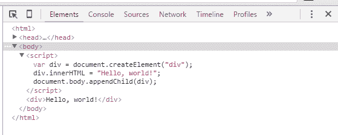
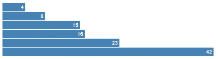

# D3.js 如何掌握 DOM 来可视化 Web 数据

> 原文：<https://thenewstack.io/visualizing-data-web-d3-js/>

这篇文章是解释 D3.js JavaScript 可视化库工作原理的半零星系列文章的第一部分。


对于一个可视化工具来说， [D3.js](http://d3js.org/) JavaScript 库是一只奇怪的野兽。它本身并不是一个图表包，而是一套将数据绑定到文档对象模型(DOM)的编程工具，DOM 是浏览器和 Web 应用程序表示 HTML 的接口。例如，它[可以从一组数字中创建](http://d3js.org/#introduction)一个 HTML 表格。

如果您只是需要在 Web 上发布条形图的快速解决方案，可能有其他 JavaScript 库更适合。但是如果你真的想流畅地使用网络可视化，从长远来看，D3 是你最好的选择。

“交易是这样的。不要告诉 D3 *如何*做某事，而是告诉 D3 *你想要什么*，”D3.js 创建者[Mike bo stock](http://bost.ocks.org/mike/),[以一种有点隐晦的声明](http://bost.ocks.org/mike/join/)表示，至少对新手来说是这样。

D3 学习起来可能有点令人生畏，尤其是因为大多数教程和书籍[似乎都是从无到有地一头扎进了 DOM 是如何操作的。DOM 为 HTML 提供了浏览器 API，为计算机提供了一种标准的方式来表示、存储和操作文档。它本身不是一种编程语言；它是一个模型。](https://www.amazon.com/Mastering-D3-js-Visualization-JavaScript-Developers/dp/178328627X)

D3 [也依赖于一组其他的网络标准](http://website.education.wisc.edu/~swu28/d3t/index.html)。它是用 JavaScript 编写的，使用 SVG 显示图形，使用 CSS 显示和布局，使用 DOM 在 Web 页面中嵌入可视化效果。

换句话说，D3 对你扔了很多。这组教程(这是第一部分)将使用来自 Bostick 和其他来源的代码片段，把它分成更小的块。

## 超越大教堂

当然，如果你想创建图形元素，你可以直接用 DOM 编程。Bostick 提供了一个如何给 body 元素添加 div 的例子

```
&lt;script&gt;
var div  =  document.createElement("div");
div.innerHTML  =  "Hello, world!";
document.body.appendChild(div);
&lt;/script&gt;

```

..浏览器渲染为:

```
&lt;div&gt;Hello,  world!&lt;/div&gt;

```

直接从浏览器查看源代码，在页面上没有显示 div，对了，只有 D3 代码；相反，您必须在您最喜欢的浏览器中打开[开发者工具](https://developers.google.com/web/tools/chrome-devtools/?hl=en)包来查看 div 元素:



所以这很酷。但是对于程序员来说，它的伸缩性并不好。假设你想用一堆 div 创建一个条形图(这是网页设计的禁忌，但请继续关注我们)。使用 DOM，对程序员来说会是[混乱的](http://d3js.org/#selections)，因为它要求程序员[写出迭代](http://bost.ocks.org/mike/bar/#manual)并让程序跟踪状态，正如这个来自 D3js.org 站点的例子所示。下面是直接用 DOM 呈现的众所周知的条形图:

```
&lt;div class="chart"&gt;
  &lt;div style="width: 40px;"&gt;4&lt;/div&gt;
  &lt;div style="width: 80px;"&gt;8&lt;/div&gt;
  &lt;div style="width: 150px;"&gt;15&lt;/div&gt;
  &lt;div style="width: 160px;"&gt;16&lt;/div&gt;
  &lt;div style="width: 230px;"&gt;23&lt;/div&gt;
  &lt;div style="width: 420px;"&gt;42&lt;/div&gt;
&lt;/div&gt;

```

一般来说，正是因为这个原因，Web 开发人员不愿意直接使用 DOM。相反，D3 采用了一种声明性方法。开发人员[可以写出创建条形](http://www.w3.org/TR/selectors-api/#examples)的通用公式，而不是手工写出每个条形。可以用上面的代码呈现的相同的条形图可以在 D3.js:
中完成

```
d3.select(".chart")
  .selectAll("div")
  .data(data)
  .enter().append("div")
  .style("width",  function(d)  {  return  d  *  10  +  "px";  })
  .text(function(d)  {  return  d;  });

```

在一个附带的 CSS 块(未显示)中，开发人员将指定如何创建栏。在 DOM 和 D3 方法中，产生了相同的条形图:



## 你好世界

那么 D3 是如何工作的呢？要在 D3 的 div 标签中呈现“hello world”，需要 Bostick 编写的代码如下:

```
<span class="keyword">var</span>  body  =  d3.select(<span class="string">"body"</span>);
<span class="keyword">var</span>  div  =  body.append(<span class="string">"div"</span>);
div.html(<span class="string">"Hello, world!"</span>);

```

那些代码被放入一组脚本标签中。当然，你需要一个指向库副本的指针——你自己的副本或者 D3 站点上的副本——在文档头的某个地方:

```
&lt;script src="http://d3js.org/d3.v3.min.js"  charset="utf-8"&gt;&lt;/script&gt;

```

在上面的代码中，你添加了 div 标签，然后在里面放了一些文本。看，使用 D3 的好处在于它允许你指定 CSS 和 HTML 常量，比如 div 或者 style，作为函数。HTML 标签的容器、属性值、类名和 ID 名也是 D3 操作的目标。

利用 [W3C 选择器 API 推荐标准](http://www.w3.org/TR/selectors-api/)，D3 允许你指定元素组作为选择。

“与元素一起工作赋予了选择它们的力量；您可以操作单个元素或多个元素，而无需对代码进行实质性的重组。虽然这看起来是一个小变化，但是消除循环和其他控制流可以让你的代码更加整洁，”[在一篇教程中写道。](http://bost.ocks.org/mike/bar/#Selecting)

这里的关键是[D3**选择**标签](https://github.com/mbostock/d3/wiki/Selections#d3_select)，它[应用于页面的第一个元素](http://website.education.wisc.edu/~swu28/d3t/concept.html)。还有 **[selectAll](https://github.com/mbostock/d3/wiki/Selections#d3_selectAll)** 标签，适用于页面的所有元素。下面的代码会给你三份“Hello World！”:

```
&lt;Addition&gt;&lt;/Addition&gt;
&lt;Addition&gt;&lt;/Addition&gt;
&lt;Addition&gt;&lt;/Addition&gt;

```

```
&lt;script&gt;
var body  =  d3.selectAll("Addition");
var div  =  body.append("div");
div.html("Hello, world!");
&lt;/script&gt;

```

## 链条，链条，链条

接下来，你要学习如何阅读 D3。D3 使用了一种[方法链](http://alignedleft.com/tutorials/d3/chaining-methods)的语法，JavaScript 人可能从 jQuery 上知道。链式语法允许您[使用句点(" .)将多个方法链接在一个序列中](http://alignedleft.com/tutorials/d3/chaining-methods))将它们拴在一起。

通过语法链接，上述脚本代码可以简化为:

```
&lt;script&gt;
d3.selectAll("Addition").append("div").text("Hello, world!");
&lt;/script&gt;

```

所以，。**选择**，或。**选择全部**，选择元素，。 **append** 添加 HTML 标签，而**。文本**插入文本。

## 带上数据

所以我们知道可以通过 D3 对 DOM 的控制来操纵元素。下一步是将数据(您希望可视化的数据)绑定到元素。数据输入，图像输出，对吗？

我们通过调用 [selection.data](https://github.com/mbostock/d3/wiki/Selections#data) 来实现这一点。数据[可以是几乎任何东西的数组](http://alignedleft.com/tutorials/d3/binding-data) y，包括数字、字符串或其他数组或键/值对的对象，使用您最喜欢的工具从数据库或其他来源提取。只需将数据集数组声明为一个变量:

```
var dataset  =  [  5,  10,  15,  20,  25  ];

```

然后在一个 selectAll 之后用它们被添加到的元素调用它:

```
d3.select("body").selectAll("p").data(dataset)

```

D3 [也可以读取 TSV、JSON、XML、CSV、HTML 或普通 txt 格式的外部文件](http://www.d3noob.org/2012/12/getting-data.html)。

请记住，当您调用这个函数时，不必在页面上创建所有的元素。您使用 [enter](https://github.com/mbostock/d3/wiki/Selections#enter) 方法创建一个占位符元素来传递数据项。在这个例子中，无耻地从斯考特·玛瑞的[棒极了的一套 D3 教程](http://alignedleft.com/tutorials/d3)、[。append](https://github.com/mbostock/d3/wiki/Selections#append) 将创建缺失的元素，并将数据元素绑定或附加到它们上面。因此…

```
d3.select("body")
    .selectAll("p")
    .data(dataset)
    .enter()
    .append("p")
</code><code>    .text</code><code>(function(d){  return  "This is data element #"  +  d;  });

```

…将获得您的数据集列表。在这里，**。文本操作符**允许你[可以把一个函数作为参数](http://alignedleft.com/tutorials/d3/using-your-data)。在这种情况下,“d”是每次迭代中被调用的数据元素，它可以被称为任何东西。此功能…

```
(function(d){  return  "This is data element #"  +  d;  });

```

…接受传递给它的输入值，这里定义为“d ”,并为第四个数据元素返回字符串“这是数据元素#25 ”,依此类推…

的。文本操作符是众多可以将函数作为参数的 D3 方法之一。这就是 D3.js 开始在灵活性方面变得非常强大的地方。

除了接受函数作为参数，D3 还有其他方法来设置选择的 HTML 属性和 CSS 属性。在下一个 set 教程中，我们将抛弃我们对 Div 的不恰当使用，使用 [SVG](https://www.w3.org/Graphics/SVG/) 进行一些真正的设计。敬请关注。

特征图片:一个 D3.js 生成的[球体螺旋](https://www.jasondavies.com/maps/sphere-spirals/)来自软件工程师 [Jason Davies](https://www.jasondavies.com/) 。

<svg xmlns:xlink="http://www.w3.org/1999/xlink" viewBox="0 0 68 31" version="1.1"><title>Group</title> <desc>Created with Sketch.</desc></svg>