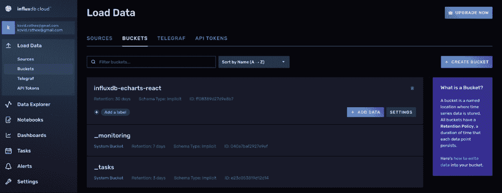
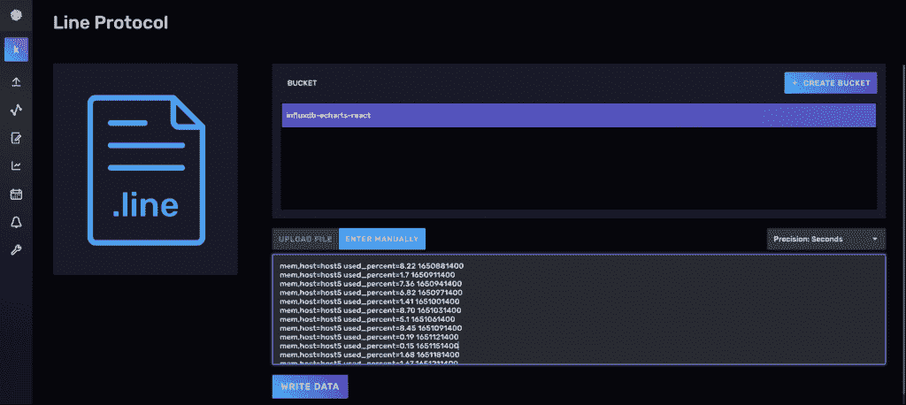
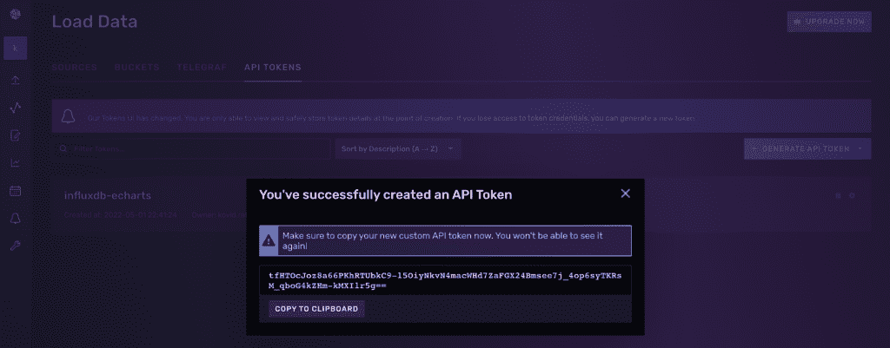
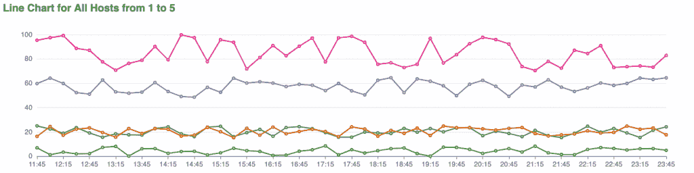
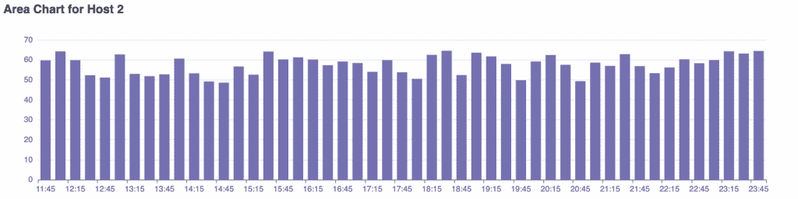
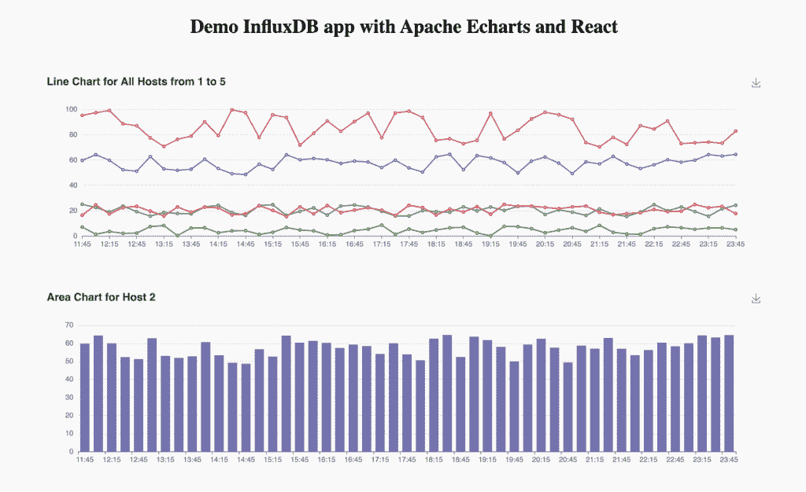

# 用 ECharts 和 InfluxDB 可视化时间序列数据

> 原文：<https://thenewstack.io/visualizing-time-series-data-with-echarts-and-influxdb/>

您使用的每个应用程序、设备或服务都需要特定的软件架构才能高效运行。其中最重要的是数据库层。

 [科维·拉特希

Kovid 是一名数据和基础设施工程师，在澳大利亚墨尔本的 Servian 担任高级顾问。之前，他在一所工程学院担任助理教授，并在进入数据领域之前担任全栈开发人员，他已经在那里工作了八年。他喜欢写关于数据工程、基础设施即代码、DevOps 和站点可靠性工程的文章。](https://www.linkedin.com/in/kovidrathee/?originalSubdomain=au) 

所选择的数据库类型取决于您正在处理的数据类型、您预期的检索延迟以及您将执行的操作类型。

许多数据总是有一个时间属性，或者换句话说，[它自然是按时间](https://www.influxdata.com/what-is-time-series-data/?utm_source=vendor&utm_medium=referral&utm_campaign=2022-07_spnsr-ctn_echarts-and-influxdb_tns)排序的。这种自然的时间顺序有利于优化需要随时间搜索和聚合的数据的性能。[时间序列数据库](https://www.influxdata.com/time-series-database/?utm_source=vendor&utm_medium=referral&utm_campaign=2022-07_spnsr-ctn_echarts-and-influxdb_tns)旨在利用这种自然的时间顺序。

[InfluxDB](https://www.influxdata.com/?utm_source=vendor&utm_medium=referral&utm_campaign=2022-07_spnsr-ctn_echarts-and-influxdb_tns) 通过一种与众不同的方法来解决大规模处理时序数据的问题:使用[存储引擎](https://docs.influxdata.com/influxdb/v2.2/reference/internals/storage-engine/?utm_source=vendor&utm_medium=referral&utm_campaign=2022-07_spnsr-ctn_echarts-and-influxdb_tns)、[时序索引](https://docs.influxdata.com/influxdb/v2.2/reference/internals/storage-engine/#time-series-index-tsi/?utm_source=vendor&utm_medium=referral&utm_campaign=2022-07_spnsr-ctn_echarts-and-influxdb_tns)、[分片技术](https://docs.influxdata.com/influxdb/v2.2/reference/internals/runtime/?utm_source=vendor&utm_medium=referral&utm_campaign=2022-07_spnsr-ctn_echarts-and-influxdb_tns)、[快速数据摄取](https://docs.influxdata.com/influxdb/v2.2/reference/syntax/line-protocol/?utm_source=vendor&utm_medium=referral&utm_campaign=2022-07_spnsr-ctn_echarts-and-influxdb_tns)等等。最重要的是，InfluxDB 与大多数编程框架和语言无缝集成，如 Python、Node.js、Scala 和 Go。

在本文中，您将了解如何设置一个基本的 [React](https://reactjs.org/) 应用程序，从 InfluxDB Cloud 查询数据，并使用查询的数据通过 [Apache ECharts](https://echarts.apache.org/) 填充结果。你还将学习如何建立一个 [InfluxDB 云账户](https://www.influxdata.com/influxcloud-trial/?utm_source=vendor&utm_medium=referral&utm_campaign=2022-07_spnsr-ctn_echarts-and-influxdb_tns)，创建存储桶和编写[流量查询](https://docs.influxdata.com/flux/v0.x/#/?utm_source=vendor&utm_medium=referral&utm_campaign=2022-07_spnsr-ctn_echarts-and-influxdb_tns)。

## **什么是 InfluxDB？**

如上所述，InfluxDB 有一组[特性](https://docs.influxdata.com/influxdb/v2.2/get-started/?utm_source=vendor&utm_medium=referral&utm_campaign=2022-07_spnsr-ctn_echarts-and-influxdb_tns)和[官方客户端库](https://docs.influxdata.com/influxdb/v2.2/write-data/developer-tools/client-libraries/?utm_source=vendor&utm_medium=referral&utm_campaign=2022-07_spnsr-ctn_echarts-and-influxdb_tns)用于最流行的语言和框架。您可以使用设计良好且成熟的查询语言来查询您的数据，如 [InfluxQL](https://docs.influxdata.com/influxdb/v2.2/query-data/?utm_source=vendor&utm_medium=referral&utm_campaign=2022-07_spnsr-ctn_echarts-and-influxdb_tns) 和 [Flux](https://docs.influxdata.com/influxdb/cloud/query-data/get-started/?utm_source=vendor&utm_medium=referral&utm_campaign=2022-07_spnsr-ctn_echarts-and-influxdb_tns) 。然而，将数据摄取到 InfluxDB 的最快方式是轻量级的、基于文本的协议 [InfluxDB 线路协议](https://docs.influxdata.com/influxdb/v2.2/reference/syntax/line-protocol/?utm_source=vendor&utm_medium=referral&utm_campaign=2022-07_spnsr-ctn_echarts-and-influxdb_tns)。

InfluxDB 在处理实时金融系统的数据时大放异彩，如股票市场和加密货币，以及用于 GPS、天文、交通和天气数据的[物联网应用](https://www.influxdata.com/blog/iot-easy-node-red-influxdb/?utm_source=vendor&utm_medium=referral&utm_campaign=2022-07_spnsr-ctn_echarts-and-influxdb_tns)。

因为 InfluxDB 是开源数据库，你可以自己部署，也可以使用 InfluxDB Cloud 在你选择的云平台上部署 InfluxDB，比如 Azure、Google Cloud 或者 [Amazon Web Services](https://aws.amazon.com/?utm_content=inline-mention) (AWS)。

## **什么是阿帕奇 ECharts？**

Apache ECharts 是一个基于 [zrender](https://github.com/ecomfe/zrender) 的开源 JavaScript 库。它允许你使用渐进式渲染和流加载来渲染[各种各样的图表](https://echarts.apache.org/examples/en/index.html)。您可以用 Canvas 或 SVG 格式呈现图表。Apache ECharts 以其低内存占用而闻名，这使得它成为移动应用程序的绝佳选择。

## **设置 InfluxDB**

创建一个免费的 InfluxDB 云帐户很简单。你可以使用电子邮件和密码注册一个账户，也可以使用谷歌或微软的单点登录(SSO):


### **创建一个存储桶**

使用您选择的登录方法登录到您的云帐户后，您需要[用一些样本数据创建一个存储桶](https://docs.influxdata.com/influxdb/cloud/organizations/buckets/create-bucket/?utm_source=vendor&utm_medium=referral&utm_campaign=2022-07_spnsr-ctn_echarts-and-influxdb_tns)。点击控制台右侧的**创建存储桶**，您将看到以下弹出窗口，提示您为存储桶指定一个名称:


### **导入样本数据**

本教程使用一个数据集来捕获五个实例在几个小时内的五分钟平均内存使用情况。您可以在这个 [GitHub 存储库](https://github.com/kovid-r/influxdb-echarts-react)中找到本教程的所有数据，或者您可以获取[样本数据](https://github.com/kovid-r/influxdb-echarts-react/blob/main/sampleData.txt)并将其粘贴到文本框中，一旦您单击**手动输入**选项，该文本框就会打开。或者，您可以上传包含以 InfluxDB 线路协议格式存储的数据的文件。



在以下窗口中，使用线路协议方法粘贴要上传的数据后，单击**写入数据**按钮:

如前所述，数据集包含五个实例的内存使用数据，这些数据在几个小时的持续时间内平均超过五分钟。InfluxDB 线路协议中的原始数据如下所示:



`mem,host=host5 used_percent=8.22 1650881400
mem,host=host5 used_percent=1.7 1650911400
mem,host=host5 used_percent=7.36 1650941400
mem,host=host5 used_percent=6.82 1650971400`

### **创建新的 API 令牌**

现在，导航到 **API 令牌**选项卡，并创建一个 API 令牌，以便您可以从您的应用程序访问数据。然后，将提示您使用 API 令牌，如下所示:



将令牌存储在配置文件中，因为您将无法再次查看该令牌。如果您最终丢失了这些信息，您可以在稍后的过程中请求新的令牌。

在生产环境中，您最好不时地轮换令牌。为此，您可以使用类似于 [Vault](https://www.vaultproject.io/docs/secrets/databases/influxdb) 的工具。

### **克隆 GitHub 库**

加载数据并创建令牌后，就可以连接 InfluxDB 云数据库了。要连接，克隆 [GitHub 库](https://github.com/kovid-r/influxdb-echarts-react):

`git clone https://github.com/kovid-r/influxdb-echarts-react`

在安装 Node.js 应用程序之前，您需要在`src/App.js`文件中更改以下变量:

`const token = INFLUXDB_API_TOKEN;
const org = INFLUXDB_ORGANIZATION;
const url = INFLUXDB_URL;
const bucket = INFLUXDB_BUCKET;`

您可以在您的组织设置中的`Name`和`Cluster URL`部分分别找到`INFLUXDB_ORGANIZATION`变量的组织名称和`INFLUXDB_URL`变量的集群 URL，如下图所示:

要检索存储桶的名称，请导航到左侧面板中的**加载数据**并单击**存储桶**，InfluxDB 将列出您组织中的所有存储桶:

## **使用带 InfluxDB 的 ECharts**

GitHub 存储库中的 React 应用程序使用以下依赖项使您能够同时使用 InfluxDB 和 Apache ECharts:

```
// fetches all the data in the influxdb-echarts-react bucket
const fluxQuery  =  `from(bucket:  "influxdb-echarts-react")|>  range(start:  0)`;

// function that uses RxJS Observables to get a stream of data from InfluxDB
functionfetchData()  {
 queryApi.queryRows(fluxQuery,  {
      next:  (row,  tableMeta)  =>  {
 const  o  =  tableMeta.toObject(row);
 setChartData((v)  =>  [...v,  o]);
 },
      error:  (error)  =>  {
 window.console.error(error);
 window.console.log('\nFinished ERROR');
},
      complete:  ()  =>  {  setCompleted(true);
      window.console.log('\nFinished SUCCESS');
 },
});
}

```

克隆完存储库后，转到根目录下`package.json`文件所在的位置。当您使用 Node.js 包管理器安装应用程序时，该文件将帮助您安装上述所有依赖项。使用`npm ci`，使用以下命令执行全新安装并启动您的应用程序:

`npm ci && npm start`

几秒钟后，您将能够在终端屏幕上看到以下消息:


安装完成后，登录到 [localhost:3000](http://localhost:3000/) 查看两个现成的图表，您将在下一节中了解这两个图表。通过加载您自己的样本数据和更改图表类型，您可以随意使用该应用程序。

## **在电子海图上绘制数据**

在 Apache ECharts 中，有数百个图表供您探索，但是本教程只关注其中的两个:[多行图表](https://echarts.apache.org/examples/en/editor.html?c=line-simple)和[条形图](https://echarts.apache.org/examples/en/editor.html?c=bar-background)。Apache ECharts 还为您提供了一个浏览器内选项预览部分，您可以在将其作为应用程序的一部分之前尝试其他东西。

折线图是具有多条线的图表，每条线代表样本数据中五个实例之一的固定间隔的平均内存使用情况。条形图只包含一个实例的数据，以固定的时间间隔显示平均内存使用情况。

### **多线图表**

一个多行图表同时绘制了所有五个实例的内存使用情况。这里使用调色板填充了五种不同的颜色。如果您不指定颜色，Apache ECharts 将为您着色默认值。



下面是负责生成该图表的函数:

```
function  Chart({  chartData  })  
    {  return  (  
    <>  <ReactECharts 
        option  =  {{  
            title:  {  
                text:  'Line Chart for All Hosts from 1 to 5'  
                },  
            color:  colorPalette,  
            tooltip:  {  
                trigger:  'axis'  
                },  
            grid:  {  left:  '3%',  
                    right:  '4%',  
                    bottom:  '3%',  
                    containLabel:  true  
                },  
            toolbox:  {  
                feature:  {  
                    saveAsImage:  {}
                    }  
                },  
        xAxis:  {  type:  'category',  
 boundaryGap:  false,  
 data:  arr
 }
        yAxis:  {  
            type:  'value'  
            },  
        series:  [  
            {  name:  'Host 1',  
              type:  'line',  
              data:  chartData.filter(function  (chartData)  {  
                  return chartData.host  ===  "host1";  }).map((val)  =>  val._value)  
                  },  
            {  name:  'Host 2',  
              type:  'line',  
              data:  chartData.filter(function  (chartData)  {  
                  return chartData.host  ===  "host2";  }).map((val)  =>  val._value)  
                  },  
            {  name:  'Host 3',  
              type:  'line',  
              data:  chartData.filter(function  (chartData)  {  
                  return chartData.host  ===  "host3";  }).map((val)  =>  val._value)  
                  },  
            {  name:  'Host 4',  
              type:  'line',  
              data:  chartData.filter(function  (chartData)  {  
                  return chartData.host  ===  "host4";  }).map((val)  =>  val._value)  
                  },  
            {  name:  'Host 5',  
              type:  'line',  
              data:  chartData.filter(function  (chartData)  {  
                  return chartData.host  ===  "host5";  }).map((val)  =>  val._value)  
                  }  
 ]  
 }}
        />
 </>  
 );  
}

```

*注意，你使用的是*[*ECharts for React*](https://github.com/hustcc/echarts-for-react)*库。*

你可以在 Apache ECharts 官方网站上查看一个简化的折线图示例。

### **条形图**

在本例中，条形图显示了其中一台主机主机 2 的内存使用情况。正如您在示例数据和下图中看到的，主机 2 的内存使用范围在~45 到~65 之间，图表自动调整大小到 0 到 70 的范围。



折线图和条形图的代码属于同一个函数，其一般结构如下:

```
function  Chart({  chartData  })  {  
    return  (  
        <>  
            <ReactECharts  
                // code for line chart 
            />  
            <ReactECharts  
                // code for bar chart 
            />  
        </>  
    );  
}

```

当您进行更改和更新图表类型、样本数据、React 配置等时。，您可以登录 [localhost:3000](http://localhost:3000/) 查看您的更改。如果您从[GitHub 库](https://github.com/kovid-r/influxdb-echarts-react)部署它，这是应用程序的默认视图:



## **结论**

搜索、聚合和可视化经常结合在一起，对于充分利用时间序列数据至关重要。

图表和图形是任何时序数据分析用例的关键。Apache ECharts 为您提供了一种简单有效的绘制图表的方法。

<svg xmlns:xlink="http://www.w3.org/1999/xlink" viewBox="0 0 68 31" version="1.1"><title>Group</title> <desc>Created with Sketch.</desc></svg>