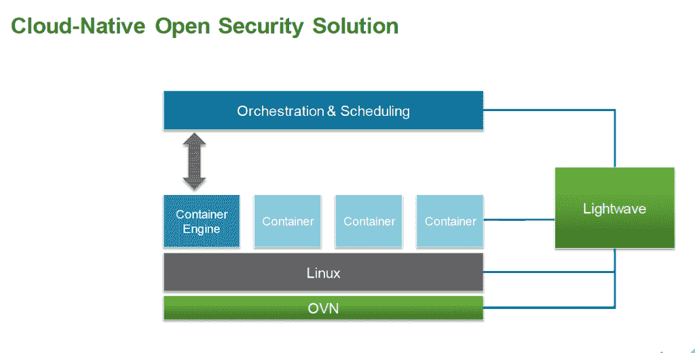

# VMware 通过轻量级 Linux 操作系统和云原生工具响应容器移动

> 原文：<https://thenewstack.io/vmware-announces-cloud-native-tools/>

VMware 正在回答一些关于[它计划如何在容器化的世界中竞争的问题](https://thenewstack.io/amid-container-vs-vm-hype-vmware-draws-docker-closer/)，它发布了两个计划开源的工具，这两个工具[都帮助企业构建和部署云原生应用](http://www.vmware.com/cloudnative/technologies)。与此同时，其分拆公司 Cloud Foundry 也发布了一款相关工具。

正在宣布:

*   **Project light wave**——集装箱识别和出入管理解决方案。
*   Project Photon——一个为容器设计的轻量级 Linux 操作系统。
*   **Lattice**——Cloud Foundry 的集群化容器调度、路由和日志聚合的轻量级打包。

VMware 副总裁兼云原生应用首席技术官 Kit Colbert 表示，企业转向云原生应用来帮助他们获得更高的速度和敏捷性，这些因素也适用于 VMware 公司。他说，该公司今年将每隔几个月发布一次，因为它的目标是“尽早和经常”发布项目，并获得客户反馈。

“这个空间非常非常年轻。我们交谈过的许多公司仍在思考这到底是什么样子，最终需要做什么，”他说。

科尔伯特谈到云原生应用部门的工作时说:

> “这是一个定义我们使命的机会:从根本上说，是让开发者成为数据中心的一流用户。在某些方面，VMware 在软件定义的数据中心愿景方面所做的事情非常相似。它一直在利用虚拟化数据中心，使其成为真正的自助服务混合云。”

他说，虽然专注于开发人员，但也考虑到了运营团队:

“我们正在帮助运营团队运行这些云原生应用，并管理所有功能，如合规性、性能和安全性。它有助于将应用程序代码从开发人员的笔记本电脑一直带到生产堆栈中。”

## 光波计划

这个容器身份和访问管理解决方案旨在解决容器带来的安全缺陷。

Gartner 的一份报告称 [Docker 安全性“不成熟”，](http://www.theregister.co.uk/2015/01/12/docker_security_immature_but_not_scary_says_gartner/)并表示，整体 Linux 容器“在安全管理和支持机密性、完整性和可用性的通用控制方面令人失望。”

科尔伯特解释说，随着数以千计甚至数十万计的应用程序实例的运行，识别所有部分并确保网络配置正确以便它们可以相互交谈，同时确保一些黑客状态不会轻易进入是至关重要的。

Lightwave 不仅可以验证用户，还可以验证应用程序中的组件——他们就是他们所说的那个人，他们正在他们应该在的地方运行。它可以与目录服务一起使用，也可以与身份提供者集成。他说，这不是对 Docker、Rocket、Mesos 或 Kubernetes 的替代，而是一种扩展。

如果您有许多基于 Linux 的主机，调度程序可以使用 Lightwave 检查要在其上提供应用程序的经过身份验证的主机。随着 1 月份发布的 [OVN，它还可以为应用程序验证可信网络。](https://www.sdxcentral.com/articles/news/open-vswitch-crew-tackles-network-virtualization/2015/01/)

【T2

“围绕这些不同的部分形成了一个生态系统，这些不同的部分必须粘合在一起，以便身份管理能够获得我们的客户所寻求的信任和安全性，”他说。

他说中间层对光波特别感兴趣。It、CoreOS 和 Pivotal 将于太平洋时间周一上午 10:00/东部时间下午 1:00 参加这些工具的[在线发布。](http://www.vmware.com/nextgenapps)

## 光子工程

Colbert 说，随着 Linux 成为企业的标准构建模块，VMware 认为扩展其管理程序以包含 Linux 是有意义的。

“我们的想法是通过创建一个我们可以在概念上构建到 vSphere 中的 Linux 发行版来简化管理并提高安全性。我们开源它的原因是，当你考虑如何重新思考虚拟机管理程序和 Linux 在一起是什么样子时，我们可以做很多独特的事情，”他说。

他说，在发布自己的 Linux 发行版的同时，该公司仍然致力于运行客户想要的任何操作系统。

他说，传统的操作系统包括许多包，容器内的应用程序看不到也不会使用，所以它变得没有必要。他说，CoreOS 倡导容器最小化操作系统的理念值得称赞。

“这种分离是我们 VMware 非常感兴趣的地方，”他说。“当你看到这种分裂时，过去的操作系统有一些应用程序和一些基础设施，现在应用程序在容器内；基础设施就在外面。… Photon 是 Linux 操作系统的基础设施部分。这就是我们希望将其内置于[其虚拟机管理程序] ESX 的原因。”

例如，IDC 分析师陈美威一直在说，要转向以操作系统为中心的技术，如容器，VMware 需要拥有自己的操作系统，以与拥有操作系统并将其与虚拟机管理程序相结合的竞争对手竞争。

“这不是不可能的，他们最终将需要在操作系统层进行更大的投资，并可以选择一家公司来帮助这一点，特别是在容器方面，”陈此前表示。

## 格子木架

[Lattice](https://github.com/cloudfoundry-incubator/lattice) 是开源 Cloud Foundry 组件的轻量级版本，用于在集群上运行容器化的工作负载，而不需要全面部署 Cloud Foundry。Lattice 不包括认证或构建。它通过 vagger 运行，不使用 Cloud Foundry CLI，因为它自己没有云控制器。

根据其 GitHub 页面，Lattice 技术基于开源的[云铸造](http://cloudfoundry.org/)组件:

*   [迭戈](https://github.com/cloudfoundry-incubator/diego-design-notes)调度和监控集装箱化的工作负载
*   [日志聚合器](https://github.com/cloudfoundry/loggregator)聚合和流式传输应用程序日志
*   Gorouter 提供 http 负载平衡

正如我们去年秋天所写的， [Diego 有自己的故事](https://thenewstack.io/docker-on-diego-cloud-foundrys-new-elastic-runtime/)，他是一个新的编排经理，负责分配任务和应用程序流程。

Pivotal 的高级技术总监安德鲁·谢弗(Andrew Shafer)说，迭戈是一个应用执行、基于容器的可插拔调度器和健康检查管理器。IBM、SAP 和 Cloud Credo 也在帮助开发开源项目。这个项目对任何人开放。查看更多关于 [Github 的内容。](https://github.com/cloudfoundry-incubator/diego-release)

Diego 与 Docker 的契合展示了使 Cloud Foundry 更易访问和简化的努力。正如我们去年秋天在新堆栈上所写的，Diego 帮助 Warden (Garden)带来了一个更干净的容器抽象，这是最初为 [Cloud Foundry](http://cloudfoundry.org/) 开发的容器技术:

Diego 允许 Cloud Foundry 团队简化平台即服务(PaaS)。惠兰说，droplet 执行管理器(DEA)、健康管理器和一些云控制器现在由迭戈负责。云控制器不是 Diego 的一部分，仍然在 Cloud Foundry 中。对于开发人员来说，Cloud Foundry 将运行应用程序流程并将它们分发到 Diego，然后 Diego 管理其蜂窝网络中的任务和更长的流程。它让 Diego 更像它自己的微服务环境，当然还有很多需要开发的地方。不希望或不需要 Cloud Foundry 所有特性的开发人员仍然可以使用 Diego 作为核心组件来构建他们需要的 PaaS。

Diego 解决的编排问题使它可以与 Google Kubernetes 和 Mesos 等平台相媲美。Kubernetes 和 Diego 都运行在 [etcd](https://thenewstack.io/about-etcd-the-distributed-key-value-store-used-for-kubernetes-googles-cluster-container-manager/ "About Etcd, the Distributed Key-Value Store Used For Kubernetes, Google’s Cluster Container Manager") 上，这种配置技术也是 CoreOS 用来管理其服务器部署操作系统的技术:

Mesos 只是一个通信基础设施和协议，用于支持跨分布式资源的调度。Diego 做到了这一点(不可否认更具体)以及更多:容器化、日志聚合、路由、健康管理等。构建在 Mesos 之上的框架，比如 Marathon，更能直接与 Diego 相提并论。

CoreOS、Pivotal 和 SAP 是新堆栈的赞助商。

通过 Flickr Creative Commons 的特色图片。

<svg xmlns:xlink="http://www.w3.org/1999/xlink" viewBox="0 0 68 31" version="1.1"><title>Group</title> <desc>Created with Sketch.</desc></svg>