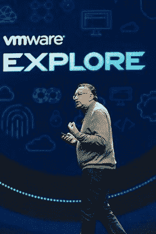
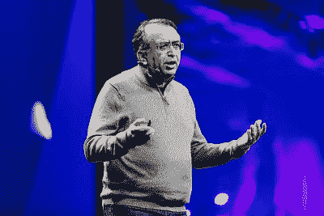

# VMware Aria Graph 支持新的多云管理策略

> 原文：<https://thenewstack.io/vmware-aria-graph-powers-new-multicloud-management-strategy/>

VMware 本周发布了一系列公告，将软件制造商 smack dab 置于多云管理领域的主要参与者中间。

在本周举行的 [VMware Explore 2022](https://www.vmware.com/explore/us.html) 大会上，最大的宣布之一是 [VMware Aria](https://www.vmware.com/products/aria.html) ，这是一个由 [VMware Aria Graph](https://blogs.vmware.com/management/2022/08/project-ensemble-preview-api-first-approach.html) 支持的多云管理产品组合。Aria Graph 是一种基于图形的数据存储技术，由 VMware 有机构建，可捕捉多云环境的复杂性。

## VMware Aria 图表的最佳部分

VMware 云计算管理业务部门的总经理 SVP 在新闻发布会上说:“VMware Aria Graph 是一个用于管理数百万对象关系的多云数据存储库。她指出，这不仅仅是规模的问题，而是能够捕捉基于事件的方法所发生的变化的近乎实时的性质

“Aria Graph 最好的部分是一个使用 [GraphQL](https://thenewstack.io/untangling-enterprise-api-architecture-with-graphql/) 模型的 API，它让开发人员可以立即访问这些信息，以及关于他们的应用程序的信息——它们是如何配置的，它们的依赖关系是什么，它们的成本是多少，它们的性能如何？”帕德马纳班说。“所有这些信息都来自一个集中的 API，而不管是哪个产品在提供这些信息。我们可以从许多不同的来源收集这些信息，并将其提供给开发人员和运营商，不仅仅是 VMware 产品管理产品，还有第三方产品。”

统一的 GraphQL API 简化了开发人员和运营团队的使用。它还可以作为开发人员友好的、一致的多云环境界面。和 GraphQL 查询提供了快速、高效的数据访问。

Enterprise Management Associates 的分析师 [Torsten Volk](https://www.linkedin.com/in/torstenvolk/) 表示:“新的 Aria Graph 数据存储可跟踪跨云、数据中心和边缘位置的应用基础架构和数据依赖性，并构成 VMware Aria 产品组合的新支柱，以持续优化应用环境，而不会增加运营风险。“虽然这非常令人兴奋，但在将庞大的 [vRealize](https://www.techtarget.com/searchvmware/definition/VMware-vRealize-Suite) 产品组合集成到一个一致的平台方面，VMware 仍有许多工作要做。”

Padmanabhan 在一篇[博客文章](https://blogs.vmware.com/management/2022/08/introducing-vmware-aria.html)中说，从成本、性能和安全角度理解目标云的特征，并将其与其他云选项进行比较，取决于拥有跨这些云环境的所有对象和工作负载的关系图。“这正是 VMware Aria 的新数据存储区— VMware Aria Graph —的设计目的，”她解释道。

## 第三方解决方案

 VMware Aria Graph 和 API 服务支持数据存储与第三方解决方案集成，例如可观察性和应用性能管理工具。此外，Aria Graph 中从原生公共云、内部云、VMware 工具和第三方工具收集和标准化的数据丰富了客户现有 VMware vRealize(正在更名为 Aria)、 [CloudHealth by VMware](https://cloudhealth.vmware.com/) 和[VMware Tanzu Observability](https://tanzu.vmware.com/aria-operations-for-applications)产品中的运营、自动化和成本指标，除了原生公共云之外，还为私有/混合云带来了应用感知管理，该公司表示。

VMware 首席执行官 Rangarajan Raghuram 在会议的主题演讲中说:“如果你回想一下谷歌刚出现时，他们的天才之处在于他们创建了一个网络图，上面有所有这些网络链接。“我们也做过类似的事情。我们已经创建了您所有云资产的图表，您知道，成千上万的 VPC 和 Kubernetes 集群以及无服务器和本地等等。使用这个图表，我们可以完成各种管理和安全任务以及自动化，这是您以前从未想到过的。”

VMware Aria Graph 是该公司核心管理解决方案的基础，包括 Aria 成本、Aria 运营和 Aria 自动化。此外，它还为大规模云治理(Aria Guardrails)、云迁移(Aria Migration)和业务洞察(Aria Business Insights)提供了一套端到端的多云管理解决方案，Padmanabhan 说。

VMware Aria Graph 将作为 [VMware Aria Hub](https://blogs.vmware.com/management/tag/vmware-aria-hub) 中的一项功能提供给客户。VMware Aria Hub 在 2021 年 VMworld 大会上作为[项目群](https://blogs.vmware.com/management/2021/10/introducing-project-ensemble.html)首次推出，它提供集中的视图和控制来管理整个多云环境。

## 新姓氏

在 VMware Explore 上，该公司推出了 VMware Aria 作为其新的单一云管理系列名称。VMware 官员表示，VMware 的多云管理解决方案(VMware vRealize、CloudHealth by VMware Suite 和 Tanzu Observability by Wavefront)的客户将有权获得相应的 VMware Aria 产品。与此同时，该公司表示，VMware Aria Cost、VMware Aria Operations 和 VMware Aria Automation 为用户提供跨云的基础架构和应用服务的一致交付和运营解决方案。

GlobalData 的分析师 [Charlotte Dunlap](https://www.linkedin.com/in/charlotte-dunlap-6a32298/) 告诉新堆栈:“VMware 本周的主要信息围绕着它作为云行业瑞士的能力，以及跨 VMware 和非 VMware 平台提供不可知的多云管理。”。“问题是，它的大多数云和平台竞争对手都提出了相同的管理主张。但是，VMware 明确地将股份放在了 DevOps 周围的地面上，最终扩展了 Tanzu 以解决关键的运营问题，包括一些突出的创新，例如跨多个云运行的所有应用的整合、接近实时的视图，称为 VMware Aria Graph。”

Dunlap 说得对，VMware Aria 的产品与微软 Azure Arc 和谷歌 Anthos 类似。此外，Dunlap 表示，她希望听到更多关于其智能自动化和可观察性路线图的信息。

同时，VMware Aria 补充并扩展了对 [VMware Tanzu](https://thenewstack.io/vmware-tanzu-application-platform-a-portable-paas-for-kubernetes/) 平台中云原生应用的开发、交付、开发、运营和生命周期的管理。

VMware 对新 Aria 产品品牌的愿景是为开发人员和运营商带来一套统一的云服务。

“这最终将为开发人员提供一致的 API 和 CLI，以便在任何支持的数据中心、公共云和边缘环境中部署和运行他们的应用程序，而无需更改代码，”Volk 说。“运营商可以使用他们现有的运营工具，根据一套集中的策略来管理、优化和升级任何应用程序基础架构。”

最后，组织可以使用相同的云工程师来管理内部和公共云中的应用平台。Volk 告诉新堆栈，新的 Aria Central 是将 VMware 的自动化、运营和成本管理产品组合集成到一个多云管理平台的第一步。

然而，“发布时提供的最令人兴奋的自动化服务是自动化云护栏，”Volk 说。“这是基于 [SaltStack](https://thenewstack.io/saltstacks-open-source-future-under-vmware/) 团队的 [Idem](https://saltproject.io/additional-projects/idem/) 项目，该项目由 [VMware 于 2020 年收购](https://www.vmware.com/support/acquisitions/saltstack.html)，旨在跨公共云和内部位置自动应用一组统一的策略(例如，用于成本控制、安全性、性能、可扩展性),这将支持一些用例，例如允许软件工程师在 vSphere、AWS、Azure、GCP 和其他支持的云平台上请求 Kubernetes 集群。”

## 概括起来

在她的博客文章中，Padmanabhan 总结了新的咏叹调，写道:

随着 VMware Aria 的发布，我们在四个关键方面统一了 VMware 云计算管理:

*   产品:VMware Aria —一个多云管理产品组合，用于管理跨任何云的基础架构和云原生应用的成本、性能、配置和交付。
*   平台:由 VMware Aria Graph 提供支持的 VMware Aria Hub 由基于图形的数据存储提供支持的集中式视图和控制，该数据存储可捕获多云环境的资源和关系。
*   解决方案:新的端到端服务-三种新的端到端解决方案跨越管理学科，提供云治理、云迁移和业务洞察。
*   产品组合:VMware Aria —统一 VMware 产品组合的单一系列名称:vRealize、CloudHealth by VMware Suite 和 Tanzu Observability。

<svg xmlns:xlink="http://www.w3.org/1999/xlink" viewBox="0 0 68 31" version="1.1"><title>Group</title> <desc>Created with Sketch.</desc></svg>