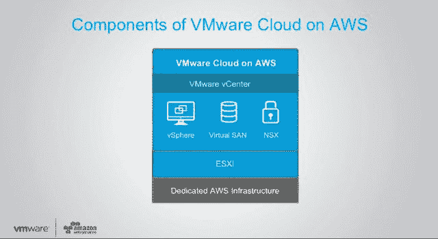
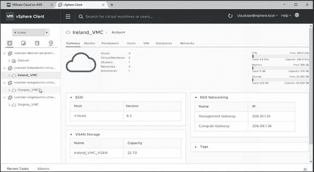
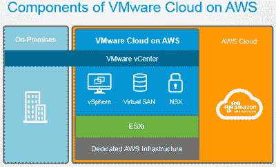

# VMware 与 AWS 的合作伙伴关系为云计算提供了一个入口

> 原文：<https://thenewstack.io/vmware-aws-partnership-provides-container-onramp-cloud/>

VMware 和 Amazon Web Services [周四下午宣布](https://aws.amazon.com/blogs/aws/in-the-works-vmware-cloud-on-aws/)他们将使 Amazon Web Services 成为 vSphere 驱动的虚拟机的“主公共云”部署平台，这是其长期战略的最新行动，也是迄今为止成功的行动。

通过这样做，正如 VMware 预计将在下周在巴塞罗纳举行的[大会](http://www.vmworld.com/en/europe/index.html)上确认的那样，它为端到端混合部署方案剪彩，该方案使开发人员能够使用 Docker 工具构建应用程序容器，同时将这些容器作为 vSphere 虚拟机在 AWS 云上进行渲染和部署。

正如 VMware 发言人周四晚些时候向新堆栈确认的那样，这种合作关系确实使[VSP here Integrated Containers](https://blogs.vmware.com/vsphere/2015/10/vsphere-integrated-containers-technology-walkthrough.html)(VIC)能够使用 VMware 的现有工具无缝部署在 AWS 公共云基础架构上。

## 不再有二元选择

“这成为 VMware 的主要公共云产品，”首席执行官[帕特·基尔辛格](http://www.vmware.com/company/leadership/pat-gelsinger.html)在周四的新闻发布会上说[ *上图右侧* ]“由 VMware 销售、支持和交付。结果是，我们让客户能够在我们今天发布的这种混合环境中无缝运行。”

开发人员和管理员将通过[有限参与测试计划](http://learn.vmware.com/37941_REG)首次体验 AWS 上的 VMware 云，目前正在接受申请。

在同一场新闻发布会上，AWS 首席执行官[Andy Jassy](https://twitter.com/ajassy)【*见上图*】表示:“仔细想想，世界上绝大多数企业都是通过 VMware 实现虚拟化的。“他们已经习惯于运行 VMware 提供的软件和工具来运行他们的内部基础架构。因为 AWS 和 VMware 没有提供无缝体验，也没有提供在本地和 AWS 中运行相同软件的无缝机会，他们实际上不得不做出二元决策，即“要么我使用 VMware 软件，而在公共云中很难使用 AWS；或者我在公共云中使用 AWS，我不得不放弃 VMware 软件。"

Jassy 提到的这种二元选择过去常常因 VMware 决定在公共云领域与 AWS 竞争而得到加强，VMware 现在承认这一决定没有带来足够的回报。

## 大老板搬进来了

就在七周前，在拉斯维加斯举行的 VMworld 2016 大会期间， [VMware 宣布了一项合作伙伴关系](http://www.datacenterknowledge.com/archives/2016/08/30/vmware-reassembles-cloud-stack-as-new-vmware-cloud-foundation/)，使 VMware 服务能够在 IBM Cloud 上得到支持。该公司已经[试图通过](https://thenewstack.io/amid-container-vs-vm-hype-vmware-draws-docker-closer/) [vCloud Air](http://vcloud.vmware.com/explore-vcloud-air/what-is-vcloud-air) 与三大云提供商竞争，但没有取得多大成功。客户已经看到了针对 Microsoft Azure 上的 VMware 虚拟机的[部署选项，尽管 word 阻止了潜在的 AWS 集成，尽管很明显 VMware 的](https://azure.microsoft.com/en-us/blog/ga-enhanced-migration-and-disaster-recovery-for-vmware-virtual-machines-and-physical-servers-to-azure-using-asr/) [NSX 网络虚拟化平台正在适应 AWS](http://diginomica.com/2016/09/08/vmware-innovates-on-its-platform-but-do-customers-care/) 。VMware 高管当时的面部表情足以向分析师发出信号，表明有事情正在酝酿之中。

“这一新产品是 AWS 云上的一个完全托管的原生 VMware 环境，可以按小时按需或以订阅形式访问，”AWS 首席传道者 Jeff Barr 在周四的公司博客文章中写道。它包括客户目前在其数据中心运行的相同核心 VMware 技术，包括 vSphere 虚拟机管理程序(ESXi)、Virtual SAN (vSAN)和 NSX 网络虚拟化平台，旨在提供干净、无缝的体验

VMware 云产品副总裁 [Mark Lohmeyer](https://www.linkedin.com/in/marklohmeyer) 和 AWS 云战略总经理 [Matt Wood](https://www.linkedin.com/in/themza) 花了几分钟时间演示 Barr 的观点，仅使用最新版本的 VMware 本地工具，将 VMware 虚拟机无缝部署到 AWS 在爱尔兰的服务器上。虽然该演示不涉及 Docker 风格的容器，但它清楚地证明了 NSX 已经成功地重新设计为 AWS 提供客户基础设施支持服务。

VIC 是 VMware 版的 containers [，设计在 NSX](https://thenewstack.io/vmware-integrated-containers-may-introduce-docker-enterprise/) 上运行。通过将 NSX 平台扩展到世界上最大的公共云上，VMware 使企业拥有完全集成到其现有环境中的混合云部署选项不仅可行，而且达到了可衡量的程度。这样，容器化的环境就不必划分为单独的服务器—虚拟服务器，甚至物理服务器。[微分段](https://thenewstack.io/microsegmentation-how-vmware-addresses-the-container-security-issue/)是 VMware 处理细分任何需要独占策略的工作负载问题的方式，可有效地将容器化的工作负载视为独立的，而无需弯曲网络使其独立。

## 制导机

[NSX](http://www.vmware.com/products/nsx.html) 是 VMware 微分段功能的来源。

![[SCM]actwin,88,83,88,83;http:// AWS Summits Live Stream - Google Chrome chrome 10/13/2016 , 4:47:07 PM](img/d1825cf2d5c9460b31e8b29439c99cd0.png)

“通过将[*AWS*]链接到客户现有的本地环境，”Lohmeyer 说，“我们可以提供一个跨越这两个世界的公共控制平面，实现一整套新的、强大的混合用例。”然后，他继续展示了他所描述的“在 AWS 上运行的整个 VMware SDDC 软件体系— ESXi、VSAN 存储、NSX 网络，当然还有这些产品的所有企业功能，无论是 NSX 微分段还是 VSAN 闪存存储。”

在 VMware [公司的博客文章](https://blogs.vmware.com/vsphere/2016/10/vmware-cloud-on-aws-a-closer-look.html)中，高级员工架构师 [Frank Denneman](http://frankdenneman.nl/) 指出:“我认为 VMware 云计算 AWS 服务的优势之一是它允许管理员、运营团队和架构师使用他们现有的技能和工具来使用 AWS 基础架构。您可以将工作负载迁移到云中，而无需以任何方式重新搭建平台，无需转换虚拟机，无需重新打包，非常重要的是，无需大量测试，您只需迁移虚拟机。”

[正如我们在拉斯维加斯](https://thenewstack.io/context-vmwares-plan-lead-enterprises-virtualization-jungle/)所看到的，VMware 正在调整其现有工具，以便管理员能够将基于虚拟机和基于容器(使用 VIC)的工作负载视为平等的合作伙伴。所以丹尼曼指出的美德在这里也会得到延伸。这种扩展将使 vSphere 现有的分布式资源调度器(DRS)能够在这些系统中充当容器调度代理，从而无需使用 Kubernetes、Apache Mesos 或 Docker Swarm。

## 怪人出局

在 2015 年 1 月，[码头工人 SVP·斯科特·约翰斯顿提出](https://thenewstack.io/amid-container-vs-vm-hype-vmware-draws-docker-closer/)容器的广泛使用将最终导致一个单一的、统一的工具集用于所有运营工作负载。随着 AWS 与 VMware 的集成，这一预测可能会成为现实，但不会像 Johnston 希望的那样。

正如 Denneman 所指出的，VMware Cloud on AWS 的关键价值主张是，它不涉及管理工具集。这也是 VIC 的价值主张——虽然它在开发阶段采用了 Docker，但它在管理套件的网关处阻止了 Docker。它还为亚马逊自己的 EC2 容器服务提供了一个合法的——甚至可能更好的——替代方案，这种方案提升了亚马逊的地位，而不是压制它，而且也没有将 Docker 排除在已经普及的开发套件之外。

VMware 应对容器化威胁的方法是利用其在虚拟基础设施中的优势:接受和吸收容器，同时为接管容器控制权的网络基础设施奠定基础。在新公司母公司迈克尔·戴尔的帮助下，VMware 现在处于实现这一目标的最佳位置。

[码头工人](https://www.mirantis.com/software/docker/kubernetes/)是新栈的赞助商。

<svg xmlns:xlink="http://www.w3.org/1999/xlink" viewBox="0 0 68 31" version="1.1"><title>Group</title> <desc>Created with Sketch.</desc></svg>