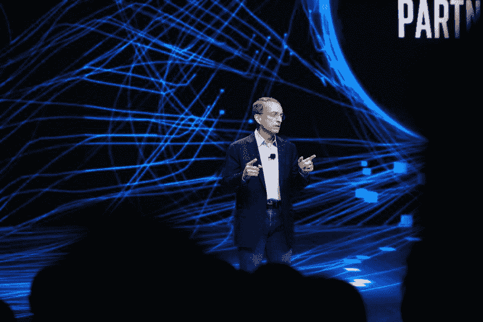
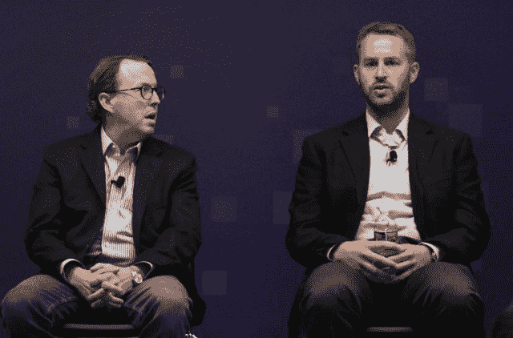
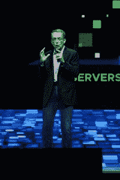
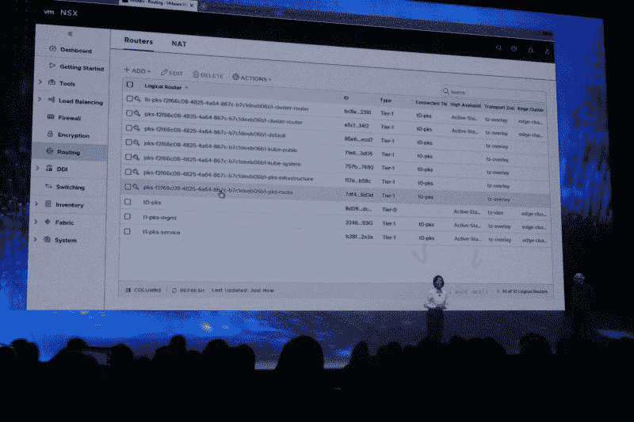
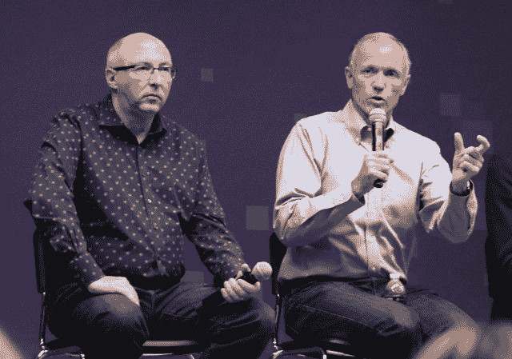

# VMware CEO:虚拟机仍然是运行 Kubernetes 的最佳场所

> 原文：<https://thenewstack.io/vmware-ceo-a-virtual-machine-is-still-the-best-place-to-run-kubernetes/>

在周一上午于拉斯维加斯举行的 VMware[VMworld 2018](https://www.vmworld.com/en/us/index.html)大会的主题演讲中，占据中心舞台的并不是 vSphere。虽然很明显[虚拟机环境](https://thenewstack.io/vmworld-2018-las-vegas-preview-the-post-vsphere-era-takes-shape/)及其支持生态系统不会就此消失(从未有过如此广泛部署的平台)，但周一还是坚定地回答了这样一个问题，即 VMware 打算采取哪种主要战略来带领其企业客户进入工作负载管理的新领域，即众所周知的构建新老堆栈的领域。

“从字面上看，世界已经变成了这个复杂的网络，”首席执行官[帕特·基尔辛格](https://twitter.com/PGelsinger)评论道。“我们已经看到世界从由严格的边界定义的……简单地说，在分布式世界中，硬件不可能工作。我们帮助客户保护应用和数据，无论他们身在何处。我们认为虚拟云网络有三个基本要素:一个以云为中心的网络结构，具有内在安全性，并且全部以软件形式交付。世界正从数据中心走向数据中心。”

## 家居空间

VMware 现在不再认为 VMware 的客户共享一个环境，而是将其用户群描述为共享一个基础架构平台:NSX，这是一个虚拟网络层，它通过一个命名空间跨越数据中心和云的多个物理地址空间。企业可以用各种方式部署工作负载，甚至可以同时部署。然而，只要他们的名称空间和地址分配依赖 NSX 作为底层平台，VMware 就打算支持他们。

这并不意味着 vSphere 正在被烧毁。周一上午，该公司发布了 AppDefense 应用端点安全系统，该系统已被纳入 vSphere 环境 6.7 版的新“白金”SKU。在这里的新闻发布会上，云平台产品营销高级总监 Mike Adams 肯定了他的部门的观点，至少在应用程序安全性方面，“我们所做工作的基础是 vSphere。”

随后，在同一场新闻发布会上，VMware 美洲区首席技术官[Cameron Haight](https://www.linkedin.com/in/cameronhaight/)表示，当今的物理网络基础架构太过脆弱，无法支持应用程序不断增长的需求，即使这些应用程序并未升级到更新的体系结构。而那些正在发展的公司正在以他们自己的开发者从未预料到的规模发展。

[从左至右:VMware 美洲区 VP/CTO Cameron Haight；高级总监。云平台产品。Mktg。迈克·亚当斯]

海特建议的解决方案是 VMware 所谓的“虚拟云网络”该网络中的一些提供商将包括该公司已经建立的合作伙伴，包括亚马逊 AWS 和微软 Azure，这两家公司都支持该公司的 NSX-T，这是一种针对应用程序优化的 SDN 实施。Haight 说，通过 NSX-T，管理员可以制定“一致的政策，无论是在您的数据中心、私有云还是一些公共云环境中。因此，当工作负载在这些不同的环境之间移动时，您不必更改那些您花费大量时间试图配置的策略。”

Pivotal Container Service (PKS)，[去年在这里宣布](https://thenewstack.io/pivotal-container-service-hard-wires-cloud-foundry-kubo-google-cloud/)，是 VMware 的一个“纯”或“香草”Kubernetes 的实现，正如这里的一些高管今天所描述的，加上 BOSH 作为其应用程序部署和发布管理工具链。不出所料，PKS 是为在 NSX 运行而生的。

“NSX 为快速部署集装箱化环境提供了轻松实现网络和安全自动化的环境，”帕特·基尔辛格评论道。“它完全支持 VMware PKS，完全支持 Pivotal 的应用程序服务，我们还承诺完全支持所有主要的 Kubernetes 发行版，如 Red Hat、Heptio 和 Docker。NSX——这个星球上唯一一个能够应对复杂大规模集装箱部署的平台。”

请注意，Gelsinger 将该产品称为“VMware PKS”，尽管“P”指的是姐妹公司 Pivotal。

## “惊人的共识”

在主题演示中，VMware 负责云应用营销的高级主管温迪·卡特(Wendy Cartee)向 PKS 展示了在 vSphere 上运行 Kubernetes，特别是 PKS 的底层 NSX 层如何在 Kubernetes 命名空间启动时通过开发人员设计的 YAML 文件显示网络对象。在这种情况下，每个名称空间都支持单独用户或名称空间的独立操作。

 演示显示，几秒钟之内，PKS 就给命名空间分配了一个逻辑路由器和逻辑交换机。换句话说，PKS 创造了网络资源，同时 Kubernetes orchestrator 也在构建集群。

VMware 首席技术官 [Ray O'Farrell](https://www.vmware.com/company/leadership/ray-ofarrell.html) 评论道:“开发人员使用他们熟悉的 Kubernetes APIs 和基础架构，添加了一个新的命名空间，在幕后，PKS 完全负责网络——结合了 NSX 和我们在 PKS 的工作，真正实现了这一功能的自动化。”

这是一个演示，当然，全体工作人员必须排练至少一次。因此，首席执行官盖尔辛格的反应只是前奏，这一事实不应削弱其更深层的含义:

“Kubernetes 正在迅速地，也许是引人注目地，成为容器管理和自动化的共识方式，”他告诉观众。“它是现代应用团队如何看待其下一代环境的框架，并迅速成为当今企业如何构建和部署其应用的关键。容器是高效的、轻量级的、可移植的——它们对开发者有很多价值。

“但是，它们也需要像任何基础设施挑战一样运行和操作，”Gelsinger 继续说道。虽然容器加速了应用程序的更新和生命周期管理过程，但他继续说，“我们也有这些基础设施问题。我想明确的一点是，运行容器环境的最佳方式是在虚拟机上。事实上，公共云中的每个领导者都在虚拟机上运行他们的容器… Google 和所有主要的云都在虚拟机上运行他们的容器。简单地说，这是运行容器的最佳方式。通过我们的共同努力，我们已经解决了基础设施问题。”

## 没有一致性的地方

在周一下午由首席技术官 O'Farrell 带领的公司技术首席运营官和总经理的新闻发布会上，我问他们如何期待面向 Kubernetes 的容器化应用程序的开发人员将 NSX 作为他们的网络层，而不必有效地从他们已经使用的任何 SDN 网络覆盖中拔出来——例如，[weaver works](https://www.weave.works/)——而不必重新设计这些应用程序。

[从左至右:VMware CTO Ray O 'Farrell 网络与安全总经理 Tom Gillis]

“NSX 背后的想法是，这是一个覆盖，”回应

[Tom Gillis](https://www.linkedin.com/in/tomgillis1/)

，VMWare 网络和安全总经理，“它创造了简单性…当网络结构存在于基础架构的一个狭窄部分时，比如说，对于现在、将来存在的容器，覆盖的价值是在它们之间提供一致性。

“我们已经做了大量的工作来将 NSX 集成到您将要部署的每一个主要的容器和 Kubernetes 平台中，”Gillis 告诉新的堆栈，“好处是，它只是工作。没有复杂性，您不需要依赖开发人员去设置复杂的企业策略和连接。这都是内置的，所以我们实现了我们认为的容器的核心价值支柱[*主张*]，即伴随连接性和安全性的快速部署。”

然而，在周一下午晚些时候的一次小组会议上，一些 VMware 客户确实表达了一点点悲伤——虽然不太明显，但仍然存在——为 PKS 和 NSX 改编了一个已经容器化的应用程序。具体来说，他们正在用一个能够同时跨越一个私有云以及两个或更多公共云的大型网络平台来取代一个旨在让一群容器相互传递消息的覆盖层。说“不复杂”可能和说没有努力不一样。当一个高度分布式的、面向微服务的应用程序打算在利用 NSX 的平台上运行时，它可能需要也可能不需要一些微妙的*调整*；以及这种调整可能是必要的这一事实，将重新架构的话题重新提到了讨论桌上。

正是 PKS 与 NSX 的这种联系，可能会使这个特殊的平台在 Kubernetes PaaS 计划的新兴人群中变得独一无二，这些计划成功地将“container”拼写为“k”。它可能是普通的香草 Kubernetes，但似乎也有巧克力糖浆、鲜奶油、香蕉片和樱桃——它们不是为了让事情变得普通。

<svg xmlns:xlink="http://www.w3.org/1999/xlink" viewBox="0 0 68 31" version="1.1"><title>Group</title> <desc>Created with Sketch.</desc></svg>