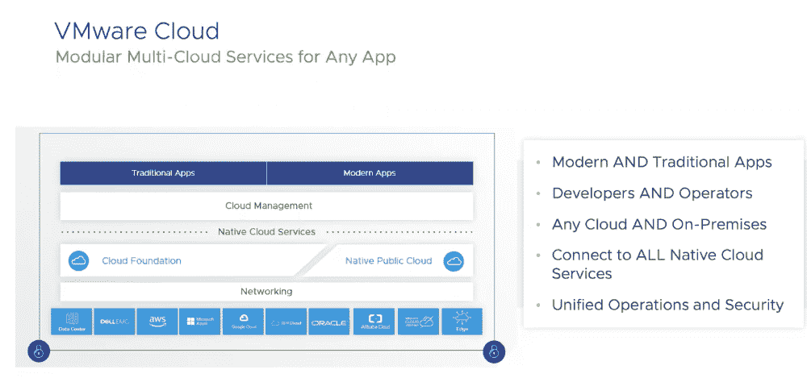
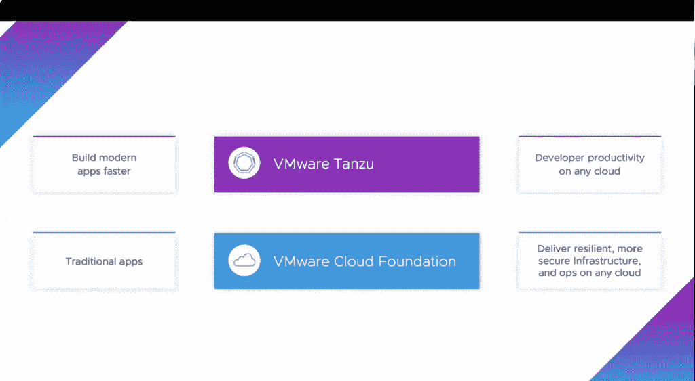
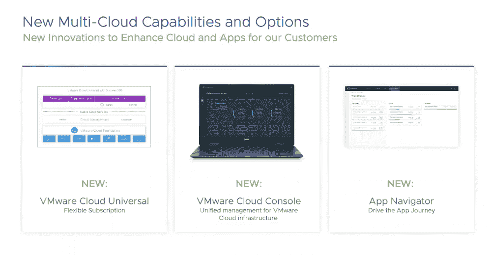

# VMware 云，混合云环境的单一平台

> 原文：<https://thenewstack.io/vmware-cloud-a-single-platform-for-hybrid-cloud-environments/>

随着 VMware Cloud 的推出， [VMware](https://tanzu.vmware.com?utm_content=inline-mention) 向为组织提供跨多云和混合云环境转移资源的单一平台又迈进了一步。

通过单一界面，VMware 客户现在可以在内部运行 [VMware Tanzu](https://cloud.vmware.com/tanzu) 和 [VMware Cloud Foundation](https://www.vmware.com/content/dam/digitalmarketing/vmware/fr/pdf/datasheet/products/vmware-cloud-foundation-faq.pdf) 以及 [Azure](https://azure.microsoft.com/fr-fr/) 、 [Google Cloud](https://cloud.google.com/) 和 [Amazon Web Services](https://aws.amazon.com/?utm_content=inline-mention) (AWS)。例如，以前这种能力主要局限于 AWS 环境。

VMware 产品和云服务首席运营官 Raghu Raghuram 在一次分析师和记者简报会上表示，VMware 云旨在解决寻求在分布式多云环境中部署应用程序和扩展运营的组织的“核心问题”。

“这就是现实:你如何提供一个一致的基础设施，让所有这些应用程序都能运行，不管它们是传统应用程序还是现代应用程序？您如何以一致的方式管理所有这些，并以一致的方式控制成本？”拉古拉姆说。“最重要的是，如何以一致的方式保护它们，我们认为这将是首席信息官们在未来十年要努力解决的核心问题。”

Raghuram 说，VMware 云保护伞下提供的各种工具和选项现在代表了 Raghuram 所说的“实现应用程序现代化的最快途径”。

Raghuram 说，使用 VMware 云，组织的应用程序运行速度提高了 80%,数字迁移速度提高了 46%,而总拥有成本“降低了 59%”,但他没有具体说明进行比较的指标。“我们比其他任何机制都更快、更便宜、更好，”Raghuram 说。“我们保留他们想要的云选择。”

Raghuram 说，VMware 云还代表了 VMware 技术的“融合”,作为 VMware 多云战略的核心基础。其中包括虚拟机(VM)和 Kubernetes 编排平台，如 vSphere 和 Tanzu。他在演讲中说，VMware 为 500 万名开发人员和 8500 万个工作负载提供服务，总共有 30 万个客户。

Raghuram 说，通过在 Azure、AWS 或谷歌上本地运行操作，DevOps 客户既可以管理传统的 VM 应用程序，也可以“在他们想要的任何地方以一致的方式”管理更现代的 Kubernetes 和容器化的应用程序。“然后，开发人员可以连接到任何这些平台上的原生云服务，IT 可以以集中的方式管理它们，并保护集中方式的模型，”Raghuram 说。“这确实是我们对 VMware 云计算的愿景。”

Raghuram 说，VMware 云也不是全有或全无的产品，因为组织可以从不同的模块化服务中挑选最适合他们特定需求的服务。

Raghuram 说，客户可以选择只采用 VMware Cloud Foundation 基础架构，或者“他们可以在任何云上使用 Tanzu 或我们在任何云上的云管理产品组合”，他指的是 VMware 的 Kubernetes 发行版。

“但总的来说，VMware 云计算提供了一整套协同工作的多云服务。因此，他们将所有这些结合在一起，作为一个集成的多云解决方案运行，”Raghuram 说。“这就是我们过去一年在解决客户生活在云分布式世界中的问题方面所做的工作。”

在与分析师和记者的演示中，[高级副总裁兼 VMware 云服务业务部门总经理 Mark Lohmeyer](https://www.linkedin.com/in/marklohmeyer) 概述了支持 VMware 云的三项声明:

*   **VMware Cloud Universal** :“灵活的”订阅允许用户购买和使用 VMware 多云基础架构管理服务。该服务允许用户“做出一个预先承诺，然后在合同期限内的任何时候，灵活地有效兑换该信用池，以消费要约中的任何符合条件的服务订阅服务。”
*   **VMware 云控制台**:面向 VMware 云基础架构客户的单一监控和管理环境。
*   **VMware App Navigator** :一项服务，旨在帮助开发运维团队“根据每个应用的业务价值，在企业应用的整个状态中”评估其应用转型计划并确定其优先级。

“我们的客户越来越需要在这个多云世界中运营，并能够在这些不同的环境中根据业务需求构建、运行和部署应用，”Lohmeyer 说。“我们一直在努力推出一系列新的产品，真正帮助我们的客户加速其现有应用环境的现代化之旅，并加速他们的云计算之旅……这三个新发布的产品支持这一目标。"

<svg xmlns:xlink="http://www.w3.org/1999/xlink" viewBox="0 0 68 31" version="1.1"><title>Group</title> <desc>Created with Sketch.</desc></svg>