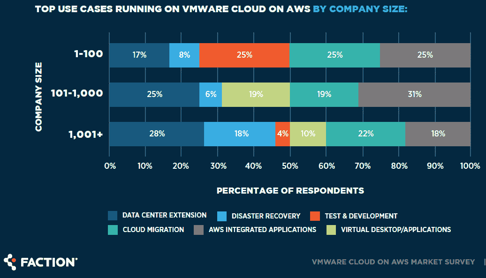

# VMware 云计算在 AWS 的异地私有市场中占有一席之地

> 原文：<https://thenewstack.io/vmware-cloud-on-awss-slice-of-the-off-premises-private-pie/>

2010 年代初，企业工作负载开始虚拟化，其中许多最终运行在基于 VMware vSphere 和 OpenStack 等软件的所谓私有云上。随着十年的发展，企业加快了对公共云的采用，但 New Stack 今年夏天接触的组织中，超过一半的组织仍然要求至少部分云服务在内部提供。

在这个最新的云十字路口，59%的 IT 专业人员正在异地私有云上运行工作负载，这一数据来自之前未报告的[“2020 年 VMware 云计算 AWS 市场调查”](https://info.factioninc.com/2020-vmware-cloud-on-aws-market-survey)派系是 AWS 上 VMware Cloud 的托管服务提供商。我们的假设是，大部分(如果不是全部的话)调查样本都是 VMware 用户，因为 [VMware 用户组](https://www.vmug.com/)占 1，054 名受访者的 83%,其余是从派系的数据库中收集的。

该报告将基于 AWS 的 VMware 云计算呈现为一个不断增长的市场。在 AWS 上部署了 VMware 云的主机数量的快速增长表明正在赚钱，但渠道合作伙伴中的[抱怨](https://www.crn.com/news/cloud/vmware-partners-aws-scoops-up-vmware-cloud-on-aws-deals-and-pushes-you-out-)也表明没有足够的空间给各种各样的竞争对手。有一种观点认为，它的黄金时代已经过去，因为异地私有云实际上是一种权宜之计，允许公司在不进行现代化的情况下迁移工作负载。

虽然私有异地云很常见，但只有 7%的受访者在 AWS 上运行 VMware 云，这意味着至少有一半的 VMware 用户使用类似[亚马逊 VPC](https://aws.amazon.com/vpc/) 的替代方法运行异地私有云。与去年的报告相比并不令人鼓舞。不仅这 7%的数字基本保持不变，而且潜在客户的数量也减少了。2019 年，55%拥有异地私有云的受访者正在使用或考虑 VMware on AWS 产品，但这一比例降至 45%，至少部分原因是评估和拒绝该选项的人数增加。

AWS 上的 VMware Cloud 通常被认为是更大的战略性 IT 计划的一部分，该计划可能包括关闭旧的数据中心以节省资金。对于当前运行该解决方案的人来说，最常见的用例是数据中心扩展，这意味着可以启用某种类型的混合云。迁移完整的数据中心和灾难恢复也是主要的使用案例，但这不是非常具有战略意义的，也可能不是最便宜的长期方法。

最新一代云架构的复杂性令人望而生畏，这也是 VMware 发布 [Tanzu](https://thenewstack.io/the-new-stack-context-tanzu-the-vmware-kubernetes-distro-for-developers/) 的原因。到目前为止，只有 1%的派别调查使用它，但更多的人正计划这样做。Tanzu 将能够部署在客户自己的内部数据中心以及外部的 AWS 前哨上，下一代云架构可能会令人望而生畏。

要点如下:至少从一个方面来看，运行 vSphere 的私有云已经[衰落](https://thenewstack.io/investigating-the-next-generation-of-infrastructure-as-a-service)，而像 AWS Outposts、Google Anthos 和 Microsoft Azure Stack 这样的内部基础设施正在蓬勃发展。如果客户在内部运行云公共云提供商的基础架构，那么就有真正的动机放弃 VMware 的软件定义的数据中心软件以及它在过去四年中与 AWS 一起营销的联合产品。

亚马逊网络服务和 VMware 是新堆栈的赞助商。

由来自 Pixabay 的 Mike Goad 拍摄的特写图像。

<svg xmlns:xlink="http://www.w3.org/1999/xlink" viewBox="0 0 68 31" version="1.1"><title>Group</title> <desc>Created with Sketch.</desc></svg>