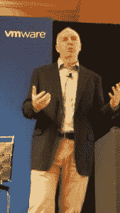
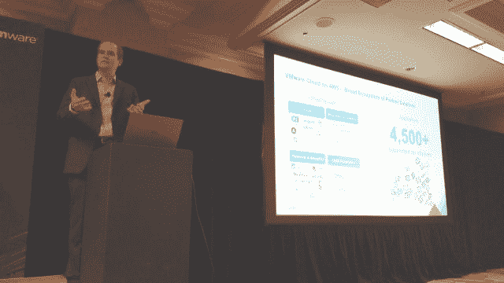
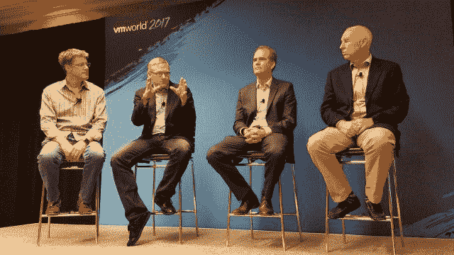
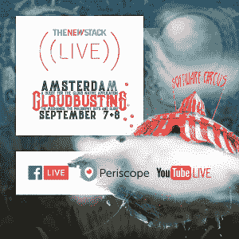
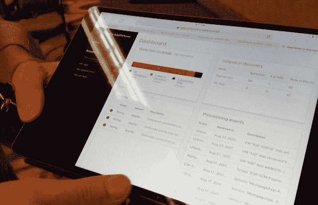

# VMware 围绕 Amazon 和应用程序整合其云平台

> 原文：<https://thenewstack.io/vmware-consolidates-cloud-platform-around-amazon-applications/>

越来越多的 VMware 客户完全可以放心地在公共云中运行他们的全部应用程序。鉴于这种认识，VMware 周一在拉斯维加斯举行的 VMworld 2017 上正式宣布推出基于公共云的基础设施服务，部分或全部托管在亚马逊裸机服务器上。

“我们有 20，000 名客户来到 VMworld，我们不断看到这样的对话，”VMware 产品和产品组合营销高级副总裁 [Erik Frieberg](https://www.linkedin.com/in/efrieberg/) 在展会的新闻发布会上说。“正在发生的是，围绕应用程序的对话。”

[AWS 上的 VMware Cloud](https://www.vmware.com/cloud-services/vmware-cloud-aws.html)将于周一在亚马逊位于俄勒冈州的美国西部地区上线，尽管高管们表示，向其他 AWS 地区的推广可能会占用 2018 年的大部分时间。新平台将成为企业在亚马逊云上托管部分或全部虚拟基础架构的一种方式，但采用了 VMware 的经典 [vSphere](https://my.vmware.com/en/web/vmware/info/slug/datacenter_cloud_infrastructure/vmware_vsphere/6_5) 管理套件。

“如果你是运营或 IT 副总裁，或者是组织的首席信息官，组织的命脉是什么？这是应用，”SVP 继续说道。“每个客户都有数百个、数千个，甚至上万个应用程序。随着他们的接近，他们不再有混合云的概念，无论是本地战略还是混合云战略。他们有一个*云*策略。他们正在做的是查看每一个应用程序，然后决定‘我想用它做什么？’"

## 基础设施退居二线

去年的 VMworld 在很大程度上关注了跨云(包括内部云平台)扩展虚拟基础架构的理想。当时的主题是客户正在为他们的工作负载寻找一个单一的基础。去年 9 月，[亚马逊和 VMware 联合宣布了](https://thenewstack.io/vmware-aws-partnership-provides-container-onramp-cloud/)合作伙伴关系，明确了他们的目标，即在单一平台上同时提供 VMware 虚拟基础架构和亚马逊服务。因此，今天的声明对于期待某种类型的重大事件发生的客户来说并不意外。

今天发生变化的是 VMware 对处于云生态系统中心的应用程序的态度，而不是基础架构。该公司现在描绘了一幅多种服务和众多提供商的图景，所有这些都由一个比以往任何时候都更加以工作负载为中心的管理平台缝合在一起。它包括 CI/CD 平台，如 Chef、Puppet、Ansible、Splunk 和 Maven，这些平台是承载企业应用程序开发生命周期的重要动脉。

在这方面，VMware 正在寻求建立一个能够与[竞争的生态系统，新兴的云原生格局](https://github.com/cncf/landscape)——不仅是其广度，还有其词汇。

“在左边，你可以看到 20 多家基础设施独立软件开发商，”VMware 云平台产品副总裁 [Mark Lohmeyer](https://www.linkedin.com/in/marklohmeyer/) 说，他指的是一张看起来与你在开源社区看到的没有什么不同的图表。Lohmeyer 说，这些独立软件供应商“代表了开发运维、云迁移和成本计算、网络、安全、数据保护和灾难恢复等领域的各种一流能力，他们利用了当今适用于 VMware 内部部署的能力，并将其扩展到基于 AWS 的 VMware 云。”

开源虚拟基础设施软件，如 [Kubernetes](/category/kubernetes/) 在过去的一年中取得了进展，展示了应用程序如何作为一个单元进行管理，以及如何跨云平台进行扩展。去年，VMware 证明了其 NSX 网络平台也可以桥接云平台。但是这个信息是非常以平台为中心的；今天的主题是应用。

VMware 首席技术战略官[Guido Appenzeller](https://www.linkedin.com/in/appenz/)*在回答分析师 Jean Bozman 的一个问题时表示:“目前，我在[ *客户的* ]云方法中看到了很多异质性。”对于所有类型的工作负载，我们的大多数客户仍然非常注重内部部署。有些客户已经开始采用云计算，他们的大部分工作负载都在云中运行。你知道，我见过一些客户，他们在这一点上，可以轻松地在公共云中运行任何类型的工作负载。顾客很少，对吧？它通常要求您重新设计您的应用程序。但是有可能。我们 VMware 提供了一个产品组合，其中有一些针对内部部署的解决方案，一些基于 VMware 的解决方案，以及一些针对一般公共云的解决方案。"*

向基于组合的方法的转变可以说始于两年前，[随着 Photon Platform](https://thenewstack.io/vmwares-photon-platform-and-how-it-treats-containers/) 的推出，它成为在 VMware 品牌、虚拟机管理程序驱动的环境中实现容器化的一种手段。随着该公司不再提供自己的公共云服务，[去年，它与 IBM](https://thenewstack.io/ibm-welcomes-vmware-websphere-users-cloud/) 合作提供服务，将客户现有的 VMware 基础架构扩展到 IBM 云中。

但是这项服务是由 IBM 提供给 IBM 云客户的。相比之下，AWS 上的 VMware Cloud 是 VMware 品牌的、由 VMware 提供的服务。Lohmeyer 告诉记者，VMware 将负责 AWS 平台的补丁、升级和新功能的交付。原生 AWS 服务也将可用于部署到公共云的应用程序，尽管 VMware 的图表明确阻止了 AWS 服务向内部部署部分的扩展。因此，VMware 不会启用一种“亚马逊堆栈”来与微软的 Azure 堆栈竞争。

## VMware 安全性

这种全栈方法还为该公司实现了一种新型的意图驱动的安全功能，称为 AppDefense。VMware 负责安全产品的高级副总裁 Tom Corn 向新的堆栈展示了这一功能，它将首先通过研究应用程序在 CI/CD 平台中的部署配置来收集应用程序的预期行为，其次通过将配置数据与其自身对应用程序通信模式的行为分析进行比较来收集行为。

使用分析引擎，AppDefense 将确定任何应用程序的行为何时何地超出了预测的标准，并立即标记操作员。从基于浏览器的控制台，操作可以决定如何响应，以及如何自动响应未来的再次发生。

“我们在这方面已经工作了两到三年，”Corn 说，“这是这个问题的本质:你能使用虚拟化的独特属性在安全性上有一个完全不同的转折吗？这是我们提供的新解决方案，旨在保护运行在虚拟化和云环境之上的应用程序，它实际上由三个要素组成，其主要内容是，“我如何锁定这些应用程序？”那就是，捕捉，检测和回应。"

Corn 将操作的“捕获”部分描述为通过多个来源收集其预期的配置和行为。针对这种累积的意图应用的实时检测过程将导致对应用的实时分析。正如他随后向我们展示的那样，使用浏览器或 AppDefense 移动应用程序的操作员可以选择让可疑应用程序在保护模式下运行，在这种模式下，虚拟机在更严格的策略限制和更密切的监控下运行。或者，他们可能被隔离，在那里他们被限制在未经批准的情况下发射。

在他的讨论过程中，Corn 没有明确提到虚拟机，他也承认容器化的应用程序行为也会被考虑在内。但是，我们最初看到的是一种以虚拟机为中心的方法来管理行为审查下的应用程序。

SVP 拒绝与思科的 Tetration Analytics 进行具体比较，这是一个行为驱动的应用分析平台，于 2016 年年中首次发布。

Corn 承诺的是 AppDefense 将为应用安全做 NSX 为基础设施安全所做的事情。这一区别进一步说明了这家基础设施公司的重心转移。由于对*编排*(管理容器化应用程序的能力，超过了容器引擎本身提供的能力)的认识不断提高，新堆栈询问 VMware 高管他们的客户在多大程度上引导他们进行了这种转变。

Erik Frieberg 告诉我们，他的公司的客户确实表达了对基于容器框架构建系统的兴趣。但他没有表扬任何一个管弦乐队(例如，DC/OS，Kubernetes，Docker Swarm)或任何一个管弦乐队激发了他的兴趣。

Mark Lohmeyer 表示，VMware 将继续推进其针对[VSP here Integrated Containers](https://thenewstack.io/vmware-integrated-containers-may-introduce-docker-enterprise/)(VIC)的计划。“如果你从客户的角度看两个不同的利益相关者，你就有了开发者，你就有了它，”他说。“vSphere Integrated Containers 的好处在于，对于开发人员来说，它为他们提供了一个本机容器界面，因此他们可以利用所有现有的面向容器的开发工具，它在此基础上工作，无需任何更改。但对于 it 运营人员来说，他们可以通过 SDDC[*软件定义的数据中心*]、vCenter 以及利用他们的工具来管理 IT。”

至少在展会的早期阶段，VMware 高管的策略似乎是不强调较新类别工作负载的“容器性”。通过利用 CI/CD 平台来收集应用程序的意图，该公司可以获得一个机会来利用容器编排的主要吸引力之一——意图驱动的配置——来构建一个更具竞争力的平台，再次跨越新旧技术领域。

敬请关注新堆栈，了解本周拉斯维加斯 VMworld 2017 平台新闻的更多报道。

<svg xmlns:xlink="http://www.w3.org/1999/xlink" viewBox="0 0 68 31" version="1.1"><title>Group</title> <desc>Created with Sketch.</desc></svg>