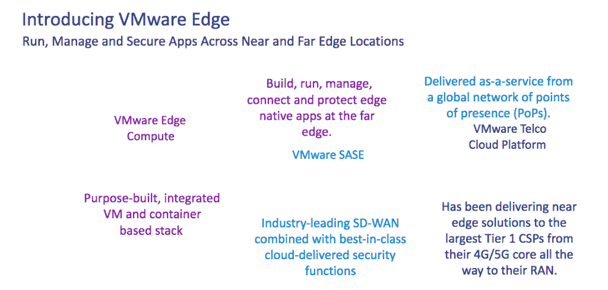

# VMware 披露其边缘计算的未来

> 原文：<https://thenewstack.io/vmware-discloses-its-edge-computing-future/>

[VMware](https://tanzu.vmware.com?utm_content=inline-mention) 的边缘计算愿景扩展到整个边缘计算基础架构范围。其计划的范围在宣布其对 VMware Edge 的雄心时得以透露，该产品是其在本月的 [VMworld](https://www.vmware.com/vmworld/en/index.html) 会议上推出的，面向那些努力管理多种基础架构，特别是复杂的多云和分布式环境的组织。

在 VMworld 主题演讲期间，VMware 首席执行官 [Raghu Raghuram](https://www.linkedin.com/in/raghuraghuram) 指出，边缘计算对于“将应用和服务推向更接近其需求的地方”越来越必要，特别是在零售、制造、运输和能源等行业。

“在我们看来，多云现在从公共云一直延伸到私有云，再延伸到边缘，”Raghuram 说。

“但伴随着多云的优势而来的是挑战:你的企业架构更加分散，你的工作负载更加多样化，云原生企业 SASE 现在是边缘应用，”他说。“您在不同的云上运行，但每个云都有自己的孤立工具和系统，这使得管理、连接和保护在云上运行的这些应用程序变得更加困难。”

Raghuram 说，作为一种解决方案，VMware Edge 计算堆栈“是专门构建的，因此您可以在远端部署 Edge 本机应用程序”。

## 在遥远的边缘

VMware Edge 的一个关键特性是 VMware 创建的堆栈，该堆栈由虚拟机(VM)和基于容器的堆栈组成，为开发运维团队提供了在远边缘管理和保护边缘本地应用的能力(VMware 将“远边缘”定义为位于客户场所的设备和数据)。

VMware Edge 计算堆栈将提供标准版、高级版和企业版。VMware 表示，它还计划开发一个轻量级版本的 VMware Edge 计算堆栈，为轻量级应用程序提供它所说的“极薄的边缘”。

VMware 服务提供商和边缘部门高级副总裁兼总经理 Sanjay Uppal 表示:[VMware 边缘体系涵盖了边缘基础架构的所有领域，并可在许多不同的地点进行扩展。](https://www.linkedin.com/in/sanjayuppal)

他说，位置的数量“非常关键”，因为数据中心通常可能有 10 个或更多的位置，公共堆栈跨越成千上万甚至更多的位置，边缘网络延伸到生产和消费数据的端点附近

Uppal 说，VMWare 的声明是“前所未有的，因为你有一个跨层和堆栈的公共管理平面，以区别于数据中心中运行的堆栈”。

“这种堆栈可以适应实时工作负载，甚至可以满足您在蜂窝基站中所需的微秒级工作负载，但它也可以在单个域或跨数万到数十万个位置的单个企业的环境中运行，这正是 VMware Edge 发布的关键所在。”

VMware 表示将通过 VMware Edge 提供的其他先前可用的产品包括:

*   VMware SASE 将 SD-WAN 功能与云交付的安全功能相结合，包括云网络安全、零信任网络访问和防火墙。这些功能通过一个全球存在点(pop)网络跨近边和远边位置以服务的形式交付。
*   VMware 电信云平台。VMware 表示，它一直在向“世界上最大的通信服务提供商提供近边缘解决方案，从他们的 4G/5G 核心一直到无线接入网络(RAN)。”

## 电信用例

该公司表示，事实上，VMware Edge 非常适合电信需求。“接触企业客户的主要途径之一将是通过电信公司或服务提供商，”Uppal 在 VMworld 大会的问答环节中说道。

VMware 将边缘计算及其变体定义为:

*   一种分布式数字基础架构，用于在多个位置运行工作负载，靠近生产和使用数据的用户和设备。将工作负载放置在边缘是满足边缘原生应用需求的关键。
*   放置在云和远程客户位置之间的任何位置并作为服务交付的边缘本地工作负载称为边缘附近的*。*
**   放置在距离端点最近的远程客户位置的边缘本地工作负载称为*远边缘*。*

 *然而，定义各不相同，而边缘计算基础设施的最终使用要求基本保持不变，尤其是在电信领域。

“如果你问五个不同的人边缘的确切定义是什么，你往往会得到许多答案，”Uppal 在一次新闻和分析师会议上说。“所以，我们要说的是，边缘是分布式数字基础设施——数字基础设施，因为我们希望影响我们的客户正在经历的数字化转型。”

<svg xmlns:xlink="http://www.w3.org/1999/xlink" viewBox="0 0 68 31" version="1.1"><title>Group</title> <desc>Created with Sketch.</desc></svg>*