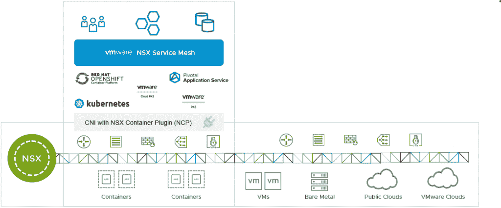
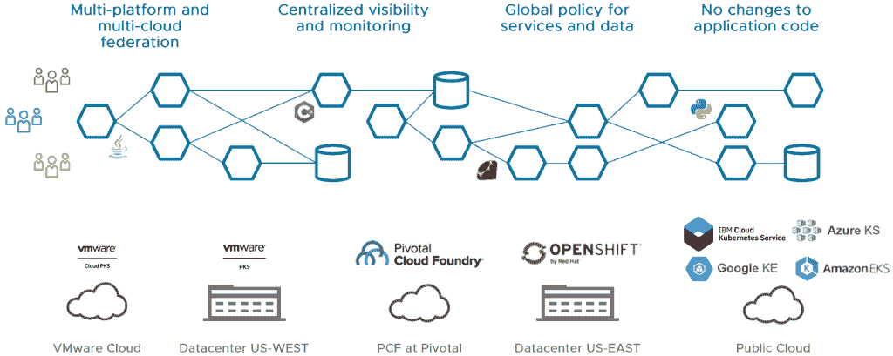

# VMware 将 Istio 扩展到微服务的“NSX 服务网”

> 原文：<https://thenewstack.io/vmware-extends-istio-into-the-nsx-service-mesh-for-microservices/>

使用开源软件 [Istio](https://istio.io/) 作为基础，VMware 推出了 [VMware NSX 服务网格](https://pages.cloud.vmware.com/vmware-nsx-service-mesh)，为企业级微服务提供应用级可见性、控制和安全性，所有这些都通过一个开发人员友好的应用程序接口(API)进行管理。

该软件与 VMware 的旗舰云网络平台 NSX-T 数据中心集成，该软件通过容器网络接口(CNI)对容器提供[支持。Istio 旨在与开源的](https://blogs.vmware.com/networkvirtualization/2018/02/ready-take-off-kubernetes-cloud-foundry-vsphere.html/) [Kubernetes](https://kubernetes.io/) 容器编排引擎协同工作。

VMware 宣布了这项新服务，将于明年年初推出，最初作为 2019 年初 kube con+CloudNativeCon 会议[云 PKS 服务的一部分，该会议将于本周在西雅图举行。独立版本将于明年晚些时候推出。](https://cloud.vmware.com/vmware-cloud-pks)

虽然 Istio 提供了云原生计算用户期望的所有基本功能，但 VMware 希望为企业用户提供额外的功能层，因为企业用户可能没有资源在内部开发这些功能。

VMware 网络和安全首席技术官 Pere Monclus 表示:“光知道我的服务自己在做什么还不够，因为它们是代表某些人，即那些通过这些服务进行身份验证的用户来做的。组织可能需要通过服务网格提供的度量和控制来了解法规遵从性、策略和业务度量，

“我们需要扩展服务网格，以更符合企业政策定义方式的方式理解用户做什么，服务做什么，以及用户体验什么，”Monclus 说。

微服务架构将复杂的应用程序分解为多组单一用途的网络组件，这可能是一个管理难题，因为每个微服务都必须在动态重新配置的网络中进行检测、保护和定位。此外，微服务的多个副本可以并行运行，以满足不断增长的需求。它们的流量也必须得到管理。

一个服务网格将一个侧柜连接到每个微服务，将这些任务的开发从单个开发人员那里标准化和移动。它管理流量控制，并通过身份验证、授权和服务通信加密来保护应用程序。此外，一个好的服务网格还可以通过记录服务事务为细粒度的系统监控做好准备。

VMware NSX 服务网格构建在由谷歌、IBM 和 Lyft 创建的 [Istio](/service-mesh-and-the-promise-of-istio/) 的代码基础上，但增加了新功能，使微服务更易于企业使用，包括:

*   简化 Kubernetes 集群的部署。
*   多个 Kubernetes 集群的协调，在一个联盟中工作，跨越多个云。
*   与 NSX 平台集成，实现统一的策略管理、网络服务和可见性工具。
*   将服务发现扩展到微服务所依赖的外部资源。
*   将 Istio 的服务和 API 可见性/补救扩展到围绕服务级别目标策略的抽象。

云原生计算基金会、Kubecon + CloudNativeCon 和 VMware 是新堆栈的赞助商。

<svg xmlns:xlink="http://www.w3.org/1999/xlink" viewBox="0 0 68 31" version="1.1"><title>Group</title> <desc>Created with Sketch.</desc></svg>