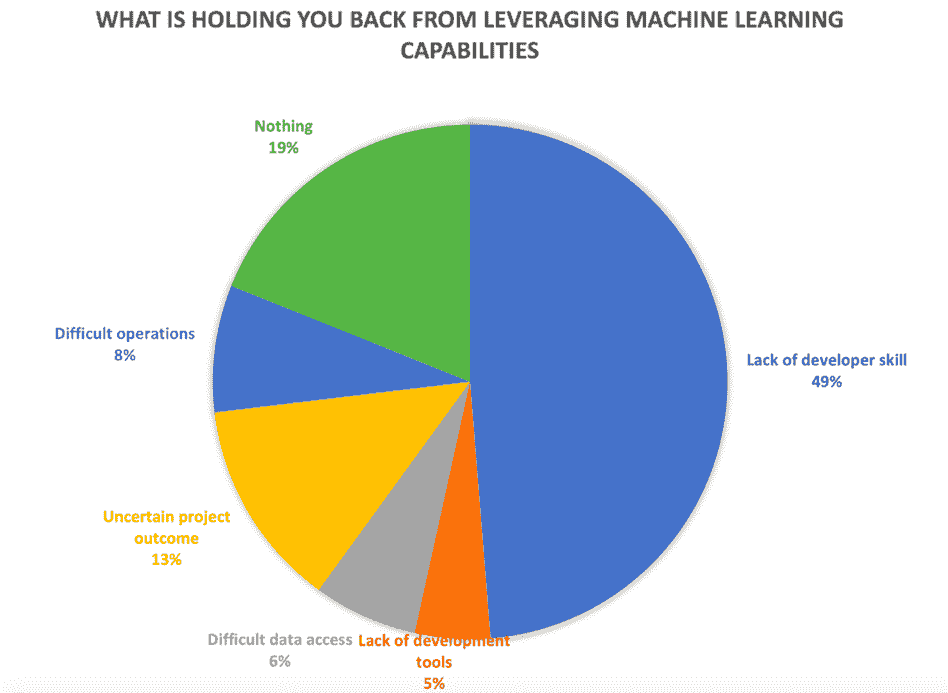
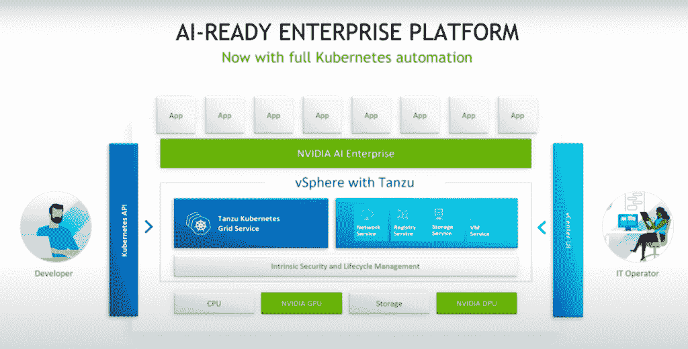

# VMware 扩展了对 Nvidia AI Enterprise 的 Tanzu 支持

> 原文：<https://thenewstack.io/vmware-extends-tanzu-support-for-nvidia-ai-enterprise/>

[VMware](https://tanzu.vmware.com?utm_content=inline-mention) 正在为 [DevOps 团队](https://thenewstack.io/category/devops/)的人工智能(AI)和[机器学习(ML)](https://thenewstack.io/category/machine-learning/) 雄心提供更多支持，因为 vSphere with Tanzu 已经针对 AI 应用程序的开发人员进行了升级，该公司今天与 AI 和 GPU 合作伙伴 Nvidia 在 [VMWorld](https://www.vmware.com/vmworld/en/index.html?src=ps_612dfffb8ac96&cid=7012H000001lCDu&gclid=CjwKCAjw7--KBhAMEiwAxfpkWBgQpz1uvRi6SFRqpiP_qm2uaouPaYpT24xE9vcuTqHsj__J07uurxoCAFoQAvD_BwE&gclsrc=aw.ds) 的第一天共同宣布。

在之前宣布为人工智能开发人员提供用于容器访问的 Nvidia AI Enterprise 和 vSphere with Tanzu 后，“现在我们宣布能够提供 Kubernetes orchestrator，这是一个重要的区别，”VMware 产品和技术营销副总裁 Lee Caswell 在活动前的新闻发布会上说。

“让 Tanzu Kubernetes 支持基于容器的开发人员的能力是我们如何简化人工智能部署的重要下一步，”Caswell 说。

来源:EMA 研究快速调查，2021 年 10 月。

一个重要的区别是使用 vSphere 或 Tanzu 与 Nvidia AI Enterprise 的区别。如上所述，将 Nvidia AI Enterprise 与 Tanzu 配合使用的能力在很大程度上反映了 VMware 的 Kubernetes 整体推送。

## 帮助填补技能缺口的支持

对于那些需要部署和/或管理人工智能和 ML 应用程序但缺乏资源来这样做的 DevOps 团队来说，为 Kubernetes 提供人工智能支持越来越被认为是必不可少的。例如，在企业管理协会(EMA)最近对 275 名开发人员和 DevOps 工程师的调查中，49%的开发人员报告缺乏有效使用机器学习模型的技能。

EMA 分析师 Torsten Volk[告诉 New Stack 说:“虽然 Kubernetes 提供了将人工智能驱动的预测纳入开发和 DevOps 生命周期所需的关键横向扩展能力，但软件开发人员和 DevOps 工程师正在努力从基于容器的开发的这一巨大优势中受益。”。](https://www.linkedin.com/in/torstenvolk/)

“Nvidia AI Enterprise 和 VMware vSphere with Tanzu 之间的这种新水平的集成提供了一套 API 来简化这两者:在 Kubernetes 上开发和运营人工智能驱动的应用程序功能。这可能是将人工智能的使用纳入整个企业主流的一大步。”

## 自动化集装箱化工作负载交付

VMware 表示，Tanzu 和 Nvidia AI Enterprise 的改进集成对于开发人员和 DevOps 团队来说非常重要，他们需要一种更简单的方法来将人工智能功能添加到他们的开发和发布管道中。

今年 3 月，VMware 和 Nvidia 宣布了 VMware 当时吹捧的“端到端”人工智能就绪型企业平台，它说运营团队更容易部署和操作。这个联合平台包括 Nvidia AI 企业软件套件，该套件针对 VMware vSphere 进行了认证、优化和支持。

周二，VMware 还宣布，包含在 VMware vSphere with Tanzu 中的 Tanzu Kubernetes 网格服务与 Nvidia AI Enterprise 集成，使客户能够自动交付容器化的工作负载，并在生产中主动管理应用。

“Nvidia 人工智能企业包括 Tanzu Kubernetes Grid for simplified MLOps 是一项重要的声明，因为开发人员和运营团队一直在等待一个企业级平台来开发、运行和操作他们的人工智能项目，”Volk 说。“这可能是那个平台。”

VMware Tanzu，现在是一个人工智能就绪的企业平台。

## 寻求一个统一的应用平台

一个重要的区别是单独使用 vSphere 或 Tanzu 与 Nvidia AI Enterprise 的区别。如前所述，将 Nvidia AI Enterprise 与 Tanzu 结合使用的能力反映了 VMware 的整体 Kubernetes 计划。

Caswell 说:“你从 Tanzu 得到的是 Kubernetes 编排的能力，对于那些关注开发空间的人来说，Kubernetes 已经迅速发展成为如何编排容器使用的事实上的标准。”

“现在，容器实际上非常有趣——容器启动更频繁，删除更频繁，因此它们实际上非常不稳定。因此，现在能够使用 Kubernetes[使用 Tanzu]来管理容器并对其进行编排，这为您提供了过去没有的更高级别的安全性和管理。”

Volk 说，在 VMware 寻求提供一个可以跨越数据中心和公共云的统一应用平台的过程中，Kubernetes 支持的增加至关重要。

“当涉及到人工智能模型的开发和生命周期管理时，‘一次编码，随处部署’的范式变得更加重要，”Volk 说。“提供一套独立于基础架构的 API 是 VMware 与流行但专有的公共云产品(如 [AWS](https://aws.amazon.com/?utm_content=inline-mention) Sagemaker 和 Azure ML)的关键区别。”

<svg xmlns:xlink="http://www.w3.org/1999/xlink" viewBox="0 0 68 31" version="1.1"><title>Group</title> <desc>Created with Sketch.</desc></svg>