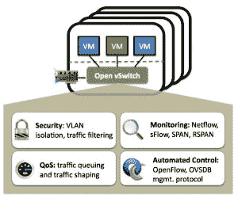

# VMware 将 Open vSwitch 的监督权交给了 Linux 基金会

> 原文：<https://thenewstack.io/vmware-hands-oversight-open-vswitch-linux-foundation/>

对于大规模交付服务至关重要的开源功能越来越多，现在又增加了 [Open vSwitch](http://openvswitch.org/) ，这是由 VMware 创建的用于连接虚拟机的开源虚拟网络交换机。

周二，[Linux 基金会](https://www.linuxfoundation.org/)宣布，随着 VMware 放弃对该项目的监管，Open vSwitch (OVS)将被添加到其不断增长的基础设施项目堡垒中。OVS 加入了开放容器倡议(OCI)的容器格式 Node.js、Kubernetes 贡献者的编排兴趣，以及现在对世界数据中心的运行至关重要的许多其他项目。

“我们真的努力做到了，我认为我们一直在公平地管理这个项目，不试图偏袒任何人，”VMware 的交换机技术总监贾斯汀·佩迪特在与新堆栈的讨论中说。“但仍有这样的看法。我认为转到 Linux 基金会有助于许多人澄清这一点。”

与此同时，VMware 希望展现稳定性和一致性，特别是对于已经在虚拟设备上投入大量资金的主要数据中心和云服务提供商。

“我不认为成为 Linux 基金会[项目]会改变 VMware 和 Open vSwitch 之间的关系，”VMware 首席工程师[本·普法夫](https://twitter.com/Ben_Pfaff)说道。“VMware 与 it 部门的互动方式将保持不变。”

普法夫解释说，虽然 VMware 工程师继续负责多达 70%的 OVS 活动提交，但这些贡献被视为个人贡献，而不是来自 VMware，Inc .的官方分发。他希望这种变化将迫使外部贡献在今年年底前增加到近一半。

## 虚拟机的虚拟交换机

数据中心网络运营商非常清楚，vSwitch 是虚拟网络的关键。通过引入将虚拟机链接到物理网络的虚拟网络，VMware 彻底改变了虚拟组件的分级(可以说是它首先创建的市场)。这样，物理服务器不仅仅是虚拟机平台的一对一主机；他们可以定义虚拟机相互通信的方式。有一种观点认为，如果没有 vSwitch，我们今天所知的云是不可行的。

2012 年 2 月，一家名为 Nicira 的公司展示了它可以构建一个在 VMware 的 ESXi 虚拟机管理程序上运行的开源网络虚拟化平台。Nicira 的真正突破是该平台完全通过公共 API 操作，而不是思科、Juniper 和其他公司所需的专有网络接口驱动程序。这一创新促使斯坦福大学的研究人员提出疑问[PDF],“NIC IRA 是否正在利用这一广泛的新技术贪多嚼不烂？还是他们有能力彻底颠覆整个互联网服务市场？”

第二年 6 月，VMware 彻底收购了 Nicira，这让斯坦福的问题变得毫无意义。这项收购交易后来估值约为 10 亿美元，商业内幕网发现参与了当时未报道的针对思科的技术竞标战。

VMware 当时的 CTO[Steve Herrod](https://www.linkedin.com/in/steveherrod)表示[他的公司致力于保持 vSwitch 的开放性](http://networkstatic.net/nicira-acquisition-by-vmware-winners-and-losers/)和供应商无关性，包括第三方虚拟机管理程序支持。包括 Cisco 在内的其他各方[很快指出了](http://blogs.cisco.com/datacenter/mp-bgp-evpn-control-plane-for-vxlan-sdn-is-growing-up) VMware 对 vSphere 之外的 OVS 支持选项的限制。毫无疑问，Nicira 交易使 VMware 成为网络公司争夺数据中心最大空间的平等竞争者，即使没有生产自己的物理交换机。

## 认识

既然物理网络设备的发展受到了阻碍，VMware 显然认为现在可以安全地消除对项目的物理控制的最后痕迹了。

“我知道外界有一些看法，”VMware 的 Pettit 说，“但我们不能只说这些:有一些机制阻止它由 VMware 驱动，而不是由 VMware 主导。

“我认为我们在贡献是什么，以及我们如何接受贡献方面一直是公平的，”他继续说道。真的，归结起来就是，所有的东西都在邮件列表上。人们发送补丁，我们应用它们，偶尔会有关于一个特性是如何实现的反馈。但是我不认为有实例可以指出，我们已经决定不接受补丁，只是因为他们不是我们想要的质量；或者有一个补丁解决了一个特定人的问题，但这将破坏普通情况下的性能。”

随着容器编排平台现在被引入到生产中，数据中心正在认识到使用网络覆盖等工具实施超大规模、高度自动化的云部署的可行性，这可能是逐渐的，但最终还是会实现的。对 VMware 来说更重要的是，这些工具不一定包括虚拟交换机。

但是，数据中心需要同时转移基于虚拟机的工作负载和基于容器的工作负载，而这正是 VMware 去年开始感觉到机会的地方。由于 Mesosphere 负责与包无关的编排，[它在 2015 年 4 月](https://mesosphere.com/blog/2015/04/20/were-tackling-container-security-at-scale-with-vmware/)宣布将与 VMware 的[项目 Photon](https://thenewstack.io/vmware-open-sources-photon-controller/) 合作，并将某些 VMware 服务(如身份验证)与 Mesosphere 的 DC/OS(数据中心操作系统)集成。

这意味着这两家公司至少在官方层面上继续在[开放虚拟网络](http://blog.sflow.com/2015/09/open-virtual-network-ovn.html)项目上合作。为了继续推进该项目的进展，VMware 不能被认为有任何带有一点排他性的目标。三周后，我们可能会在本月晚些时候于拉斯维加斯举行的下一届 VMworld 大会上看到这些共同努力的最新成果。

思科[和](https://blogs.cisco.com/tag/mantl) [Mesosphere](https://d2iq.com/) 是新堆栈的赞助商。

由 [darkday](https://www.flickr.com/photos/drainrat/) 制作的[旧列车道岔组](https://www.flickr.com/photos/drainrat/16644778772/in/photolist-rmQQQm-mMwh-ehyRhj-pv5C7Z-gY5n8F-dbHfyz-rcVTV9-sHC6yq-aSkswp-5ZEy3v-qEwXy4-biKddF-fsA8zq-r3BuqU-eBEvp-qLwxs6-6Ju6DB-kK5JE6-dHnPMt-9X71dT-hJtGat-9ey3MS-sEjJJF-p8Hubb-oJuiTn-9ey3tY-ocNTtL-p8PN7s-dTUEyu-9ey41N-pFDoFw-9v9mki-gMoM3N-38Cfjn-bdEMb-7b7f35-4ZJetA-4WAgbr-JDhyh-4RLkQ-JDhym-5bbauv-Nn4Df-njBrwR-e27MjV-c8b5mG-5PtECE-asCRkK-hCuyUU-DUB1dh)标题图片，由 2.0 通过 [CC 许可。](https://creativecommons.org/licenses/by/2.0/)

<svg xmlns:xlink="http://www.w3.org/1999/xlink" viewBox="0 0 68 31" version="1.1"><title>Group</title> <desc>Created with Sketch.</desc></svg>