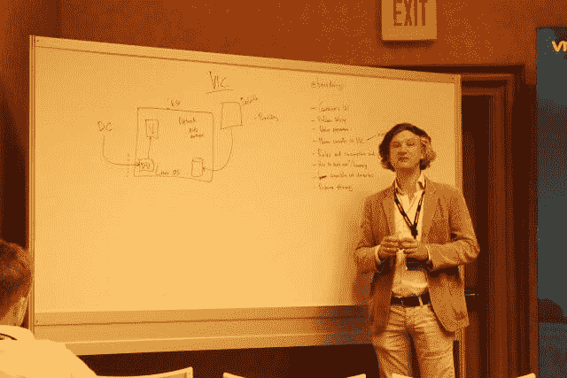
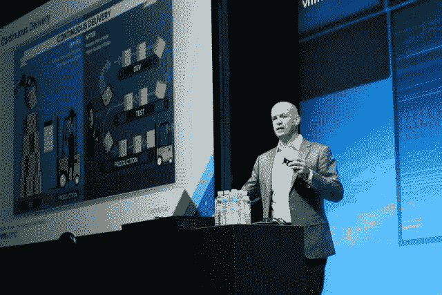

# VMware Integrated Containers 如何将 Docker 引入企业

> 原文：<https://thenewstack.io/vmware-integrated-containers-may-introduce-docker-enterprise/>

周二，在拉斯维加斯举行的 VMworld 2016 大会上，我们比以往任何时候都更近距离地看到了最新版本的[VSP here Integrated Containers](https://blogs.vmware.com/vsphere/2015/10/vsphere-integrated-containers-technology-walkthrough.html)(VIC)的架构和操作，并与 VMware 的“绿地”容器系统 [Photon Platform](https://vmware.github.io/photon/) 形成了鲜明的对比。维克还没准备好迎接黄金时间。虽然这里的与会者期待周二宣布正式上市，但事实并非如此，尽管该公司的下一次巴塞罗那会议只有几个月的时间了。

在周二下午的深度简报中，[Ben Corrie](https://twitter.com/bensdoings)—[最初 VMware 的第一个容器项目 Project Bonneville](http://blogs.vmware.com/cloudnative/introducing-project-bonneville/) 的首席工程师，很可能是他的公司拥抱容器化的鼻祖——令人惊讶地描述了他自己的产品，与舞台上的介绍有些不同。尽管图表显示了什么，尽管高管和产品经理使用了描述 VIC 如何工作的语言，Corrie 告诉我们，说[它在](https://thenewstack.io/vmwares-photon-platform-and-how-it-treats-containers/) [Docker](https://www.mirantis.com/software/docker/kubernetes/) 容器周围包裹了一个类似虚拟机的外壳以使它们与该公司的 [vSphere](http://www.vmware.com/products/vsphere.html) 虚拟化平台兼容，这在技术上是不准确的。

“想象一下文氏图，一边是 vSphere，另一边是 Docker，”Corrie 解释说，“在 vSphere 和 Docker 所做的所有事情中间有一个巨大的交集:网络配置、存储管理、应用程序生命周期管理。几乎所有 vSphere 做的事情都有某种重叠。

“VIC 所做的是，它从 vSphere 获取一切，然后添加我们需要的任何 Docker 位，以便能够将 Docker 映像作为虚拟机调配到 vSphere 中。”

## 重新成像

Corrie 告诉与会者，在标准的容器化环境中，网络虚拟化、存储虚拟化和控制平面管理都是在 Linux 空间内处理的。这些功能本质上包含了虚拟机管理程序中的内容。因此，当它们被虚拟化时，“你最终得到的是一堆嵌套的虚拟机管理程序，”他继续说道，“你必须选择一个并在其中配置容器。

“但是，当您调配这些嵌套的虚拟机管理程序时，我们正在复制许多现有的虚拟机管理程序。猜猜看，您的嵌套虚拟机管理程序远不如您的实际虚拟机管理程序好或成熟。所以我们可以扔掉很多这些东西。如果我们去掉 Venn 图中的容器[*]部分，代之以虚拟机，我们就可以把所有这些都扔掉，只使用 vSphere 基础设施。”*

从开发人员的角度来看，在 VIC 环境中，Docker 似乎是完整存在的。但实际上，科里说，“码头工人是虚拟世界的一个门面。因此，从 Docker 客户端，我们现在可以控制虚拟世界网络，我们控制虚拟世界存储。我们提升了码头工人的形象；它作为一个虚拟机进入虚拟空间。您正在与之通信的端点实际上只是虚拟圈集群中的一个资源池。它不是虚拟机；这是一个资源库。

毕竟，这就是科里对他设计的产品的解释开始偏离其展示方式的地方——科里承认了这种偏离。他明确表示，VIC 将容器呈现为虚拟机，而不是虚拟机中的容器。区别不是微不足道的。虽然 Docker 使用从注册表中提取的库和其他依赖项的图像来组装容器的图像，但 VIC 使用这些相同的部分来生成虚拟机的图像。包装中的容器看起来不像虚拟机，而是一个真正的虚拟机，从上到下。

这并不是说 vSphere 被愚弄而认为容器是虚拟机。恰恰相反:开发人员很容易被骗相信她使用的引擎是 Docker。

那么，为什么即使是主旨演讲也展示了 vSphere Integrated Containers 将“C”包装在更大的“VM”盒子里，然后在没有“C”的其他“VM”盒子中分发呢？我直接问本·科里。

“有效沟通非常困难，”科里回答道。“而且你说得对，这很令人困惑。但是区别很明显；区别很明显。事实上，有一种方法可以分辨哪个是哪个。”

对于一个容器位于 T4 虚拟机内部的系统，科里在白板的帮助下解释道，有一个 Docker 守护程序，由网络和存储抽象拼凑而成。“你不能在虚拟机中有一个 Linux 容器，里面没有所有这些东西，”他说，“这是完全不必要的。这将是一个非常浪费的模型，只需在一个虚拟机中旋转一个容器，然后进行横向扩展。”

他补充道，将 VIC 集装箱内的一个组件称为“光子”并不会让事情变得更混乱。

在 VIC 容器中，有一个代理充当外壳提供者。但是正如 Corrie 明确指出的，除了应用程序本身之外，很少有其他东西可以将虚拟机的映像与 Docker 容器的映像区分开来。VIC 容器的包装据说是完全 Docker 兼容的，但这是因为 VIC 系统允许 Docker 客户机将其解释为 Docker 容器。

## 基础设施 2026

在周二的主题演讲中，VMware 云平台 CTO [Kit Colbert](https://twitter.com/kitcolbert) 将 VIC 展示为比 Docker 更深层次的容器基础。“企业容器基础设施为您提供了您所需要的东西，”Colbert 说，“让您在生产中放心地运行容器化的应用程序。虽然它为开发人员提供了继续使用 Docker Client 的方法，但从 it 运营商的角度来看，“它只是 vSphere。"

在周二的主题演讲之外，[VMware 负责云原生应用的总经理 Paul Fazzone](https://twitter.com/pfazzone) 提出了一个论点，与 Docker 进行了更直接的比较，为那些在一对一的规模上权衡两者优点的组织。

“VMware 给我们的是在今天的生产环境中运行容器的最佳方式，”Fazzone 说，他以前曾在 NSX 项目中有过工程经验。他指出，VIC 使用自己的容器引擎，它不是 Docker 引擎，也不使用 Docker 的运行时。这一点我们已经知道了，但是 Fazzone 更进一步，展示了 VIC 和 Photon Platform 如何成为 NSX 的有效交付机制。

Fazzone 表示，虽然 VIC 的大多数开源组件(例如，其新的 Admiral 图形管理门户和新的[港](https://github.com/vmware/harbor)私有容器注册表)都是正式可选的，但“vSphere 容器引擎是该解决方案的强制组件，因为这是我们通过 vSphere 产品保留 it 运营模式的方式。

“这将使我们不仅能够确保您希望在内部运行的应用程序的生产特性，”他继续说道，“还能让您快速轻松地将这些工作负载从开发环境迁移到系统上。”

Fazzone 清楚地将 VIC 描述为至少在未来十年内，vSphere 将继续在引入容器化的现有 VMware 客户环境中使用的方式。他认为，此后，一种更像光子平台的基础设施将会出现。

然而，与此同时，他说，“今天在展会上的大多数人都在思考如何为他们的公司解决问题。”VIC 谈到了 VMware 客户群的这一方面，“光子是我们在未来十到十五年内关注的一个平台，不仅是本地平台，还包括跨云平台。”

## “淘气的小弟弟”

Fazzone 解释说，Photon 的目的是充当 NSX 和 [Virtual SAN](http://www.vmware.com/products/virtual-san.html) 虚拟化存储的抽象，将它们收集到一个堆栈中，但通过单个 API 将它们作为单个层暴露在容器环境中。因此，计算、网络、存储和安全服务实际上是由 VMware 的常规基础架构服务提供的，如果您愿意，它们都以“光子”的形式出现在容器化的影响范围内

“通过这个 API，它可以划分基础设施并创建可用性区域，”他继续说道。“随着时间的推移，这种模式将允许您从私有云环境扩展到公共云环境。但这种 API 可以向您的开发团队公开，这样他们就可以向开发团队和租户预先提供资源池。”

组织中的每个开发团队(或者从服务提供者的角度来看，客户中的每个团队)都可以作为单独的租户提供，与其他租户共享基础设施，尽管项目是特定于和专用于其自己的领域的。Cloud Foundry、[、Kubernetes](/category/kubernetes/) 和 Mesos 都属于这些项目。

“我们的目标是让 it 组织能够非常简单地向他们的开发团队提供该级别的服务，同时让他们能够以更高效的方式管理基础架构，就像公共云提供商管理他们的基础架构一样。”

我问 Fazzone 容器格式对 Photon 是否重要。他说，VMware 的目的是让 Photon 支持 Kubernetes、Mesos，并在某种程度上支持 Docker Swarm。在 Photon 创建一个租户环境之后，该租户内部的一个进程将能够请求一个 Kubernetes 集群。此时，集群应该能够像任何 Kubernetes 用户所期望的那样得到维护。

他告诉我，因为 VIC 不仅基于 vSphere，而且*也是* vSphere，[它利用 vSphere 现有的 DRS 调度程序](https://pubs.vmware.com/vsphere-51/index.jsp?topic=%2Fcom.vmware.vsphere.resmgmt.doc%2FGUID-64267EC6-7617-4608-8070-2707C69BCA1D.html)进行基础架构级别的调度。然而，尽管 Photon 被描绘成一个“真正的”容器环境，Fazzone 也表示 Photon 也将拥有自己的资源调度。

“我们将基本上把这些调度程序配对在一起，”他说，“这样你就可以利用两个世界的优势。我们仍在研究一些细节，但您可以将 Photon 视为 vSphere 好奇的小兄弟。好奇的弟弟偶尔会惹上麻烦；更调皮一点。但它将允许我们探索许多领域，并随着时间的推移，帮助客户提出真正强大的生产解决方案，将这些不同的框架部署到生产中。”

在世界各地的许多家庭中——也许你能体会到这一点——经常有一个兄弟姐妹认为自己总是惹麻烦，而另一个兄弟姐妹实际上更聪明，在装出一副无辜的样子的同时逃脱了恶作剧。然后是父母，他们很难解释其中的任何一个。

<svg xmlns:xlink="http://www.w3.org/1999/xlink" viewBox="0 0 68 31" version="1.1"><title>Group</title> <desc>Created with Sketch.</desc></svg>