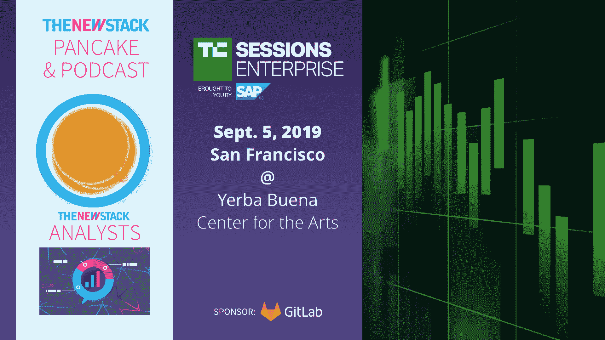

# VMware 刚刚告诉每位首席信息官，他们需要一个容器战略

> 原文：<https://thenewstack.io/vmware-just-told-every-cio-they-need-a-container-strategy/>

我们本周在 VMworld 上了解到，Linux 容器现在是主流。对于首席信息官来说，这可能是一个惊喜，因为对他们来说，容器和 Kubernetes 是熟悉的概念，但不是最优先考虑的。首席信息官们肩负着一项吃力不讨好的工作，即加快组织的创新速度，从数据中获得更多价值，同时保证数据的安全性，他们必须敏锐地意识到冰球的发展方向，而不仅仅是它现在的位置。本周给了我们一个很好的机会去做这件事。

 [Murli Thirumale，Portworx 联合创始人兼首席执行官

Murli Thirumale，Portworx 的联合创始人兼首席执行官，曾担任 Ocarina Networks，Inc .的联合创始人兼首席执行官。他还曾担任 Citrix Systems，Inc .高级解决方案集团的副总裁兼总经理。Thirumale 拥有西北大学凯洛格管理研究生院的 MBA 学位，是 F.C. Austin 杰出学者。](https://portworx.com/) 

衡量一项技术的采用情况的一个方法是看分析师说了什么。Gartner 估计，虽然目前只有 30%的组织在生产中运行容器，但这一数字将在三年内增长到 75%。另一种方法是观察软件公司的赌注，通过改变技术消费的变化，最大的赢家或输家是谁。

对于后者，我们可以看看 [VMware 本周发布的公告](/vmwares-project-pacific-integrates-vsphere-with-kubernetes/)，他们将把容器和 Kubernetes 引入其主要业务 vSphere 的核心。这一宣布加上两笔[数十亿美元的收购](/vmware-acquires-pivotal-software-for-more-kubernetes-prowess/)以增强其云原生凭证——Pivotal 和 carbon black——紧随 IBM 出于类似原因以 340 亿美元收购 Red Hat 之后。尽管首席信息官们多年来就知道他们需要一个“移动战略”或“GDPR 战略”，但世界上最大的两家软件公司的巨额赌注表明他们现在需要一个“容器战略”

那么容器策略需要什么呢？至少应该是:

## 应用驱动，而不仅仅是以基础设施为中心

比 IBM 收购 Red Hat 更重要的是，VMware 宣布将在 vSphere 上原生支持 Kubernetes，这是一个重要的迹象，表明当今的价值是以应用而不是基础架构来衡量的。企业新的竞争要务是从基础设施优化转向使用容器和 Kubernetes 实现应用和数据自动化。

应用开发最快的公司将胜出。而不是只有最快基础设施的公司。这就是为什么 OpenStack 在大肆宣传后失败了——它只专注于基础架构层。另一方面，Kubernetes 是关于应用程序的，应用程序是商业价值所在。VMware 了解这一点，并正在快速进入应用程序业务。

## 多数据中心，多云聚焦

应用程序之战将不再在单个数据中心展开。不仅公共云不会消失，而且企业将越来越多地在多种环境中运行其应用程序，这取决于许多因素，如客户的位置、每个位置可用的特定服务(GKE 的 Google DNS 搜索、EKS 的 Amazon Rekognition、IBM 的 Watson)以及业务需求。

## 注重数据

应用程序不能与其数据分离。没有数据，网飞只是一个网站。没有数据，Google 只是一个搞笑的名字。公司的数据是他们的业务，容器策略需要确保数据在整个环境中都是可用的、受保护的和安全的，同时可供最有能力从中获取业务的团队和个人使用。控制和访问可能不一致，但是当数据被视为核心战略组件时，智能容器策略可以弥合这些差距。

作为一家在容器存储和数据管理市场占据领导地位的公司的首席执行官，我实时看到了这些变化。我们的客户包括数十家全球最大的 2000 强品牌和政府机构，他们正在整合一种以应用为中心、多云和数据丰富的容器化方法。

我们的客户已经接受了容器可以对他们最重要的企业应用程序产生最大影响的想法，而不是把重点放在少数“无状态应用程序”上作为创新领域。这就是为什么我们提供解决方案和工具来解决容器采用的一些最大障碍，以允许容器在生产中部署，并具有高可用性、灾难恢复、数据安全性和性能保证，符合我们客户最重要的数字资产。

我们很高兴看到像 VMware 和 IBM 这样的主要供应商采用 Kubernetes 作为他们的核心技术之一，并期待着与更多的首席信息官合作来定义他们的容器战略。

想谈谈容器策略吗？我将于 9 月 5 日在旧金山的 [TC 会议:企业活动](https://tcrn.ch/2Y3wJGI)上发表演讲。希望在那里见到你。

<svg xmlns:xlink="http://www.w3.org/1999/xlink" viewBox="0 0 68 31" version="1.1"><title>Group</title> <desc>Created with Sketch.</desc></svg>