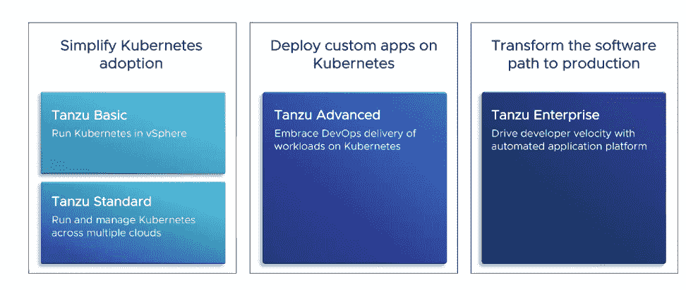
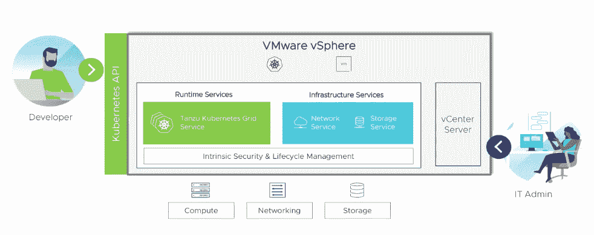

# VMware 为 vSphere 工作负载提供 Kubernetes 入口

> 原文：<https://thenewstack.io/vmware-provides-a-kubernetes-on-ramp-for-vsphere-workloads/>

企业基础设施软件巨头 [VMware](https://www.vmware.com/) 正在将其 [vSphere 虚拟化平台](https://www.vmware.com/products/vsphere.html)与其 [Tanzu 产品组合](https://tanzu.vmware.com/tanzu)相结合，以帮助将已经在 vSphere 上运行的数百万工作负载扩展到 Kubernetes 生态系统中，该公司表示。

VMware 还发布了 vSphere 7 和 vSAN 7 以及 Cloud Foundation 4.1 的更新，以帮助支持 Kubernetes 部署并管理在容器化环境(包括存储)中运行的有状态应用程序。

除了提供 vSphere with Tanzu(将于 10 月底推出)之外，VMware 还将于今天提供 [Cloud Foundation](https://www.vmware.com/products/cloud-foundation.html) 混合平台 with Tanzu。

在一次新闻发布会上，[VMware 研发副总裁兼 Kubernetes](https://www.linkedin.com/in/craigmcluckie) 的最初创建者之一 Craig McLuckie 描述了“Tanzu 产品组合涵盖了各种各样的功能，可以释放大大小小的工程团队的生产力。”

“很明显，起点是 Kubernetes 本身——我们认为这是一个非常强大的新基础设施服务抽象，它足够低，可以运行几乎任何东西，足够高，可以隐藏环境的细节，以便组织能够从基础设施功能中受益，”McLuckie 说。

虽然 vSphere with Tanzu 是“我们的许多客户开始使用 Kubernetes 的最快方式”，但 VMware Cloud Foundation with Tanzu 非常相似，[营销副总裁 Lee Caswell](https://www.linkedin.com/in/leecaswell) 在周二的新闻发布会上表示。除其他外，Tanzu 的 Cloud Foundation 允许 Kubernetes 工作负载在混合云环境中运行，以“允许运营商以他们希望的方式向开发人员提供基础设施，即通过 Kubernetes API。”Caswell 说，这种能力允许开发人员使用他们已经实现的工具，而带有 Tanzu 的 Cloud Foundation“非常适合大规模运营 Kubernetes，因为它的配置和部署完全自动化”。

vSphere with Tanzu 还集成了 Kubernetes 的管理功能，代表了 Caswell 所说的“vSphere 十年来最大的一次重新架构”有了它，组织可以采用 Kubernetes 并将其集成到他们的 VSphere 环境中，从而使 it 管理员能够部署 Kubernetes，同时具备使用 VSphere 已经获得的技能与此同时，Caswell 表示，当开发人员在 vSphere with Tanzu 上部署应用程序时，他们可以“通过 Kubernetes 接口和 API，以他们习惯的方式和他们想要的方式使用基础架构”。

Caswell 说，有了 vSphere with Tanzu，“客户可以自带网络，也可以自带存储:这是与 VMware Cloud Foundation with Tanzu 的一个关键区别。

如上所述，VMware 还提供了 vSphere 7(更新 1)和 vSAN 7(更新 1)的详细更新信息:

*   vSphere 7 允许虚拟机(VM)扩展到 24TB 和“768 个 vCPUs”，以支持“资源密集型应用”，如内存数据库。
*   vSphere 7 的集群规模增强功能，将对每个集群的主机数量的支持扩展了 50%，每个集群共有 96 台主机。
*   vSAN 7 提供 HCI Mesh 来分解计算和存储资源，从而实现增量扩展。
*   vSAN 7 的仅压缩选项提供了仅压缩选项，而不是重复数据消除和压缩，这不会影响数据库的空间管理效率。
*   通过增加对 SMB v3 和 v2.1 协议的支持，为大多数常见文件服务协议提供 vSAN 7 企业级文件服务。

VMware 是新体系的赞助商。

来自 Pixabay 的特征图像。

<svg xmlns:xlink="http://www.w3.org/1999/xlink" viewBox="0 0 68 31" version="1.1"><title>Group</title> <desc>Created with Sketch.</desc></svg>