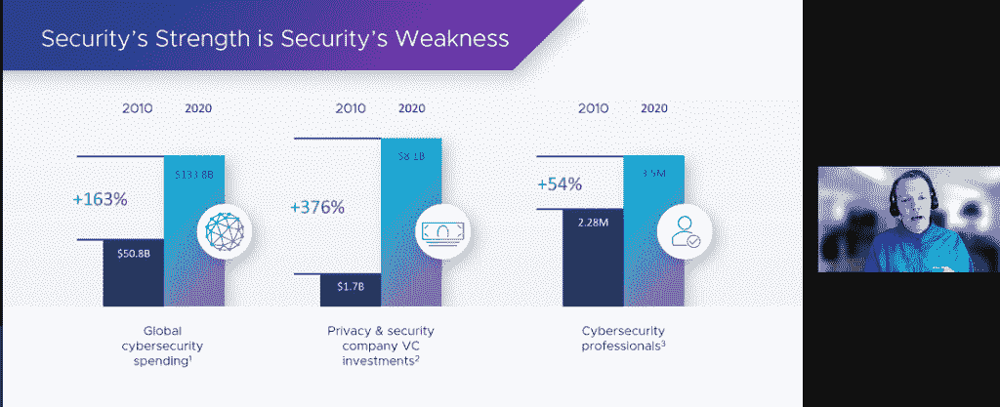

# 攻击激增后，VMware 重新定义了安全性

> 原文：<https://thenewstack.io/vmware-redefines-security-after-a-surge-in-attacks/>

企业虚拟化软件巨头 [VMware](https://tanzu.vmware.com?utm_content=inline-mention) 表示，它正在“重新定义”安全性，因为它试图帮助客户应对与威胁数量激增、攻击媒介增多以及可用于帮助阻止攻击的人力资源减少相关的挑战。

VMware 安全业务部高级副总裁兼总经理 [Patrick Morley](https://www.linkedin.com/in/patrickmorley/) 在新闻发布会上表示:“因此，我们要求所有这些 IT 安全团队做的基本上是做更多的事情，而且事情要复杂得多。”。“我们要求所有这些 IT 安全团队做的事情本质上是在不增加人员的情况下做更多的事情，这是一个真正的挑战。”

VMware 最近发布了一项研究，量化了这些安全趋势，主要是由于组织在疫情期间难以适应远程工作人员的激增。这不仅增加了安全管理的复杂性，还增加了潜在攻击媒介的数量。

根据 VMware 最近发布的 [2020 年威胁形势报告结果](https://blogs.vmware.com/security/2021/05/vmware-threat-landscape-report-blog.html)，81%的调查受访者报告在过去 12 个月中发生了一次违规，其中五分之四(82%)被视为重大违规。与此同时，76%的受访者表示他们的攻击数量有所增加，其中远程工作人员是主要原因。VMware 表示，近三分之二的受访者(61%)也认为，考虑到潜在攻击媒介的数量有所增加，他们需要以不同的方式考虑安全性。

“关于安全性，我们非常了解的一件事是，无论您对边界做了什么，坏人都会以某种方式得到它。VMware 网络和安全业务部高级副总裁 [Tom Gillis](https://www.linkedin.com/in/tomgillis1) 说:“无论是像网络安全管理软件产品这样的奇异攻击(这是我职业生涯中见过的设计最巧妙的攻击之一)，还是更普通的情况，比如‘哎呀，我有一个未打补丁的[Apache]版本，这就是在一家信用评级机构发生的高调违规事件。”。"关键是，攻击者会想办法找到一个立足点."

与此同时，房间里的大象遭到勒索软件的攻击。根据调查，76%的受访者报告了更多的勒索软件攻击，而 79%的人表示攻击变得更加复杂。在新闻发布会后的一周晚些时候，[华尔街日报](https://www.wsj.com/articles/fbi-director-compares-ransomware-challenge-to-9-11-11622799003?mod=hp_lead_pos10)报道说，在最近几周对肉类、石油和天然气分销和轮渡运输网络的多次高调袭击之后，联邦调查局局长 Christopher Wray 将这一威胁与 2001 年 9 月 11 日的恐怖袭击相提并论。

在新闻发布会上描述的帮助防止勒索软件攻击的工具中，吉利斯描述了炭黑如何与工作区集成，不仅有助于缓解恶意软件勒索软件，还可以缓解其他类型的威胁。吉利斯解释说，NSX 可以通过“说应用程序的语言或在‘流’的基础上看它，以便说‘你知道吗，这是一个真正的流，我们认识到我们希望能够理解网络中发生的事情的上下文并实际读取内容’，来读取第 7 层流量。

与此同时，尽管攻击的复杂程度不断提高，但勒索软件漏洞比其他攻击更容易预防，医疗运输服务提供商 [Angel MedFlight](https://www.angelmedflight.com/) 的首席发展官[保罗·格伦](https://www.linkedin.com/in/paulgreen130)说。组织在使用适当的工具和平台的同时，也可以通过用户培训和教育来减轻勒索软件攻击。“我们在教育方面做了更多的工作，确保人们理解他们在看什么，而不仅仅是点击，”格林说。“我认为勒索软件攻击是一种更容易预防的攻击，因为你可以对你的用户采取主动，并(提前)指导和培训他们。”

VMware 安全产品也非常依赖于 Morley 所描述的扩展检测和响应(XDR)的“梦想”。“XDR[是关于]如何在正确的地点提供正确水平的遥测技术，并从正确的来源获得它——不是每个来源，而是正确的来源，”莫利说。

莫利说，VMware 的 XDR 涵盖五个组件。它们包括基于主机、云、工作负载、网络和身份信息数据安全性。此外，Morley 说，电子邮件数据是“大多数检测的来源”。“因此，在 VMware 的五个核心领域中，我认为我们参与了其中的三个半领域:我们肯定会使用炭黑提供出色的主机和云覆盖，使用 NSX 提供网络安全。”

虽然 VMware 不提供身份平台，但 VMware[Workspace ONE Access](https://www.vmware.com/fr/products/workspace-one/access.html)提供了关于身份、条件访问和其他情况的信息，“我们没有完整的东西，”Morley 说。然而，对于缺失的组件，“我们可以提供大量的安全价值，其中我们有上下文并与其他点合作。”

<svg xmlns:xlink="http://www.w3.org/1999/xlink" viewBox="0 0 68 31" version="1.1"><title>Group</title> <desc>Created with Sketch.</desc></svg>