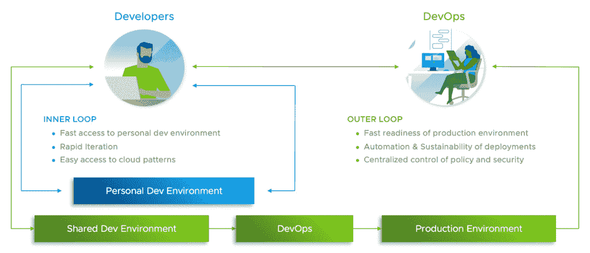
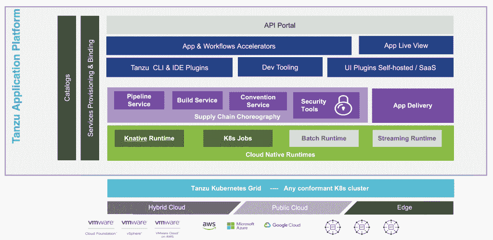

# VMware Tanzu 应用平台:面向 Kubernetes 的可移植 PaaS

> 原文：<https://thenewstack.io/vmware-tanzu-application-platform-a-portable-paas-for-kubernetes/>

Kubernetes 中的一个关键缺口是开发者和操作者之间关注点的清晰分离。作为一名热情的云原生布道者，我热爱 Kubernetes。但是，Kubernetes 缺乏面向开发人员的应用程序平台一直是我的一大烦恼。

上周，当我看到 VMware Tanzu 应用平台( [TAP](https://tanzu.vmware.com?utm_content=inline-mention) ) 1.0 的[发布](https://tanzu.vmware.com/content/blog/tanzu-empowers-superior-secure-developer-experiences)时，我真的很兴奋。在现有的基于 Kubernetes 集群的 Google Kubernetes 引擎上部署 TAP 需要几个小时。一旦我能够访问 UI 和平台，我就通过浏览文档和尝试开发人员工作流来深入了解细节。

VMware TAP 深受该公司基于 [Cloud Foundry](https://www.cloudfoundry.org) 和 [Spring Boot](https://spring.io/projects/spring-boot) 构建应用平台、框架和工具的传统影响。熟悉 [Spring Initializr](https://start.spring.io/) 的开发人员会立刻联想到 Tanzu 应用加速器提供的引导工作流。作为一名 Cloud Foundry 开发人员，我很欣赏将 RabbitMQ 和 PostgreSQL 等预先配置的有状态资源与 TAP 应用程序绑定的工作流。

## TAP 的目标受众和用户角色

VMware 为基于微服务组装/构建内部和外部应用的企业开发人员构建了 TAP。我使用组装这个术语是因为现代应用程序正变得越来越可组合，并且是各种开源组件的集合。

TAP 有三大用户角色——平台操作员(PlatformOps)、应用程序开发人员(AppDev)和开发人员安全操作员(DevSecOps)。

平台操作员负责在 Kubernetes 集群上安装和配置 TAP。他们专注于覆盖与 Kubernetes 的现有构建块集成的平台，例如容器网络接口(CNI)和容器存储接口(CSI)。

平台运营团队的最终目标是公开抽象 Kubernetes 原语的 AppDev 和 DevSecOps 平台，同时公开构建和操作现代应用程序所需的基本功能。她还可以发布最佳实践和特定于组织的约定，作为开发人员和操作人员将遵守的策略。

基于 TAP 构建的应用程序开发人员不需要了解或处理云原生堆栈的幕后工作，如图像构建器、扫描仪、图像注册表、RBAC、入口等。他专注于编写代码、调试代码，并迭代整个过程以随机应变。

开发人员可以使用 CLI 和代码编辑器或 IDE 插件的组合，通过与 TAP 的无缝集成来自动化该过程。VMware 将这种开发、调试和迭代的工作流程称为内部循环。他们获得了一个非常类似于生产环境的个人环境。

开发人员安全操作员将开发人员构建的代码带到生产环境中。他对负责构建映像、执行自动化和手动/功能测试、扫描和签名映像、将映像存储在安全的注册表中以及部署和运行应用程序的供应链拥有完全的可见性和控制权。这被称为发生在核心开发和调试之外的外部循环。

TAP 为 DevSecOps 提供了基于最佳开源项目的现成的(OOTB)工作流。但是企业团队可以通过交换 OOTB 组件，甚至改变步骤和流程来轻松定制工作流。例如，在部署应用程序之前，可以修改 OOTB 工作流来生成舵图并将它们作为版本化工件存储在图表报告中。

## 轻按作为多云便携式 PaaS

VMware Tanzu 应用平台是一个双面贴纸。平台的一边是 Kubernetes，而另一边是现代应用程序。只要部署目标运行 TAP，企业就可以采用一致的开发人员环境和工作流。

TAP 可以配置在主流的托管 Kubernetes 产品上，包括那些由[亚马逊网络服务](https://aws.amazon.com/?utm_content=inline-mention)、微软 Azure 和谷歌云平台提供的产品。开发者甚至可以将其安装在基于 Hyperkit for macOS 的 Minikube 上。`tanzu` CLI 指向运行 TAP 的集群，实现工作流。

TAP 最好的一点是，它将 Kubernetes 视为在其上构建平台抽象的最小公分母。这与 Red Hat 构建 OpenShift 所采用的方法有着根本的不同。将 Red Hat OpenShift 与 VMware Tanzu 应用程序平台进行比较值得我在不久的将来单独发表一篇文章。

另外需要注意的是，TAP 不是云代工厂。Cloud Foundry 的官方和商业实现以 Tanzu 应用服务( [TAS](https://tanzu.vmware.com/application-service) )的形式提供，这是 Pivotal 应用服务(PAS)的最新版本。TAP 和 TAS 的主要区别在于目标环境。

前者是为 Kubernetes 集群设计的，而后者是为了运行虚拟机。虽然 TAS 也可以部署在 Kubernetes 上，但 VMware 将其定位为虚拟机的 PaaS 层。一些开源项目如云原生构建包( [CNAB](https://cnab.io) 和 [kpack](https://github.com/pivotal/kpack) 可能对两个实现都是通用的，但 TAP 和 TAS 之间的用户角色和用例有细微的差别。

另一方面，VMware 在简化 Tanzu 品牌方面还有一些工作要做，该品牌有多个重叠的产品。从品牌的角度来看，Tanzu 将成为另一个 vRealize 的保护伞品牌。

TAP 实现了从提交代码到在 Kubernetes 环境中运行代码之间发生的所有事情。从 CI/CD 管道到监控和扩展，生产部署都在 Kubernetes 上进行。这给平台带来了透明性、灵活性和模块化。

如果你对 Kubernetes 上的平台是如何构建的很好奇，你应该研究两个实现——[Tanzu 应用平台](https://tanzu.vmware.com/application-platform)和 [Kubeflow](https://www.kubeflow.org) 。两者都是 Kubernetes 如何成为利基的、专门构建的抽象的元平台的极好例子。

在即将发表的一篇文章中，我们将探讨 TAP 如何将一个普通的 Kubernetes 集群转变为一个面向开发人员的应用程序平台。在下面的文章中，我将带您完成在 GKE 集群上安装 TAP 并在其上构建/运行您的第一个云原生应用程序的步骤。敬请期待！

<svg xmlns:xlink="http://www.w3.org/1999/xlink" viewBox="0 0 68 31" version="1.1"><title>Group</title> <desc>Created with Sketch.</desc></svg>