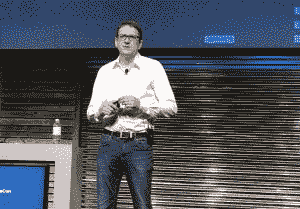

# VMware 收购 Heptio 以获得企业 Kubernetes 的专业知识

> 原文：<https://thenewstack.io/vmware-to-acquire-heptio-to-boost-enterprise-kubernetes-expertise/>

为了加强自身在云原生计算领域的实践，VMware 正在收购 Heptio，这是一家专注于企业的咨询公司，由开源[Kubernetes](https://kubernetes.io/)容器编排系统的两位最初开发者创建。

周三，VMware 在该公司的 [VMworld 2018 欧洲](https://www.vmworld.com/en/index.html)会议上宣布了这笔交易。交易条款没有披露。VMware 希望在 2019 年底前完成收购。

2017 年的克雷格·麦克卢奇。

Heptio 帮助组织部署和运营 Kubernetes。 [Joe Beda](https://www.linkedin.com/in/jbeda/) 和 [Craig McLuckie](https://www.linkedin.com/in/craigmcluckie/) 在离开谷歌后，于 2016 年创建了 [Heptio](https://heptio.com/) ，他们在那里帮助创建了 Kubernetes。这两人与[现供职于微软的布伦丹·伯恩斯](https://www.linkedin.com/in/brendan-burns-487aa590/)一起，于 2014 年首次发布了 Kubernetes。Beda 是技术首席工程师，McLuckie 是该项目的集团产品经理。

该软件很快在协调大规模集装箱作业的新兴市场上占据了主导地位。谷歌在 2015 年向当时新成立的[云原生计算基金会](https://www.cncf.io/)捐赠了 Kubernetes，这样它就可以以厂商中立的方式独立管理。

从那以后，Heptio 的工程师为上游的 Kubernetes 项目本身做出了巨大贡献。It [还为采用 Kubernetes 创建了](https://github.com/Heptio)许多相关的开源工具，包括 [Ark](https://github.com/heptio/ark) 灾难恢复工具，以及用于特使服务网格的 [Contour](https://github.com/heptio/contour) 入口控制器。

Heptio 为其企业客户提供 Kubernetes 培训、支持和专业服务。VMware 希望 Heptio 能够借助上游支持和社区参与，进一步巩固其在 Kubernetes 开源社区中的地位。

[https://www.youtube.com/embed/5Q4huiDcNSs?feature=oembed](https://www.youtube.com/embed/5Q4huiDcNSs?feature=oembed)

视频

VMware 本身对 Kubernetes 来说并不陌生。它与 Pivotal(Pivotal 和 VMware 都属于戴尔)在 [PKS](https://pivotal.io/platform/pivotal-container-service) (Pivotal 容器服务)上合作，这是一个企业级的 Kubernetes 发行版，既可用于云和内部使用。

VMware 云计算原生应用事业部高级副总裁兼总经理 [Paul Fazzone](https://www.linkedin.com/in/paulfazzone/) 表示:“Heptio 产品和服务将加强和扩展 VMware 与 PKS 的合作，将 Kubernetes 确立为跨云基础设施的事实标准。Heptio 将成为云原生业务应用部门的一部分。

2018 年 8 月，CNCF 在一项调查中发现[拥有 5000 名以上员工的企业中有 40%在生产 Kubernetes。它还发现，使用 Kubernetes 的人中有 15%使用 VMware 解决方案。它还发现 15%的 VMware 用户运行 Kubernetes。](https://www.cncf.io/blog/2018/08/29/cncf-survey-use-of-cloud-native-technologies-in-production-has-grown-over-200-percent/)

TNS 分析师 Lawrence Hecht 对本文有贡献。

云计算原生计算基金会和 VMware 是新体系的赞助商。

专题图片:乔·贝达(左)和克雷格·麦克卢奇，Kubecon 2016。

<svg xmlns:xlink="http://www.w3.org/1999/xlink" viewBox="0 0 68 31" version="1.1"><title>Group</title> <desc>Created with Sketch.</desc></svg>