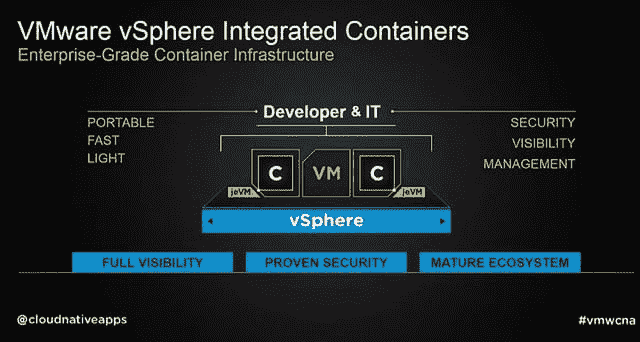
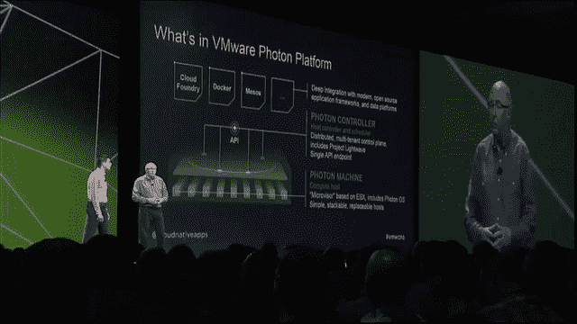
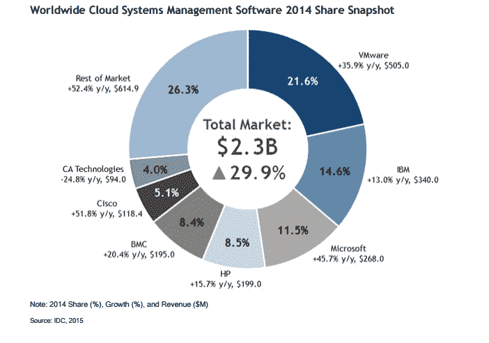

# VMware 的光子平台及其如何处理容器

> 原文：<https://thenewstack.io/vmwares-photon-platform-and-how-it-treats-containers/>

新任 Stack 主编 Alex Williams 编辑并促成了这篇报道。

去年 4 月，当 VMware 宣布它所谓的[项目 Photon](https://thenewstack.io/vmware-announces-cloud-native-tools/) 是一个用于 Docker 容器内部的小型 Linux 时，许多观察家想知道 Photon 是否可以作为另一种 VMware 技术的某种渠道。周一，在该公司在旧金山举行的 VMworld 会议上，他们的猜测是合理的:光子操作系统(现在将被称为 Photon OS)将作为一种代理，让 VMware 的 vSphere 管理系统能够了解容器内的操作。

这意味着包含 Photon OS 的容器与不包含 Photon OS 的容器会有些不同。它是 vSphere 的替代平台。这个新的 Photon 平台(VMware 称之为 Photon Platform)仅适用于“云原生”容器，适用于打算在尚未建立 vSphere 也不打算建立 VSP here 的地方提供 SaaS 的数据中心。

VMware 两位首席技术官中的最新一位 Ray O'Farrell 在旧金山举行的 VMworld 2015 周一上午的主题演讲中表示:“我们在这里要看的是……一项名为 vSphere Integrated Containers 的现有技术的扩展。“这使我们能够应对现有基础设施中容器可见性和管理的挑战。”

## 可消耗的涂层

【T2

VMware 首席技术官 Kit Colbert 接着说，正如屏幕上的图表清楚显示的那样，vSphere 集成容器将是一个封闭的容器。容器周围将有各种包装器，使它们能够在现有的 vSphere 环境中作为 VMware 虚拟机运行。Colbert 说，这个包装器将为管理员提供“在生产中运行这些应用程序所需的安全性、可见性和管理。

“我们通过让容器成为 vSphere 的一等公民来实现这一目标，”Colbert 继续说道。“这意味着您可以在一个平台上并行、完全一致地管理虚拟机中的传统应用程序和容器中的新一代应用程序。”

VMware 将容器包装器称为“jeVM”，意为“刚好够用的虚拟机”jeVM 不仅将自身包装在容器组件周围，而且还将该组件隔离到自身。你可能会对自己说，这不正是容器的全部思想吗:进程隔离？

也许是这样，但是只要数据中心坚持在虚拟机内部运行生产级容器环境，那么这种进程隔离只会在容器的本地环境中有益。

新版本的 vSphere 实际上将充当 Linux 内核和 Docker 引擎，这有利于 vSphere 容器。这些资源将在 vCenter monitoring 门户内的资源池中作为“虚拟容器主机”可用 jeVM 包装器将包括新版本的 Photon OS，它实际上“知道”它正在 vSphere 中运行。光子操作系统充当 vSphere 容器与 vSphere 的链接。

它还将包含 VMware 去年作为“Project Fargo”推出的组件[，](https://thenewstack.io/the-role-for-vmwares-project-fargo-in-the-docker-ecosystem/)现在被称为 Instant Clone。Colbert 说，这将使 vSphere containers 能够在不到一秒的时间内克隆自己并启动自己，而不会消耗主机系统的任何内存开销。

从技术上来说，容器本身的格式不需要偏离开放容器倡议(T2 的 VMware 是其成员之一)指定的标准。正是光子操作系统的引入给了容器 VMware 执行官们所称的“特殊酱料”

> 正是光子操作系统使容器能够在 VMware 的 NSX 虚拟机管理程序上有效运行，并使用 VMware 的 vSAN 存储。

“想想我们拥有的 50，000 个生态系统合作伙伴，他们开发的所有工具和技术，成千上万的用户…以及你们集体编写的数百万个脚本。所有这些东西现在只适用于容器，”科尔伯特说。

## 更坚固的光子

Photon Platform(除了包含“Photon”品牌之外)看起来出人意料地更加通用和开放源代码，有望包含 Docker、Cloud Foundry、Mesos 和“正是您需要的”来运行以 API 为中心的容器平台。这是 VMware 努力生产真正“面向 Docker 的 vSphere”的一个更紧凑的高潮，正如[新堆栈的 Susan Hall 两个月前](https://thenewstack.io/a-different-vmware-an-api-driven-hypervisor-and-a-docker-oriented-vsphere/)所说，它看起来不太像 vSphere。

*【从左至右】* Kit Colbert，Ray O ' Farrell—VMware 联合首席技术官

但它确实包含了 ESX 虚拟机管理程序的内部组件——在这种情况下，它被重新定位到一个名为 Photon Machine 的新计算主机上，与 Photon OS 共存。Kit Colbert 解释说:“我们看到的 Photon Machine 是虚拟机管理程序和 Linux 操作系统的融合，是一个轻量级、非常安全的包，可以安装在物理主机上。

光子机器被设计为可堆叠、可分发的，并且可能比硬连接到虚拟机管理程序的典型 vSphere 稍微短暂一点。一个通过它的 API 与光子机器通信，这表明开源工具可能由第三方设计来管理它们。监督这些机器堆栈的是一个光子控制器，它通过名为 [Project Lightwave](https://thenewstack.io/vmware-announces-cloud-native-tools/) 的身份管理系统来管理对集装箱以及集装箱之间的访问控制。

Ray O'Farrell 解释说:“我们希望确保它(Photon Platform)位于堆栈中，在这一点上，您仍然可以灵活地利用开放框架和数据平台，您已经习惯于使用它们来部署您的云原生应用程序。”。“像 Cloud Foundry、Docker 和 Mesos 这样的框架——所有这些仍然可以与 Photon 平台一起使用。”

## “选择的自由”

对于 Docker 来说，本周的角度是关于其技术如何实现容器的可移植性，使其与 vSphere 和 through Photon 相关。Docker 还在流程编排和网络领域与 VMware 合作。

就此而言，Docker 还与 IBM、微软和红帽合作。这些公司都有各自的议程。但对 Docker 来说，每一个都为它提供了一种参与市场的方式，而很少有小公司有机会这样做。举个例子，在管理员的世界里，[根据今年发布的 2014 年 IDC 调查数据](http://idcdocserv.com/256995)，VMware 在云系统管理和数据中心自动化软件两个领域都拥有最大的市场份额。

## 

Docker 企业营销副总裁 David Messina 本周写了一篇博文[来回应 VMware 在 VMworld 上的发布。](https://blog.docker.com/2015/08/vmworld-docker/)

“VMware 采取的方法是一种有趣的双重战略；一个是使他们现有的 vSphere 解决方案更适合 Docker，同时通过一个以极简的 Linux OS Photon 为中心的解决方案提供新一代应用程序…Docker 平台提供的应用程序可移植性为开发人员和系统管理员创造了选择的自由，让他们可以在正确的时间为任何给定的应用程序选择正确的基础架构。”

根据同一篇博客文章，VMware 与 Docker Machine 的合作允许开发人员和系统管理员利用单个命令在 Fusion、vSphere 或 vCloud Air 上运行 Docker。

据帖子称，VMware 的 NSX 团队已经与 Docker 合作，为 Docker 多主机网络提供“包含可更换电池”的选项。

这篇文章还努力展示了 Docker 在 Windows 环境下的工作方式:

我们知道你们中的许多人不仅是 vSphere 管理员，也是 Windows IT 专业人员，因此我们非常高兴向你们简要介绍并展示 Docker 如何在 [Windows 服务器环境](https://blog.docker.com/2015/08/tp-docker-engine-windows-server-2016/)上本机运行。

VMware 首席技术战略官 [Guido Appenzeller 几个月前告诉我们](https://thenewstack.io/microsegmentation-how-vmware-addresses-the-container-security-issue/)VMware 的客户无论如何都是在独立的虚拟机中运行容器环境，尤其是在生产环境中。同样需要考虑的是:构成 VMworld 与会者主体的 IT 管理员仍然对容器有些陌生。事实上，VMware 的主题演讲人在谈论这个概念之前仍然会花一些时间来定义它。尽管 Docker 生态系统的“工具”发展得如此之快，但它的大部分仍然面向开发人员，而不是管理员。

## 为相关性而战

Red Hat 的集成解决方案总经理 Lars Herrmann 在接受即将到来的关于新堆栈的播客采访时表示:“如果你看看 VMware 在宣传什么，它基本上可以归结为，‘让我们把容器作为最令人兴奋的东西，并把它作为一个方形的东西穿过一个圆孔。’。“因为他们基本上是在说，只有在虚拟机中运行容器，它们才是可信的，因为这是您获得工具的方式，也是您可以依赖硬件和虚拟机管理程序已经提供的安全属性的方式，并且您已经信任这些属性来进行虚拟化。”

Herrmann 担心，一旦容器沦为另一种形式的虚拟机，“天知道人们会把什么放进这些虚拟机。”

Apcera 首席执行官德里克·科利森也在即将到来的播客中接受了采访，他指出，VMware 并不是唯一一个与一项如果不加控制就会淘汰的技术进行斗争的公司。

“OpenStack 和 VMware 都试图在容器主导的未来格局中发挥作用，”科利森说。“最初的立场是，‘容器有点意思，但虚拟机才是重点。’当容器生态系统从后视镜中的一个光点突然超过它们时，open stack[峰会]和 VMworld 的主题都是，“不，不，我们仍然与容器驱动的世界相关。因此，你将会看到精简的操作系统、更轻的重量、更小的内存占用。"

科利森认为，当这些系统争夺集装箱化的相关性时，它们潜在的致命弱点是网络层。他指出，真正的微系统需要一个软件定义的网络，几乎只响应他们的需求。如果同一个 SDN 还被用来满足传统虚拟机的需求，“那还是太慢了。”当然，Apcera 确实提供了自己的特定于容器的 SDN，称为 Continuum，这在 VMware 的 vSphere Integrated Containers 体系结构或 Photon Platform 中都没有一席之地。

“软件系统将继续被分解成更小的移动部分，”科利森继续说道。他说，支持这些系统的网络“必须非常快，非常轻”，这两个属性并不容易归因于现代商业虚拟机管理程序。

无论如何，事情已经过去，VMware 试图利用其虚拟机管理程序，以某种方式利用原本不需要虚拟机管理程序的新体系结构，这一目标现在已经实现。

<svg xmlns:xlink="http://www.w3.org/1999/xlink" viewBox="0 0 68 31" version="1.1"><title>Group</title> <desc>Created with Sketch.</desc></svg>