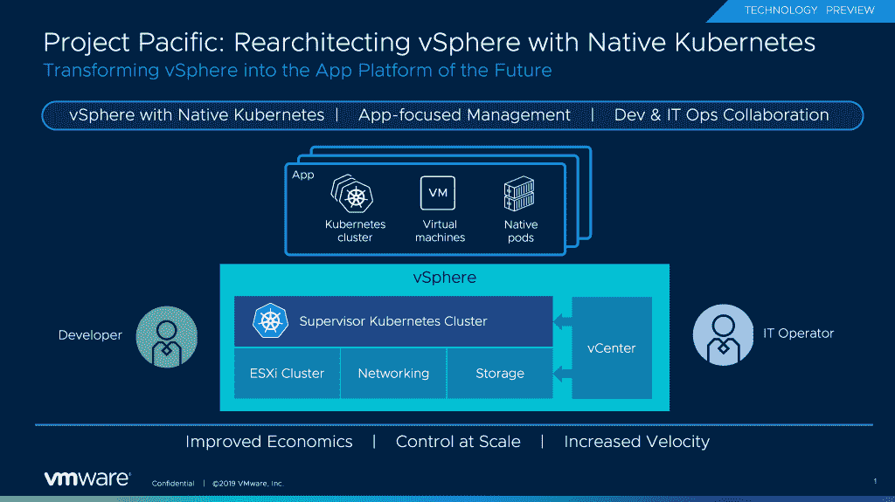

# VMware 的 Project Pacific 将 vSphere 与 Kubernetes 相集成

> 原文：<https://thenewstack.io/vmwares-project-pacific-integrates-vsphere-with-kubernetes/>

虚拟化巨头 VMware 对虚拟化平台进行了重新架构，将 Kubernetes 纳入了一个名为 Project Pacific 的项目中，这是过去十年中 vSphere 发生的最大变化。

该项目是一项更大努力的一部分，旨在将 VMware 与开源 Kubernetes 容器编排引擎更好地结合起来，形成一个名为 [VMware Tanzu](https://blogs.vmware.com/cloudnative/2019/08/26/vmware-completes-approach-to-modern-applications/) 的产品和服务组合，旨在将 Kubernetes 带给企业客户。

[在一篇博客文章](https://blogs.vmware.com/vsphere/2019/08/introducing-project-pacific.html)中，VMware 首席技术官 Kit Colbert 解释了集成的必要性:“从根本上说，它涉及现代应用程序的构成。现代应用通常是许多不同技术的复杂组合——传统的内部应用、数据库、容器中的现代应用，甚至可能是功能上的现代应用。对于开发人员和运营商来说，跨异构环境管理这些应用是一项复杂的任务。事实上，让开发人员和运营人员更好地合作是许多企业面临的一个关键问题。”

科尔伯特解释说，Kubernetes 将为支持这类应用提供基础。

Project Pacific 目前在 tech preview 中发布，[将 Kubernetes 嵌入到 vSphere 的控制平面中](https://blogs.vmware.com/vsphere/2019/08/project-pacific-technical-overview.html)，从而为组织提供对计算、存储和网络资源的统一访问。虚拟机和容器可以使用新的本机 Pod 技术进行组合，这反过来又可以由 vSphere Client 进行管理。此外，现有的 vSphere 脚本和第三方工具可以与 Kubernetes 一起使用。管理员可以在应用程序级别进行管理，而不是在虚拟机或容器级别。开发人员可以使用 Kubernetes APIs 来访问软件定义的、数据中心风格的基础设施。

Tanzu 组合还包括 Project Galleon，它利用了 VMware 最近收购 Bitnami 的打包技术，为开发人员提供了一种组装软件堆栈的简单方法。在收购 Pivotal 之前，它将在其[上包括一个作为服务开发平台的平台。它还包括 VMware Tanzu Mission Control，可为管理员提供所有 Kubernetes 集群的概览。](/vmware-acquires-pivotal-software-for-more-kubernetes-prowess/)

VMware 是新体系的赞助商。

图片来自 Pixabay 的 talha khalil

<svg xmlns:xlink="http://www.w3.org/1999/xlink" viewBox="0 0 68 31" version="1.1"><title>Group</title> <desc>Created with Sketch.</desc></svg>