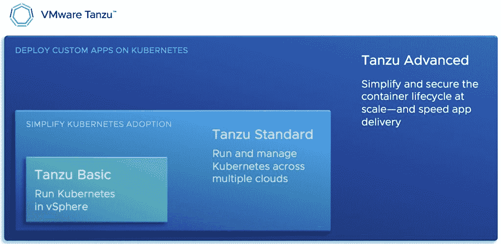

# VMware 的 Tanzu Advanced 扩展到 Kubernetes 上的所有安全层

> 原文：<https://thenewstack.io/vmwares-tanzu-extends-across-all-security-layers-on-kubernetes/>

VMware 已经扩展了其[VMware Tanzu Advanced](https://tanzu.vmware.com/tanzu/advanced)Kubernetes 发行版，为 DevSecOps 团队提供所有安全层，目标是帮助组织更快地将应用程序交付到生产环境中..

Tanzu Advanced 包含最近发布的 [vSphere for Tanzu](https://www.vmware.com/products/vsphere/vsphere-with-tanzu.html) ，旨在帮助组织更好地管理选择和添加各种拓扑到 Kubernetes 部署的挑战。VMware 表示，Tanzu Advanced 因此被创建，以通过解决容器生命周期中的需求，使企业能够更好地集成 DevSecOps。

“对许多组织来说，应用程序现代化是一项复杂的工作。VMware Tanzu Advanced 简化并保护了容器生命周期，使团队能够加速跨多个云交付现代应用程序:一种真正的 DevSecOps 方法，”[VMware](https://www.linkedin.com/in/jamesjwatters)的现代应用程序平台业务部门的首席技术官 James Watters 告诉新堆栈。“Tanzu Advanced 通过满足整个容器生命周期的需求，特别是开发速度、安全性和操作效率，使团队能够联合起来，共同努力实现应用程序的现代化。”

Watters 说，Tanzu Advanced 因此“包含了 Tanzu Standard 的功能”，以便“添加完整的网络伴奏”，包括开发人员对 Spring、构建服务、应用程序目录和 SQL 的体验。沃特斯说，高级堆栈的顶部是“全面策略管理、可观察性和服务网格的全球控制平面”。

Tanzu Advanced 的主要功能包括:

*   **开发人员速度工具:**“Tanzu Advanced 通过自动化容器来源和构建以及提供对环境的自助访问，使开发人员能够花更多时间进行编码，”Watters 说。“现在，开发人员不需要成为基础设施专家，而是可以专注于创新。”
*   **端到端安全工具:**“Tanzu Advanced 通过源代码来源、自动更新和扫描、跨所有集群的一致策略和访问控制，以及服务之间的安全连接，增强了组织的安全态势，”Watters 说。
*   **端到端管理工具:**“Tanzu Advanced 简化了运营商如何跨团队和云大规模集中管理 Kubernetes 集群，并使他们能够全面观察跨云集群的运行状况和性能，”Watters 说。

最终，Tanzu Advanced 的想法是在应用程序和容器的生命周期中增加安全保护，这也有助于为组织的 DevOps 团队标准化 DevSecOps 实践。

Watters 说:“在我们与客户的对话中，构建定制或基于容器的应用程序的组织需要扩展功能。“例如，如果客户试图构建 DevOps 实践，他们会希望简化开发人员使用容器和微服务的方式，并使安全性成为软件开发的一部分——采用真正的 DevSecOps 方法。”

## 坦祖河段

如上所述，Tanzu Advanced 为 Tanzu Standard 提供了一个 DevSecOps 框架。Tanzu Standard 为 DevOps 团队提供了:Tanzu Kubernetes Grid 及其开源附件(Tanzu Mission Control 功能的子集)以及用于入口和容器网络的[轮廓的网络组件。](https://projectcontour.io/)

Watters 还描述了 Tanzu 是如何帮助组织“在数据中心基础设施和 DevSecOps 平台上”管理和部署应用程序的。为了支持更频繁的变化，这些应用程序需要遵循现代应用程序模式，如微服务架构和 API 优先设计，“Watters 说这包括，”Watters 说。

Watters 说，Iris 项目的引入将允许 DevOps 团队“发现和分析组织的完整应用程序组合”，同时还可以自动推荐应用程序进行重新托管、重新平台化或重构，并使“客户能够适应自己的转型”。

对于“需要更多重构的应用程序”的额外支持，VMware Tanzu Labs 以前是 VMware Pivotal Labs ( [VMware 在 2019 年收购了 Pivotal Labs](https://thenewstack.io/vmware-acquires-pivotal-software-for-more-kubernetes-prowess/))-将帮助引入云原生“支持 DevSecOps 的模式和实践，并帮助他们设计、实施和配置适合他们组织的平台，”Watters 说。

<svg xmlns:xlink="http://www.w3.org/1999/xlink" viewBox="0 0 68 31" version="1.1"><title>Group</title> <desc>Created with Sketch.</desc></svg>